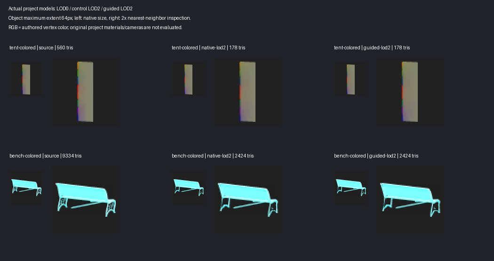

# LOD2 quality at a 64-pixel object footprint

The intended far LOD occupies about **64×64 screen pixels**. A fixed, source-fit
256×256 preview exaggerated the importance of fine detail for this level.
`Screen Quality Guide` now renders LOD2 and later with a maximum object extent
of 64 pixels and eight pixels of canvas padding. The projected aspect ratio
is preserved. LOD1 retains its previous 248-pixel object extent in a 256-pixel
canvas. The `LOD2+ Object Pixels` control permits 16–248 pixels.

The setting applies to the absolute LOD number, including generation appended
to an existing group, and works independently of `Relax Far LODs`. Small-part
proposal sizes and the deletion guard use the smaller of the configured
footprint and the existing transition-based estimate. This calibrates the
experimental quality guide; it does not modify LODGroup switching thresholds.

Thin regions and sharp RGBA boundaries must be resolved at this size to enter
the local score. Subpixel components can disappear without a local loss penalty.
Larger visible shape changes and broad color/alpha boundaries remain eligible.
The regional loss formula, budget precedence, hard-edge validation, source
sampling and attribute-correction gates retain their preceding behavior.
The other sampled surface and normalized silhouette metrics are still part of
the candidate score; this change calibrates the additional local screen guide.

## Verification

Fresh Unity runs and their audited observations are recorded in
[LOD_FAR_SCREEN_FOOTPRINT_RESULTS.json](LOD_FAR_SCREEN_FOOTPRINT_RESULTS.json).
The copied FBXs are checked against recorded source hashes; the audit also
checks the original project files remain identical. CPU candidate reports
record their actual footprint and canvas size.

The initial selected suite passed **205 tests** with fresh tent generation;
a separate fresh colored-bench generation also passed. The final focused run
passed **45 tests**; the three runs cover **206 distinct passing test cases**
with zero final failures or skips, without adding repeated cases to the total.
The focused run covers the screen-size controls, candidate reports and complete pipeline
removal of a part that was too large at the preceding transition estimate but
is subpixel at the far footprint. Controlled geometry tests also confirm that
large alpha boundaries remain measurable and the authored source is unchanged.

| Actual mesh / LOD2 | Triangles / target | Previous local detail loss | At 64 pixels | Local RGBA-boundary loss at 64 pixels |
|---|---:|---:|---:|---:|
| Colored tent | 178 / 63 | 29.9% | 9.2% | 100% |
| Colored bench | 2424 / 1038 | 100% | 12.6% | 65.0% |

These are the worst eligible regional losses from the six CPU views, not a
percentage of the whole image. Both far detail checks now pass the existing
25% guide, while eligible paint boundaries still fail it. All selected LOD1/2
variants, triangle counts and both-view raw color/coverage/shaded captures are
unchanged against the preceding guide run. No missing protected faces, hard
edges or patch interfaces were reported on these generated models.

Tent native/guided generation measured 8.47/10.88 seconds; bench measured
190.49/216.56 seconds, each for both levels together. Earlier guided runs took
14.75 and 231.06 seconds respectively. These are individual timings, not a
repeatable performance benchmark. Guide footprint calibration has produced
no measured geometric or vertex-color quality gain so far. Whole-part removal
is verified on controlled geometry; these fresh project variants did not enable
part pruning.

The illustration below shows the actual copied project models with authored
vertex RGB, at a 64-pixel maximum source extent. It is downsampled from fresh
384-pixel GPU captures with the same source framing for all variants. The
adjacent enlarged image uses nearest-neighbor scaling for inspection. These
illustrations are distinct from the six CPU views used by the guide and do
not reproduce the project's cameras, shaders or packed material maps.



## Remaining work

Screen size alone does not remove the protected-geometry floor or produce a
better geometric candidate. Continue with geometry variants that simplify
neighboring patches without locking entire face belts, evaluated at the far
footprint. Compare visible whole-part removal on eligible project models and
calibrate the remaining silhouette score to the same footprint. Retain larger
diagnostic views for inspection, without interpreting their small local regions
as far-LOD visibility requirements.

Reproduce the fresh-generation matrix using the `-meshlabLodScreenGuided`
project harness. Audit and render with:

```powershell
python -B Tools~/render_lod_far_footprint.py `
  _results~/lod-footprint64-20261010/final `
  _results~/lod-footprint64-20261010/bench `
  --previous _results~/lod-screen-guided-20261010/final `
  --focused-tests _results~/lod-footprint64-20261010/focused-final/final.xml `
  --output Documentation~/LOD_FAR_SCREEN_FOOTPRINT_RESULTS
```
