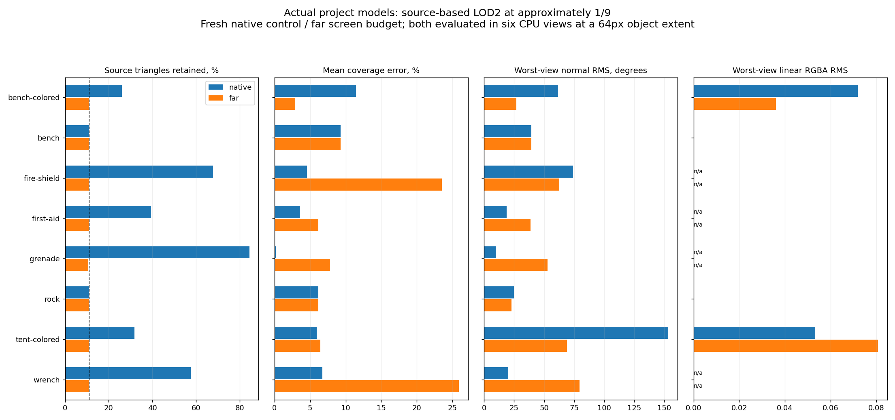
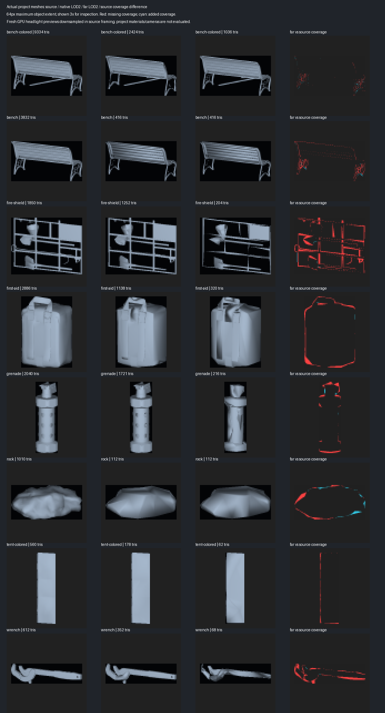
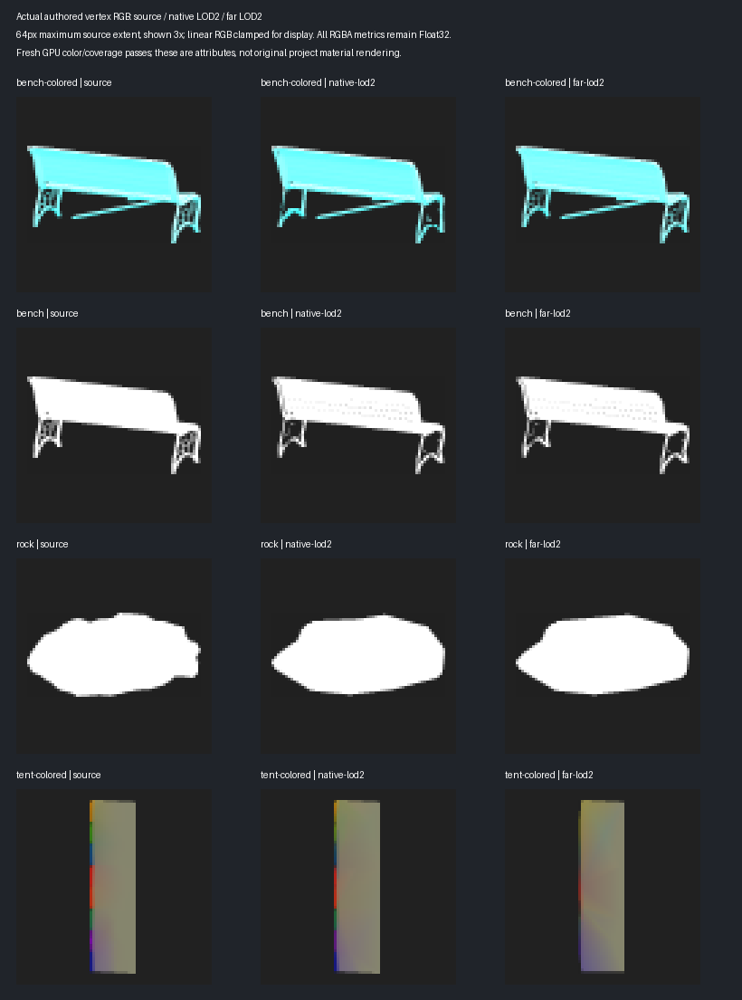

# Source-based LOD2 budget with 64-pixel quality ranking

`LOD Gen > LOD2 Screen Budget` prioritizes the requested triangle count for LOD2
and later. The default LOD0/1/2 sequence requests approximately 1/3 and 1/9 of
LOD0. Each level is reduced independently from its original working source.
The far option is enabled by default in LOD Gen's triangle-budget mode and can
be disabled to retain the preceding exact hard-edge policy. Direct pipeline
callers explicitly opt in with `farScreenBudget`.

## Why the preceding LOD2 stopped early

Strict authored-crease protection freezes incident triangles and patch borders.
Even the optional native crease constraints can fall back to that belt when
exact feature coverage fails. This left several far levels much denser than
their requested budget: tent 178/63, colored bench 2424/1038, wrench 352/68.
Changing the diagnostic footprint alone did not change their geometry.

The far mode allows ordinary meshoptimizer edge-collapse candidates to relax
exact crease/face coverage. It keeps the configured `Lock Border` and material
slots. It neither deletes arbitrary triangles nor recursively reduces LOD1.
Weight/error relaxation and permissive seam collapse retain the existing bounded
probe sequence. Explicit border locks, topology or material constraints may
still prevent reaching a target; the result reports that rather than silently
removing a requested lock.

LOD1 retains its preceding protection. Its candidate/correction guide is only
enabled when the general `Screen Quality Guide` option is selected. Far mode
automatically enables a separate 64-pixel source-framed guide for LOD2; the
`LOD2+ Object Pixels` control permits adjustment independently of attribute
relaxation. Absolute LOD indices also apply when appending to a group.

## Quality ranking

Six double-sided orthographic CPU views render four coverage samples per pixel
with depth testing, interpolated Float32 RGBA and authored normals. The object
has a maximum projected extent of 64 pixels, preserving aspect ratio, inside
a 72-pixel padded canvas. This replaces the older 128-pixel silhouette metric
with independent X/Y stretching for the far candidate score.

The score combines mean/maximum fractional coverage error, worst-view normal
angular RMS and RGBA RMS over overlapping covered pixels, local thin-component
and paint-boundary loss, and a small sampled geometry-distance term. Missing
reference attributes are unevaluated. Missing target RGBA renders white; missing
target normals are treated as incompatible where the reference normal is valid.
Source-defined regions still need sufficient pixel support to enter the local
score. This prevents subpixel parts from dominating a far-LOD decision.

A reached budget wins over an oversized candidate. Within the existing
five-percent/two-triangle undershoot band, quality wins over a lower count.
The selected attribute correction must still satisfy its surface/region checks
and must not increase the visible field, coverage or local guide errors.
Rejected replacements are destroyed; source meshes are never edited.

Exact missing crease segments, incident faces and interfaces remain diagnostic
counts on a far result, marked `screenBudgetRelaxed`. They no longer trigger
the source-copy fallback in this explicit mode. This is **not** a claim that
the authored topology, all hard edges, every smoothing region or paint category
survives a ninefold reduction.

## Project-model verification

Portable audited measurements: [LOD_FAR_BUDGET_RESULTS.json](LOD_FAR_BUDGET_RESULTS.json).
**211 selected EditMode tests passed**, with zero failures or skips, on Unity
6000.2.6f2 / Direct3D12 / GTX 980 Ti. Eight models produce 80 fresh variant/view
captures. The preceding 64-test focused run is included in this final suite,
not added to its total. Both FBX compilation configurations, identifier and
tool-dependency checks also pass.

| Actual mesh | LOD0 triangles | Previous LOD2 | Far LOD2 / target | Far six-view mean coverage error |
|---|---:|---:|---:|---:|
| Colored bench | 9334 | 2424 | 1036 / 1038 | 2.88% |
| Bench A | 3832 | 416 | 416 / 426 | 9.29% |
| Fire shield | 1850 | 1252 | 204 / 206 | 23.53% |
| First aid kit | 2886 | 1138 | 320 / 321 | 6.18% |
| Grenade | 2040 | 1721 | 216 / 227 | 7.80% |
| Rock | 1010 | 112 | 112 / 113 | 6.18% |
| Colored tent | 560 | 178 | 62 / 63 | 6.46% |
| Wrench | 612 | 352 | 68 / 68 | 25.91% |

**8/8 far budgets pass** the requested count and undershoot band. They retain
10.59–11.11% of source triangles. Total measured two-level generation time is
357.63 seconds for the native controls and 377.12 seconds for the far profiles
(+5.45%); these are individual runs, not a repeated performance benchmark.

All controls and far variants are freshly generated from the same eight copied
project FBXs. Their original file hashes and the preceding baseline's source and
native raw passes are checked. Separate post-generation CPU measurements compare
both policies at the same 64-pixel footprint, independently of whether their
generation used the guide. The GPU figures are diagnostic headlight previews,
not the original project's camera/material rendering.







Meeting the triangle count does not certify quality. In particular, the new
small-count wrench, fire shield and tent expose normal-field and/or
silhouette/paint losses. Colored-bench mean coverage error improves from 11.45%
to 2.88%, and its worst-view RGBA RMS improves from 0.0719 to 0.0361 despite the
lower count. Tent RGBA RMS worsens from 0.0533 to 0.0807. Both colored models
still fail the local sharp-boundary guide. Normal RMS compares raw authored
directions, including their sign; it is not a shader-lighting error and can be
sensitive to which coincident double-sided surface wins a depth tie.
Inspect these metrics and actual views before assigning production transition
thresholds. Better coarse normal reconstruction, seam-aware paint fitting and
additional geometry candidates remain useful follow-ups.

Local test artifacts: `_results~/lod-far-budget-20261010/final/`. Reproduce using
the copied-project harness with `-meshlabLodBudget -meshlabLodHardEdges
-meshlabLodFarBudget`; supply the existing eight-case dataset, GPU output path
and selected test results. Audit/render with:

```powershell
python -B Tools~/render_lod_far_budget.py `
  _results~/lod-far-budget-20261010/final `
  --previous _results~/lod-screen-guided-20261010/final `
  --output Documentation~/LOD_FAR_BUDGET_RESULTS
```
