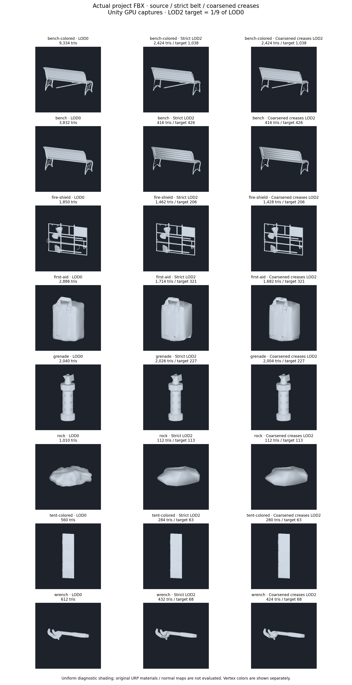
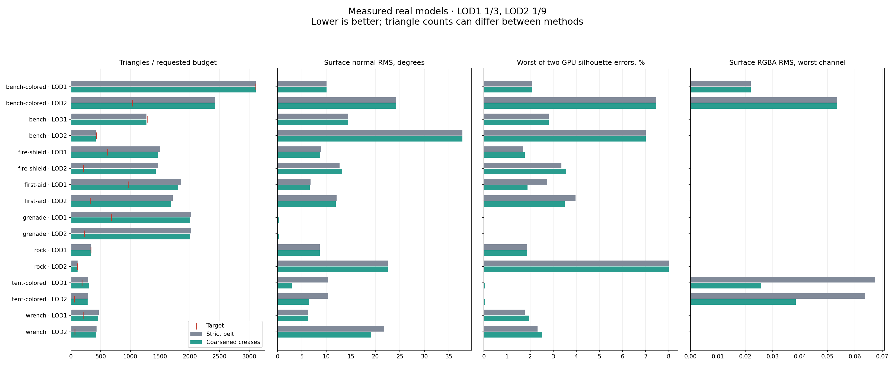
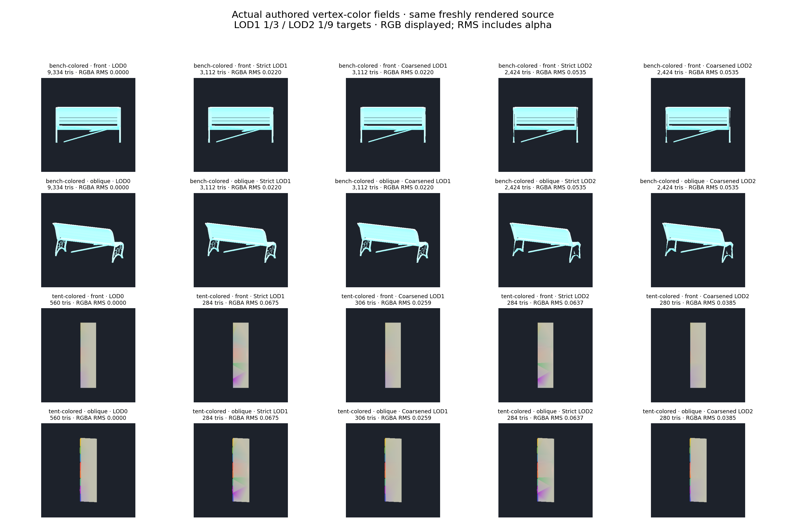

# LOD feature-chain experiment

**Coarsen Crease Chains** optionally reduces authored creases before meshoptimizer simplifies the remaining patches. It is disabled by default and available with **Triangles**, **Prioritize Triangle Budget**, and **Preserve Hard Edges**. Each level starts from working LOD0. This managed prepass itself leaves source FBX/working meshes and native ABI/binaries unchanged; the separate [native-constraint follow-up](LOD_NATIVE_CONSTRAINTS.md) adds an optional native backend.

## Controls and checks

**Crease Deviation** is relative to the source diagonal, capped at 1%; the evaluated setting is 0.5%. Zero permits straight chains with affine fields within numerical tolerance. Bounded mode permits a 5-degree endpoint-normal guide, 0.001 absolute error per UV coordinate, and the level's RGBA guide (0.02 at LOD1, 0.1 at LOD2 here). UV/RGBA gates are local to changed faces, not certified whole-surface bounds. Final source errors remain measured and reported.

- Disconnected contact fans are separated for connectivity analysis; malformed components and triangles incident to ambiguous edges remain protected.
- Only degree-two crease points collapse. Endpoints, junctions, open boundaries and material-boundary junctions remain. Render wedges change together, retaining separate shading/attribute sides and material slots.
- Every original oriented segment, material side and endpoint normal is tracked across consecutive collapses. New chords must cover the entire original polyline within the geometric deviation and endpoint-normal guide, preventing unchecked accumulation of local error.
- The link condition, component/Euler/boundary signatures, winding, degeneracy and triangle intersections are checked, including other components. Source vertex positions never move.
- Attribute dimensions, Float/HDR or Color32 storage and tangent handedness remain intact; missing channels are not synthesized.

Meshoptimizer retains the coarsened crease's incident face belt and locks its interfaces. Exact reference-face/interface checks and original-source crease coverage run after attribute correction. Coverage requires a discontinuous target edge with both oriented material sides; smoothing a crease away fails. Covered source segments are **not** unchanged original edges: one longer edge can cover several segments within the bounds.

Quality selection measures geometry, silhouette, normals, UV and RGBA against original working LOD0. Coarsened native attempts that miss the budget rank by sampled source quality, preventing a smaller but worse retry from replacing a better candidate. A reached budget still wins. Normal/RGBA correction retains per-channel/per-region RMS and maximum non-regression gates. A coarsened result reports sampled LOD0 error; the native bound applies only to its prepared mesh.

## Evidence and reproduction

The straight-only prototype passed 172 selected EditMode tests but reduced none of the eight actual FBX meshes. Actual contacts, malformed triangles, curved chains and a First Aid Kit retry-selection regression motivated component isolation, tracked bounded chords and quality-ranked native retries.

Final evaluation compares fresh unprotected, strict-belt and coarsened LOD1/LOD2 variants at 1/3 and 1/9 budgets. The checked GPU target is 384×384 independent of editor DPI. Historical images used DPI-scaled targets and are not assumed pixel-identical; comparisons use a fresh source in the same run. Original URP materials, packed/normal maps, full assemblies and transitions remain outside these diagnostics.

Final verification on Unity 6000.2.6f2 / NVIDIA GTX 980 Ti / Direct3D12: **177 selected LOD and collision EditMode tests passed**, zero failures/skips; all eight meshes and 112 GPU variant/view captures are fresh on the final C# implementation. Both FBX compilation configurations, identifier and tool-dependency checks pass. The audit checks 1660 regional correction comparisons; original feature coverage, reference faces/interfaces and source-fallback checks pass for both protected modes.

| Mesh | Strict LOD1 → coarsened | Strict LOD2 → coarsened | LOD2 target |
| --- | ---: | ---: | ---: |
| Park Bench B | 3112 → 3112 | 2424 → 2424 | 1038 |
| Park Bench A | 1269 → 1269 | 416 → 416 | 426 |
| Fire Shield | 1502 → 1462 | 1462 → 1428 | 206 |
| First Aid Kit | 1852 → 1804 | 1714 → 1682 | 321 |
| M84 grenade | 2026 → 2004 | 2026 → 2004 | 227 |
| Rock | 336 → 336 | 112 → 112 | 113 |
| Rainbow tent roof | 284 → 306 | 284 → 280 | 63 |
| Wrench | 468 → 456 | 432 → 424 | 68 |

Both modes still reach **5/16 budgets**, including 2/8 at LOD2. The tent's maximum-channel surface RGBA RMS improves 0.06751 → 0.02589 at LOD1 (61.6%) and 0.06370 → 0.03847 at LOD2 (39.6%). LOD1 uses least-squares fitting and is denser than strict protection; LOD2 accepts area-resampled RGBA fitting and has four fewer triangles. The comparisons therefore do not prove a matched-count color advantage. Compared with its own pre-correction candidate, LOD2 resampling improves 0.04223 → 0.03847 (8.9%); channel maximum/RMS gates pass, including alpha within numerical tolerance.

First Aid Kit and Wrench LOD2 normal RMS improve 12.10° → 11.91° and 21.81° → 19.18°. Results are mixed: Fire Shield LOD2 normal/silhouette errors rise slightly, and Wrench silhouettes rise slightly. Grenade normal RMS rises 0.0068° → 0.370°, with a small silhouette change. The tent trades lower color/normal errors for a small silhouette change and higher LOD2 geometric RMS. These regressions and unreached budgets keep the option experimental.







Portable measurements and capture metadata: [LOD_FEATURE_CHAIN_RESULTS.json](LOD_FEATURE_CHAIN_RESULTS.json). Workstation artifacts and logs: `_results~/lod-feature-quality-20261010/`, including `final.xml` and `feature-chains-audit.json`; duration 630.6 seconds includes selected tests and all three generation groups.

Run `LodProjectVisualQualityTests` with `-meshlabLodProjectCases <copied-cases.json> -meshlabLodVisualOutput <output> -meshlabLodBudget -meshlabLodHardEdges -meshlabLodFeatureChains`; omit `-nographics`. `-meshlabLodFeatureProbe` checks the source prepass without candidate generation/GPU capture. Then run:

```text
python Tools~/render_lod_feature_chains.py <output> --tests <results.xml> --baseline <historical-output>
```

The audit checks original/copied FBX hashes, feature coverage, protected faces/interfaces, correction gates and budget reporting. Historical source-PNG differences are recorded; changed DPI/rasterization is not treated as changed source geometry. FBX copies, raw frames and XML logs stay in ignored `_results~/` and the isolated Unity project.

## Remaining work

The prepass alone still feeds a frozen incident-triangle belt. The separate [native-constraint experiment](LOD_NATIVE_CONSTRAINTS.md) now permits patch retriangulation and includes fresh matched-count comparisons: 183 selected tests pass, with 6/16 source budgets reached. Both options remain experimental. UVs, nonlinear paint, tangents and intersections can block reduction; categorical paint needs independent acceptance.

Next: keep this managed prepass and strict baseline as controls, add thin-component/categorical-color acceptance, then test original materials/assemblies. Native ABI/binary changes continue through `build-native.yml`. Full-loop and QSlim experiments retain their separate scope.
