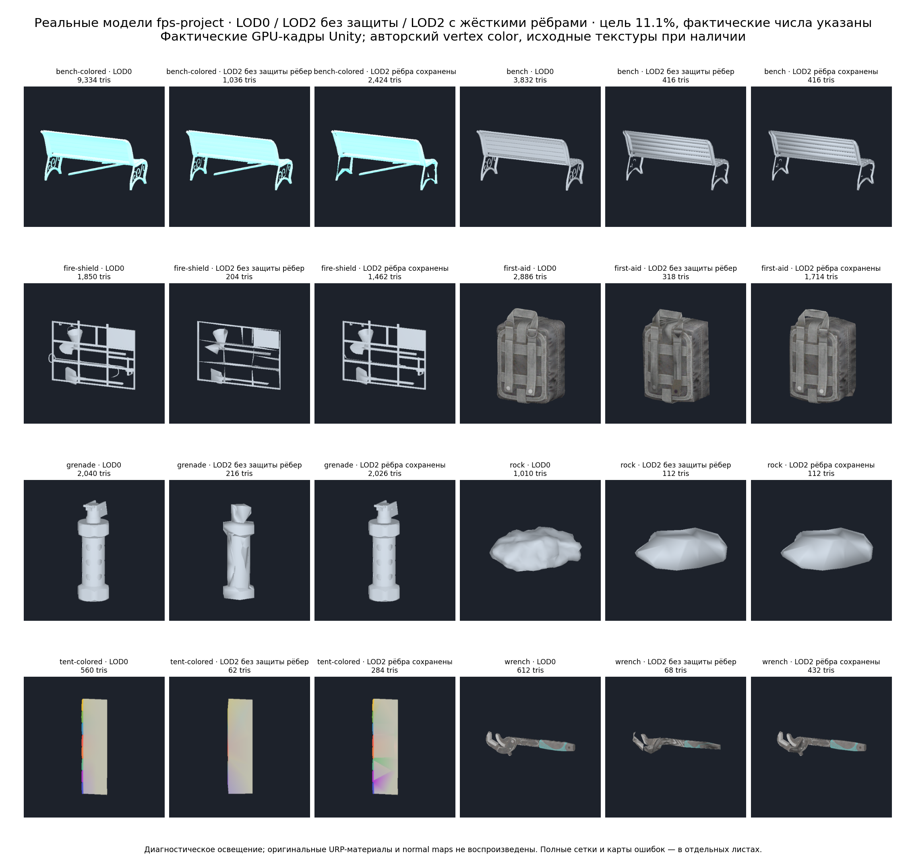
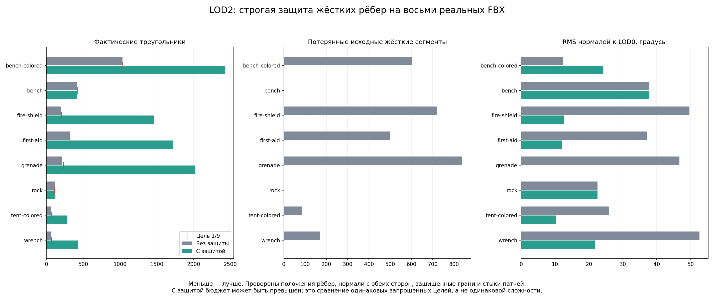
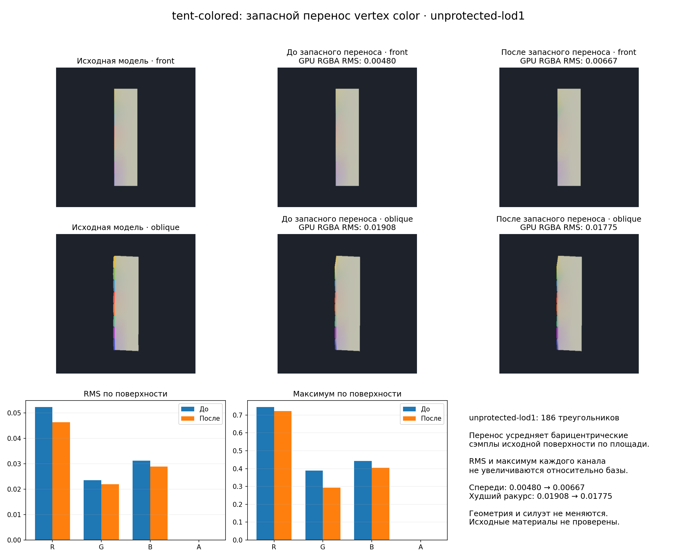

# LOD iteration handoff — 2026-10-10

This iteration is ready to integrate as an incremental implementation. The complete LOD quality roadmap is not finished. The intended hierarchy remains LOD0, LOD1 and LOD2, with independent source reduction to approximately 1/3 and 1/9 of LOD0.

## Implemented

- Independent per-level settings and source-based budgets; multiple meshoptimizer candidates ranked by measured geometry, silhouette, normals, UV and RGBA errors.
- Verified normal and vertex-color correction, including connected smoothing regions and correction non-regression checks. Regions represent authored normal continuity, not recovered DCC smoothing-group IDs.
- Raw FBX topology preparation through temporary imports without changing the original FBX; conservative full-loop and disconnected-small-part experiments.
- Optional strict hard-edge preservation. LOD Gen enables it by default; existing direct simplifier/pipeline callers opt in. Protected triangles and patch interfaces are validated before and after correction. No native ABI or distributed binary changes.
- Known protected-face floors prevent futile aggressive retries. Eligible preceding source-derived geometry can cap increasing density; it is cloned and remeasured, never recursively simplified.
- PR review fixes preserve edited working sources and preflight bindings during regeneration. Clearing previous generated LODs, prefab unpacking and generation share one Undo transaction; cancellation or an exception restores previous objects, mesh ownership and context entries, and releases pending meshes. The tool displays the failure and repaints. Regression cases cover working-quad/RGBA regeneration, cancellation between renderers/levels, and both cancellation and failure after clearing previous generated levels.
- RGBA fitting shares variables across equal-color render duplicates connected through unambiguous adjacent edges in one material slot. Disconnected contacts, ambiguous adjacency and material boundaries remain separate and conservatively pinned. Region pinning happens once per projection pass; identical mesh arrays bypass repeated whole-array comparisons. QSlim's experimental worker reports an empty prepared source instead of dividing by zero.
- Rejected varying-color fits now try area-weighted redistribution of the same source barycentric samples. Shared variables, pinned seams, Float/HDR/Color32 storage and per-channel RMS/maximum gates remain enforced. Successful ordinary fits skip the extra trials. On the actual tent's unprotected LOD1, maximum-channel surface RMS improves from 0.05224 to 0.04638 (11.2%); protected outputs and other tested outputs retain their previous fields. One GPU view worsens while the worst-view error improves; categorical-paint semantics remain unverified.
- Reproducible Unity GPU evaluation on eight actual project FBX meshes and an experimental libigl QSlim comparison. QSlim is a test/tooling experiment, not a production dependency or selected backend.

## Verified snapshot and limitations

The post-review baseline passed **162 selected LOD and collision EditMode tests**, with zero failures or skips, on Unity 6000.2.6f2. All eight actual FBX models were freshly recaptured after the Undo, RGBA-seam and performance fixes; no preceding GPU captures were reused. Both FBX compilation configurations, identifier and tool-dependency checks pass. Earlier 112/113/155-test runs remain historical evidence in [the evaluation](LOD_PROJECT_VISUAL_EVALUATION.md). These are selected checks, not a complete package-suite claim.

All 3019 authored hard-edge segments are retained at both generated levels, with zero missing protected face occurrences or patch interfaces. All 1660 measured regional correction checks pass. Nevertheless, strict protection currently reaches only 5 of 16 triangle budgets and only 2 of 8 LOD2 budgets. Equal adjacent counts can be a genuine protected-geometry limit.

The full eight-model RGBA comparison also passed 162 selected tests. Final verification passed **163 selected tests** with a fresh tent GPU capture, adding rollback coverage when the reducer returns a failure instead of throwing. Failed renderers now abort the transaction rather than committing missing surfaces. Seven other captures retain the full comparison's lineage: their resampling trials all lost, and the final optimization only skips those trials. Their recorded timings/trial counts belong to that full experiment. Final artifacts: `_results~/lod-iteration-closure-20261010/final-color-fallback/`; test results: `final-reducer-failure.xml` in its parent directory.

| Project mesh | LOD0 | Protected LOD1 | Protected LOD2 | LOD2 target |
| --- | ---: | ---: | ---: | ---: |
| Park Bench B | 9334 | 3112 | 2424 | 1038 |
| Park Bench A | 3832 | 1269 | 416 | 426 |
| Fire Shield | 1850 | 1502 | 1462 | 206 |
| First Aid Kit | 2886 | 1852 | 1714 | 321 |
| M84 grenade | 2040 | 2026 | 2026 | 227 |
| Rock | 1010 | 336 | 112 | 113 |
| Rainbow tent roof | 560 | 284 | 284 | 63 |
| Wrench | 612 | 468 | 432 | 68 |

Preserving each original crease segment is too conservative for useful reduction on several meshes. Bench B's worst silhouette mismatch worsens from 2.372% to 7.456%, despite retaining more triangles. Vertex-color RMS can improve while categorical paint boundaries still visibly interpolate incorrectly. Budget mode reports exceeded quality guides rather than treating them as certified acceptance limits. Full-loop reduction has not produced a practical gain on this project dataset.

Detailed implementation: [LOD controls and operators](LOD_FULL_LOOPS.md). Research: [topology and libraries](LOD_TOPOLOGY_RESEARCH.md). Test evidence, reproduction commands and capture lineage: [real project evaluation](LOD_PROJECT_VISUAL_EVALUATION.md). Workstation-only post-review artifacts are under `_results~/lod-iteration-closure-20261010/final-eight-models/`; copied project models and experimental Python dependencies are intentionally outside the package.

The overview/chart retain the final capture lineage above; their LOD2 fields/counts remain identical to the post-review baseline. The RGBA figure compares that baseline with the final tent capture. Source hashes, feature/region checks and unchanged source PNG checks: `final-color-fallback/audit.json`. Integration PR: [#229](https://github.com/SashaRX/UnityMeshLab/pull/229).

## Next iteration, in order

1. Replace the frozen incident-triangle belt with feature-polyline coarsening: preserve crease shape, endpoints, junctions and separate shading sides while allowing shorter chains. Compare against the present strict baseline on the same eight models and LOD1/LOD2 budgets.
2. Add acceptance checks for disappearing thin/soft components and categorical vertex-color boundaries. Evaluate visual error at matched triangle counts and real screen sizes; keep the documented Bench B and tent regressions as explicit controls.
3. Exercise original materials, normal maps, complete assemblies and LOD transitions in the project's render pipeline. Separate geometric silhouette, shading and color errors in the report.
4. Revisit full-loop removal on irregular project topology. Keep source provenance and topology/winding/intersection validation; require a measured reduction benefit before changing defaults.
5. Reconsider QSlim as an additional candidate only after equivalent attribute, topology, crease and quality checks. Any necessary native plugin change must be rebuilt through `build-native.yml`.

Keep every stage independently reviewable. Preserve working LOD0, source FBX bytes, material slots, owned-mesh cleanup, cancellation and Undo/LODGroup restoration. Do not label the system complete until the factor-three budgets and visual acceptance hold on the real project dataset.
