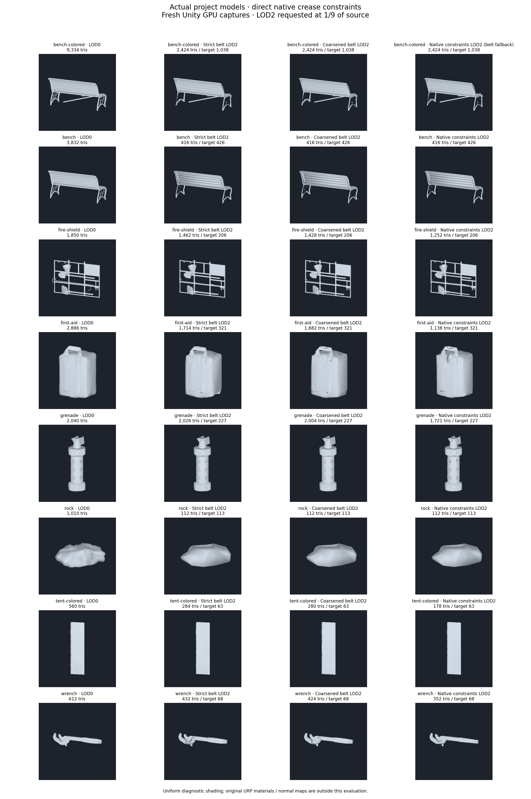
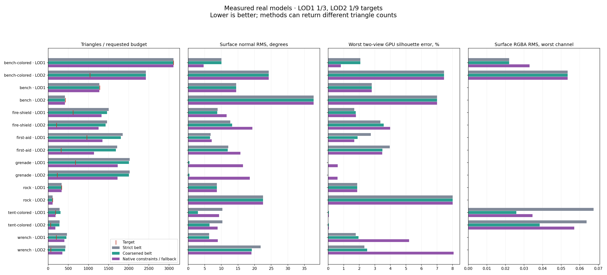
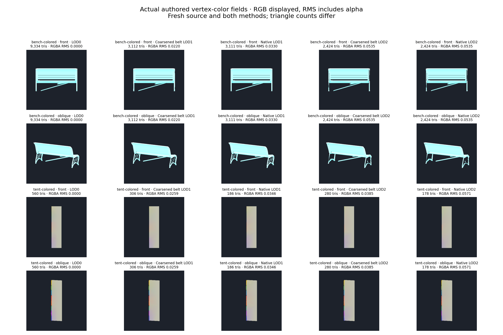
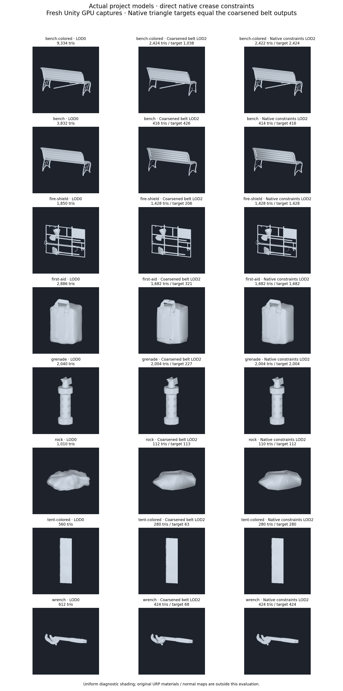
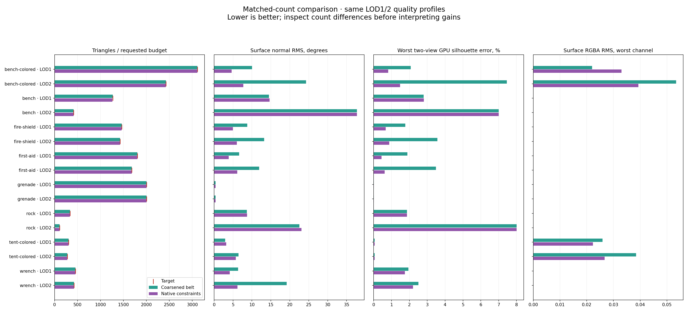
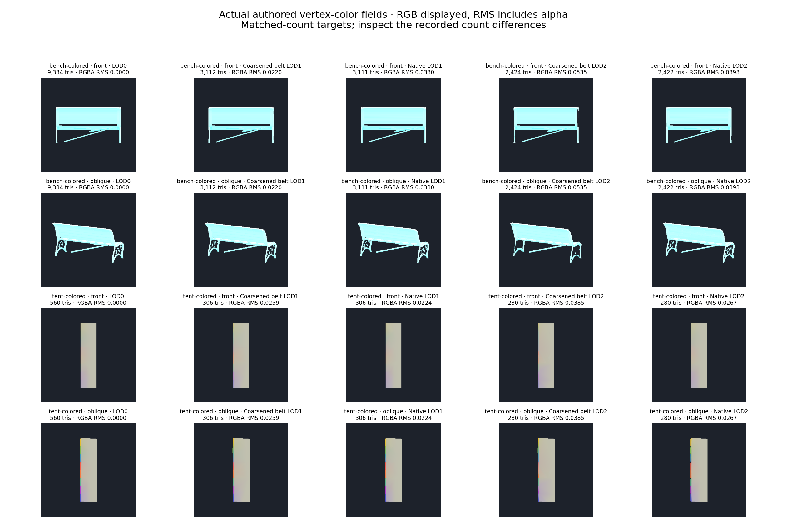

# Native crease constraints

Optional **Native Crease Constraints** is available in LOD Gen with Triangles,
Prioritize Triangle Budget and Preserve Hard Edges. It is disabled by default.
The previous strict incident-face belt and managed chain prepass remain controls.

The new additive `meshoptSimplifyConstrained` bridge accepts one Lock/Protect byte
per render vertex. All positional wedges receive consistent flags. Crease
endpoints, junctions, material borders and vertices of ambiguous faces are locked;
degree-two crease vertices protect their attribute discontinuity. Meshoptimizer
can retriangulate neighboring faces without freezing their original triangles.
Ambiguous faces remain frozen, with occurrence and interface checks.
Coincident but disconnected vertex fans are locked consistently across wedges.

Every prepared source crease must remain covered by a discontinuous target edge
with both oriented material sides and its original normal field. Native chain
collapses receive only numerical tolerance. If that check fails, simplification
retries with every crease vertex locked. A second failure uses the existing
strict incident-face belt and reports that backend explicitly. If its protected
face floor exceeds the requested budget, additional relaxed native probes stop.
Source copies remain a last-resort validation fallback. Retry counts include
both additional mesh-simplification attempts.

The optional managed prepass can first shorten chains within its separately
verified bounds; final coverage still measures every original working LOD0
segment. All geometry candidates and attribute correction use working LOD0.
The existing normal/RGBA correction gates and subsequent feature checks apply.
This is sampled quality validation, not a certified surface-error guarantee.

The existing `meshoptSimplify` ABI is preserved. Constraint ABI version 1 requires
fresh native binaries built by `build-native.yml`; older binaries produce a
readable error instead of silently running without constraints. The new native
entry rejects invalid index/flag buffers and nonfinite input before library reads.

Native CTest exercises zero attribute costs, oriented shading-side retention,
locks and invalid-buffer rejection. Unity regression and actual FBX/GPU evaluation
use `-meshlabLodNativeFeatures` alongside the existing budget/hard-edge/chain flags.
All platform builds and both native CTests passed in [CI run 38041076577](https://github.com/SashaRX/UnityMeshLab/actions/runs/38041076577).
The binaries were imported through CI's commit `3513525`; they were not rebuilt or
copied by hand. The initial extended comparison completed every model but exceeded
its 15-minute timeout (182 other checks passed). The final comparison uses a
30-minute timeout, strict-belt fallback and additional matched-count candidates.

## Final real-model evidence

The final implementation (`8034110`) passed **183 selected LOD/collision EditMode
tests**, zero failures/skips, on Unity 6000.2.6f2, NVIDIA GTX 980 Ti and Direct3D12.
All eight source FBX meshes were freshly evaluated; source hashes were checked.
Each fixture selects its largest eligible mesh, rather than the complete model
assembly. The run contains **176 fresh variant/view captures** at a physical
384×384 GPU target: source, unprotected, strict belt, coarsened belt, native
source-budget and native matched-count outputs in front/oblique views.
Each generated level starts independently from working LOD0.

Both FBX compilation configurations, identifier/tool-dependency checks and
`git diff --check` pass. The primary audit checks 2490 regional normal-correction
comparisons; the matched audit checks 1660, with the 830 coarsened-control checks
shared between them (3320 unique comparisons). Correction acceptance also checks
per-channel RGBA RMS and maximum, including alpha. All evaluated protected outputs
have zero missing original crease coverage, protected face occurrences or patch
interfaces and zero source-copy fallbacks. These are selected package checks and
sampled diagnostics, not a complete package-suite or full-project render claim.

### Source-budget comparison

The source targets remain approximately 1/3 for LOD1 and 1/9 for LOD2. Counts below
compare the fresh coarsened incident-face belt with direct native constraints.

| Mesh | Coarsened → native LOD1 | Coarsened → native LOD2 | LOD2 target |
| --- | ---: | ---: | ---: |
| Park Bench B | 3112 → 3111 | 2424 → 2424* | 1038 |
| Park Bench A | 1269 → 1269 | 416 → 416 | 426 |
| Fire Shield | 1462 → 1324 | 1428 → 1252 | 206 |
| First Aid Kit | 1804 → 1348 | 1682 → 1138 | 321 |
| M84 grenade | 2004 → 1729 | 2004 → 1721 | 227 |
| Rock | 336 → 336 | 112 → 112 | 113 |
| Rainbow tent roof | 306 → 186 | 280 → 178 | 63 |
| Wrench | 456 → 406 | 424 → 352 | 68 |

*Park Bench B LOD2 selects the explicitly reported strict-belt fallback after
native coverage fails, including the all-locked retry. It is not a successful
direct-constraint reduction. There is one such selected fallback among these
16 outputs. Native constraints reach **6/16 budgets**, versus 5/16 for either
belt control; the tent newly reaches LOD1's 187-triangle target. LOD2 still reaches
only **2/8 budgets**.

Fewer triangles do not imply better quality. At these more aggressive native
counts, Fire Shield LOD2 normal RMS rises 13.24° → 19.34°, grenade rises
0.37° → 18.57°, and tent RGBA RMS rises 0.03847 → 0.05709. Wrench LOD2 silhouette
mismatch rises 2.504% → 8.068%, despite slightly lower normal RMS. Quality guides
are reported when exceeded; prioritizing the triangle budget does not turn them
into certified acceptance bounds. The experimental option therefore stays off
by default.







### Matched-count comparison

The second comparison gives native constraints the freshly generated coarsened
control's actual triangle count as its target, while retaining the same LOD1/LOD2
quality profiles and independent working-LOD0 source. All **16 pairs** are within
5% or two triangles, whichever is greater. Several pairs are exactly equal;
others differ slightly and are shown explicitly. None selects a belt or source
fallback.

| Mesh | LOD2 triangles, control → native | Normal RMS, control → native | Worst two-view silhouette, control → native |
| --- | ---: | ---: | ---: |
| Park Bench B | 2424 → 2422 | 24.27° → 7.70° | 7.454% → 1.478% |
| Park Bench A | 416 → 414 | 37.76° → 37.73° | 7.006% → 7.006% |
| Fire Shield | 1428 → 1428 | 13.24° → 5.99° | 3.568% → 0.873% |
| First Aid Kit | 1682 → 1682 | 11.91° → 6.12° | 3.491% → 0.613% |
| M84 grenade | 2004 → 2004 | 0.3704° → 0.3703° | 0.011% → 0.011% |
| Rock | 112 → 110 | 22.56° → 23.10° | 8.005% → 8.005% |
| Rainbow tent roof | 280 → 280 | 6.45° → 5.74° | 0.050% → 0.050% |
| Wrench | 424 → 424 | 19.18° → 6.18° | 2.504% → 2.199% |

At exactly equal counts, Wrench LOD2 normal RMS improves 67.8%, First Aid Kit
48.6%, and Fire Shield 54.7%. The tent's maximum-channel surface RGBA RMS improves
0.02589 → 0.02237 at LOD1 (306 triangles each, 13.6%) and 0.03847 → 0.02673 at
LOD2 (280 each, 30.5%). Its geometry RMS also improves, while LOD1 normal RMS
slightly worsens 2.93° → 3.20°. Bench B LOD2 color improves 0.05346 → 0.03930,
but LOD1 color worsens 0.02199 → 0.03299 despite better geometry/normals/silhouette.
Rock LOD2 normals worsen slightly; Bench A LOD1 also has small regressions.
No uniform quality improvement or categorical-paint preservation is claimed.







Portable metadata and measurements: [source-budget results](LOD_NATIVE_RESULTS.json)
and [matched-count results](LOD_NATIVE_MATCHED_RESULTS.json). Original URP materials,
normal maps, complete assemblies and LOD transitions remain outside the diagnostic
shading/color captures. RGBA RMS includes alpha; color figures display RGB.

### Reproduction and timing

Workstation artifacts: `_results~/lod-native-features-20261010/final-matched/`,
including `final.xml`, `final.log`, per-model metrics and GPU captures. The final
selected run took 1297.97 seconds, including all tests and five generation groups.
Timing is still an optimization concern: Bench B's matched native Generate call
takes 201.79 seconds versus 113.15 for the coarsened control, whereas First Aid Kit
takes 30.26 versus 33.97 and the tent 5.33 versus 7.37. `generationMs` covers both
levels of one Generate call and is repeated on both metric rows; never sum it
across levels. These single-run timings are not a stable performance benchmark.

Run the selected EditMode suite with `LodProjectVisualQualityTests` and the existing
LOD/collision regression filters in an isolated project using this package.
Provide `-meshlabLodProjectCases <copied-cases.json>` and
`-meshlabLodVisualOutput <output>`, plus:

```text
-meshlabLodBudget -meshlabLodHardEdges -meshlabLodFeatureChains
-meshlabLodNativeFeatures -meshlabLodMatchedFeatures
```

Use `-batchmode -runTests -testPlatform EditMode -testResults <results.xml>`;
omit `-nographics` to retain GPU capture. Then audit and render both comparisons:

```text
python Tools~/render_lod_native_constraints.py <output> --tests <results.xml>
python Tools~/render_lod_native_constraints.py <output> --tests <results.xml> --matched
```

## Next, in order

1. Add independent visual acceptance for disappearing thin/soft components and
   categorical vertex-color boundaries at matched counts and real screen sizes.
   Keep Bench B LOD1 color, Wrench silhouette and aggressive grenade reduction as
   explicit regression controls. Profile failed native coverage and costly retries.
   The [local screen diagnostics](LOD_SCREEN_ACCEPTANCE.md) now evaluate visible
   details and sharp RGBA boundaries, with 196 selected tests passing. Their next
   step is candidate/removal policy and threshold calibration; semantic categorical
   labels and original-material acceptance remain outstanding.
2. Test original project materials, normal maps, full assemblies and transitions.
3. Revisit full-loop and QSlim candidates only with equivalent topology, feature,
   attribute and source-quality checks. Do not change defaults until the factor-three
   budgets and visual acceptance hold on the actual project dataset.
