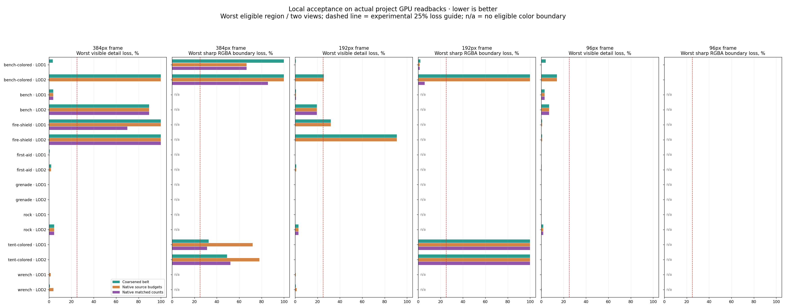
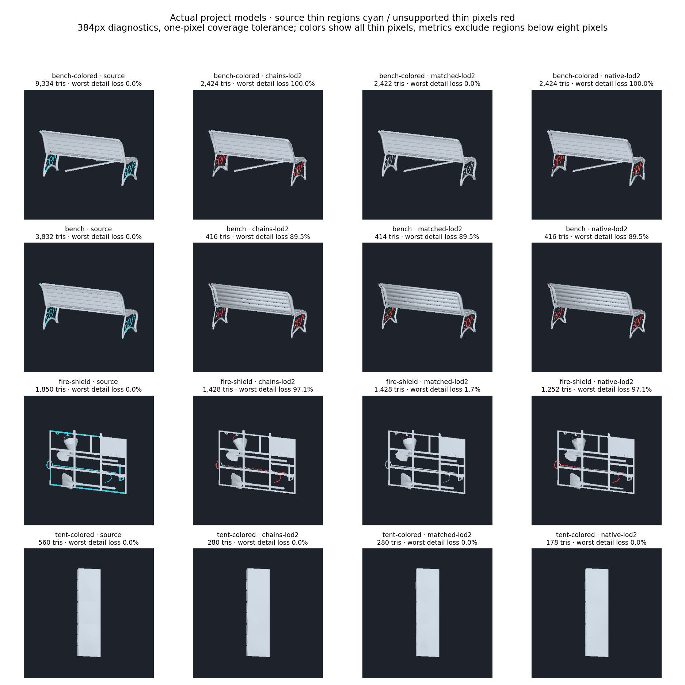
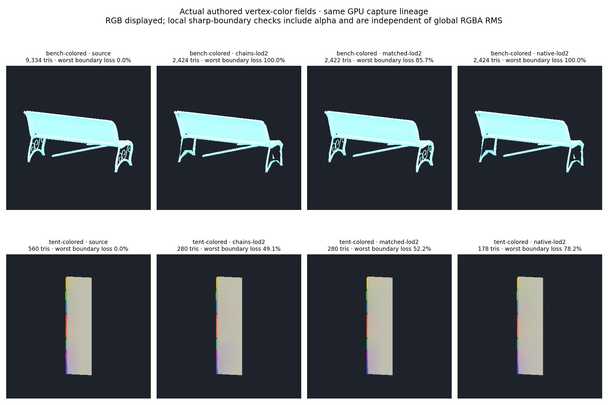

# Local LOD screen acceptance

`LodScreenAcceptance` adds independent diagnostics for visible thin features,
disconnected image regions and sharp vertex-color boundaries. It evaluates linear
GPU color/coverage readbacks at 384, 192 and 96 pixels. This document records the
independent diagnostic snapshot; direct GPU readbacks do not change generation.
The subsequent optional [CPU screen guide](LOD_SCREEN_GUIDED_SELECTION.md) uses
the same regional checks in candidate ranking, attribute-correction guarding and
small-part removal. Generation defaults remain unchanged.

## Measurements and experimental guides

- Thin regions are covered source pixels outside a radius-two morphological
  opening. This excludes the ordinary border band of a thick surface while retaining
  narrow visible details. Eight-connected regions with at least eight pixels are
  evaluated individually. Whole visible image components are also checked, so a
  disappearing thick detached feature cannot pass through the thin-feature test.
- Target coverage may move by one pixel. Missing source support is counted per
  region; a region losing 95% or more is recorded as vanished. The current
  experimental acceptance guide permits at most 25% loss in any eligible region.
- Color checks require authored varying vertex colors. Eligible pairs lie inside
  fully covered source pixels, with a one-pixel interior margin, and differ by at
  least 0.15 in any linear RGBA channel. A target pair must preserve both endpoint
  values and their signed contrast within 0.1 per channel, under one common offset
  of at most one pixel. RGB, alpha and HDR values remain separate; no palette clamp
  is applied. Connected boundary regions need at least four pairs and use the same
  25% regional-loss guide.
- Smaller footprints use coverage-aware box filtering; partially covered color
  pixels do not define a sharp boundary. Reports include the measured object's
  width/height, eligible region counts and evaluation flags. Missing channels,
  constant colors, smooth gradients or unresolved boundaries produce **not evaluated**
  for color, never an invented passing result. Buffer dimensions/nonfinite fields
  are checked and analysis/measurement can be cancelled.

The numerical guides are experimental, not semantic paint labels or certified
error bounds. Regions represent visible image features, not source mesh component
identities. Occluded details, two-view blind spots and deformation/shading/material
errors require other checks. A one-pixel tolerance becomes relatively permissive
at smaller footprints; subpixel features and small excluded regions are not proved
safe. Box-filtered diagnostic frames do not replace actual project cameras, original
materials, normal maps or transition tests. Existing normal/surface checks remain
necessary: the aggressive grenade output passes these visible-detail checks despite
its documented normal regression.

## Verified evidence and capture lineage

The final run passed **196 selected LOD/collision EditMode tests**, zero failures
or skips, on Unity 6000.2.6f2. It includes 13 new screen-acceptance cases: missing
small/thick components, bounded pixel shifts, blurred RGB/alpha boundaries despite
small global RMS, smooth gradients, absent authored paint, HDR/downsampling,
invalid buffers, cancellation and the actual-model replay.

Both FBX compilation configurations, identifier/tool-dependency checks and
`git diff --check` pass. No simplifier, native source/ABI or binary changed in this
stage; working LOD0/source FBX and existing mesh lifecycle remain intact.

The eight-model comparison **reuses the prior actual GPU readbacks** from the
native/matched run at source implementation `8034110`, which passed 183 selected
tests. It evaluates 176 variant/view captures at three footprints: **528 scale
comparisons**, with SHA-256 provenance for all 352 linear color/coverage files and
their metadata. It is not a new eight-model generation/render run.

The final run also freshly regenerates and captures the actual tent through all
five generation groups. Its 22 fresh variant/view captures include the new screen
reports; all 44 color/coverage raw files are byte-identical to their prior counterparts.
This validates capture integration and reproducibility separately from the replay.

## Results

The table uses the worst eligible region in either view at the 384-pixel frame.
It is **not** the fraction of the entire model or paint field lost. Counts for
matched native outputs equal the coarsened control's target; small actual count
differences are documented in the [native comparison](LOD_NATIVE_CONSTRAINTS.md).

| LOD2 mesh | Coarsened belt detail loss | Native matched-count detail loss | Native source-budget detail loss |
| --- | ---: | ---: | ---: |
| Park Bench B | 100.0% | 0.0% | 100.0% (belt fallback) |
| Park Bench A | 89.5% | 89.5% | 89.5% |
| Fire Shield | 100.0% | 100.0% | 100.0% |
| First Aid Kit | 2.0% | 0.02% | 1.9% |
| M84 grenade | 0.0% | 0.0% | 0.01% |
| Rock | 4.6% | 4.6% | 4.6% |
| Rainbow tent roof | 0.0% | 0.0% | 0.0% |
| Wrench | 0.7% | 0.1% | 3.9% |

Bench B's matched output retains the evaluated thin ornament regions that the belt
control loses. Bench A and Fire Shield still contain local detail failures. The
native quality gains therefore do not establish general visual acceptance.

The tent demonstrates why RMS alone is insufficient: at exactly 280 triangles,
surface RGBA RMS improves 0.03847 → 0.02673, while worst eligible boundary-region
loss worsens **49.1% → 52.2%**. At the source-budget output's 178 triangles it rises
to **78.2%**. At the 192-pixel frame, every method fails at least one small eligible
boundary region; at 96 pixels no eligible interior boundary remains, so color is
not evaluated. The observed tent footprints are 64×266 / 70×262 pixels in the
384-pixel front/oblique frames and 16×66 / 18×66 in the 96-pixel frames.

Bench B still fails some small color-boundary regions at 384 pixels even in its
matched output, despite improved total color RMS and retained thin regions. No
categorical-paint guarantee is claimed. Models without authored varying colors
show `n/a` in the color graphs.







Portable measurements, settings, source hashes and replay/fresh-capture provenance:
[LOD_SCREEN_RESULTS.json](LOD_SCREEN_RESULTS.json).

## Reproduction and next step

Run the selected LOD/collision EditMode suite including `LodScreenAcceptanceTests`
with `-meshlabLodScreenInput <native-matched-output>` and
`-meshlabLodVisualOutput <output>`. For the fresh tent capture, also provide a
single-case copied FBX dataset to `LodProjectVisualQualityTests` and the existing
budget/hard-edge/chain/native/matched flags. Omit `-nographics` for the fresh GPU
capture. Workstation outputs are in `_results~/lod-screen-acceptance-20261010/final/`;
the final XML/log are `final-corrected.xml` and `final-corrected.log` (79.85 seconds).
The initial zero-test discovery run had an invalid test-file meta GUID; it was
fixed and is not counted as test evidence.

```text
python Tools~/render_lod_screen_acceptance.py <output> --baseline <native-matched-output> --tests <final-corrected.xml>
```

The optional CPU candidate/removal policy is documented separately in
[screen-guided selection](LOD_SCREEN_GUIDED_SELECTION.md). Next, use Bench A/Fire
Shield details and the tent's RMS-versus-boundary tradeoff as controls to calibrate
the experimental guides against original materials and actual screen sizes, then
test full assemblies and transitions. The factor-three budgets and general visual
acceptance are still unfinished.
