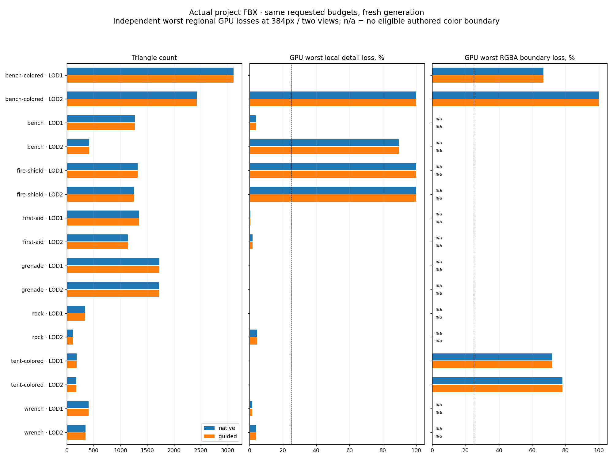
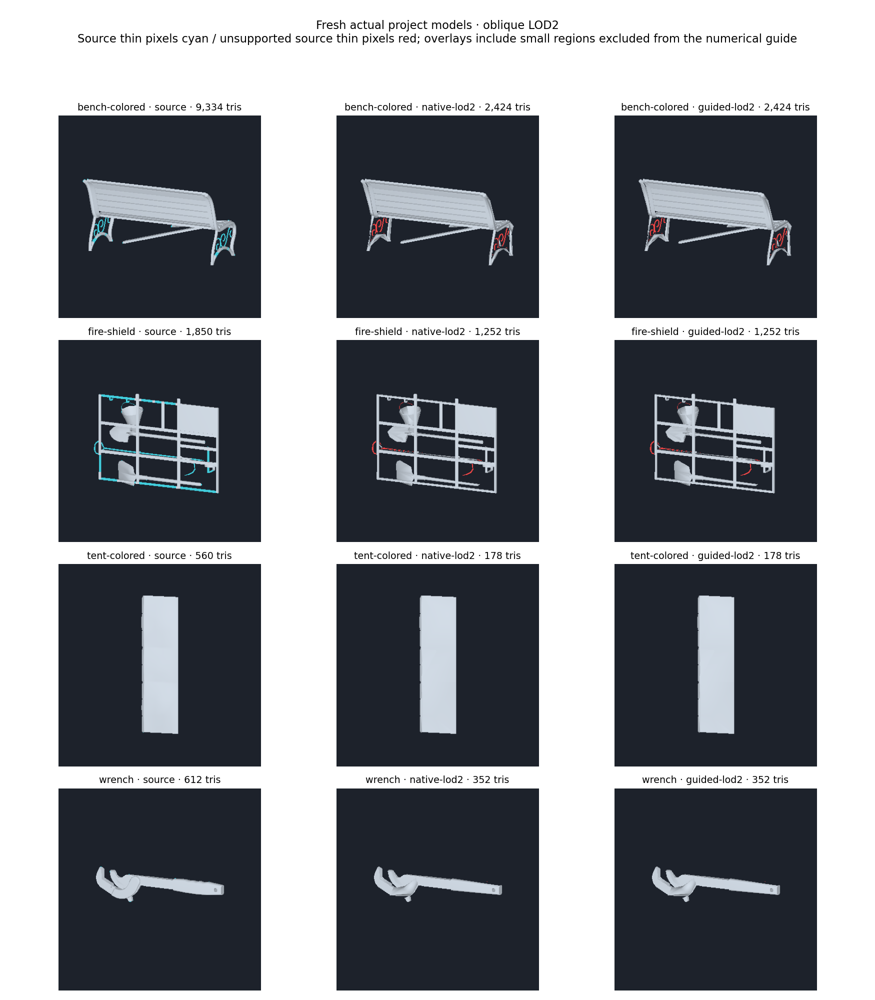
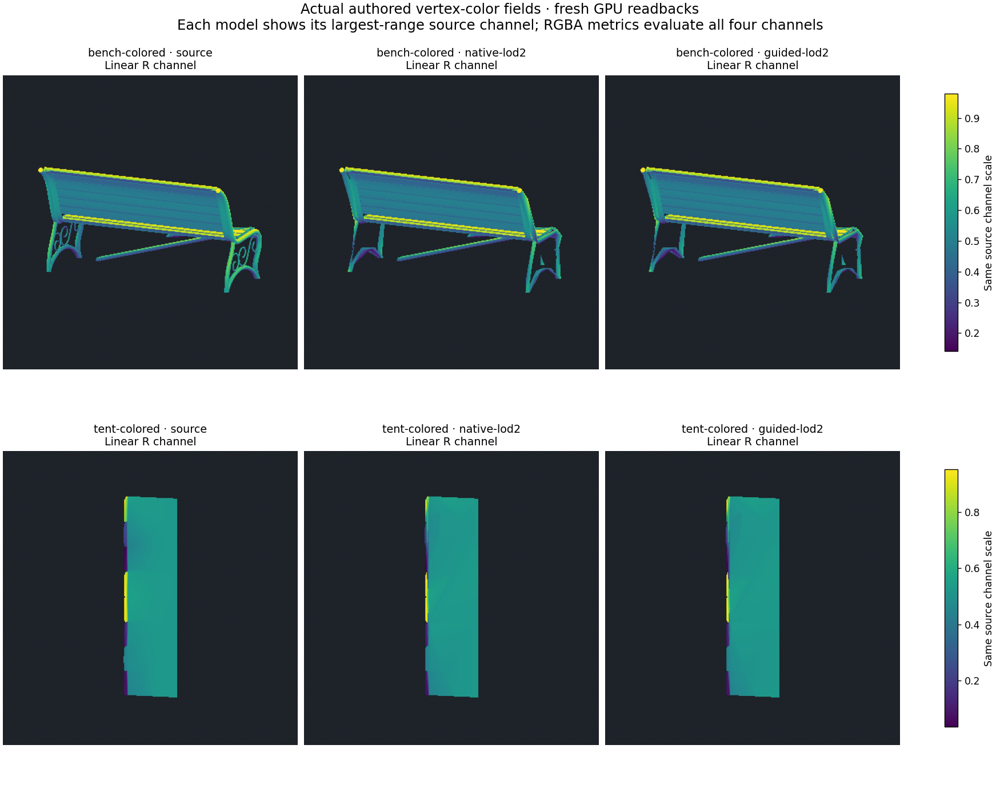

# Optional screen-guided LOD selection

`LOD Gen > Screen Quality Guide` connects the local detail/paint diagnostics to
triangle-budget candidate selection and whole-component removal. It is an
experimental option, disabled by default. Native crease constraints and chain
coarsening remain separate options.
The option is available with `Triangles` and `Prioritize Triangle Budget`; the
result panel shows local detail and RGBA-boundary loss, with unevaluated paint as
`n/a`.

## Decisions

`LodScreenValidation` renders six deterministic, double-sided orthographic views
on the CPU, with depth testing, four subpixel coverage samples and interpolated
Float32 RGBA. It needs no GPU, scene camera, material or Editor rendering pipeline.
Views preserve the projected aspect ratio and use the original source's framing
for every candidate. Sharp color checks require authored varying vertex colors;
missing, constant or insufficiently resolved paint is not reported as accepted.

The existing `LodScreenAcceptance` helper measures thin regions, visible image
components and sharp RGBA boundaries. The selection guide uses the worst eligible
regional loss across the six views at a fixed 256-pixel frame. Its added score is
`4 * (detailLoss + levelColorWeight * colorLoss)`. The far-LOD color weight therefore
still permits a weaker color preference. Budget reachability, the preceding
protected density cap and the existing five-percent undershoot band keep their
precedence. This is a ranking heuristic; an unreachable budget or failed guide
does not restore LOD0 automatically.

Native retry probes and outer quality variants both include this score. Attribute
correction is still attempted on the selected candidate. Its replacement is
retained only if neither worst detail loss nor worst color-boundary loss increases
(numerical tolerance `1e-6`). Otherwise the entire replacement is destroyed and the
candidate's original attributes and before-correction measurements are retained.
Normal and RGBA fitting keep their existing surface and smoothing-region checks.
This guard does not fit new categorical paint labels or optimize paint seams.

Before accepting a proposed whole-component deletion, the same helper compares
the retained source with the complete source. Its pixels-per-world-unit estimate
uses the existing LODGroup size, renderer transform, target transition height and
configured screen height. Removal probes allocate a canvas large enough to retain
that pixel scale, capped at 1024 pixels. An oversized/invalid probe retains the
parts rather than making them artificially subpixel. The plan is rejected as a
whole if an eligible region loses more than 25%; subpixel and small excluded
regions can still disappear. Main components, extrema and manually protected
parts remain protected by the existing analysis. This conservative batch guard
does not search for a smaller acceptable subset of the proposed deletions.

## Verification and limitations

Selected Unity regressions and a fresh eight-model native/guided comparison are
recorded with source hashes, raw GPU-readback hashes and measured counts in
[LOD_SCREEN_GUIDED_RESULTS.json](LOD_SCREEN_GUIDED_RESULTS.json). The accompanying figures use actual copied
project FBX meshes and fresh GPU captures. CPU guide values and independent GPU
diagnostics are different measurements: six source-local CPU views at 256 pixels
versus the existing front/oblique GPU previews at 384, 192 and 96 pixels.

**203 selected EditMode tests passed, with zero failures or skips**, on Unity
6000.2.6f2, GTX 980 Ti, Direct3D12. The full run took 916.37 seconds. All eight
original FBX hashes remain unchanged. Eight fresh models produce 80 variant/view
captures; 96 source/control color and coverage readbacks are byte-identical to
the preceding native evaluation.

**No quality or budget improvement was measured in this comparison.** All sixteen
guided levels selected the same outer variants and counts as their controls. All
64 guided color/coverage readbacks and all 32 guided shaded readbacks are
byte-identical to the fresh native controls. No attribute replacement was refused
on these models. Hard-edge, protected-face and patch-interface losses remain zero;
the source fallback count is zero and the Bench B LOD2 strict-belt fallback remains.
Both modes reach six of sixteen budgets, including two of eight LOD2 budgets.

| Actual project mesh | LOD0 | Both modes LOD1 | Both modes LOD2 | LOD2 target |
| --- | ---: | ---: | ---: | ---: |
| Park Bench B | 9334 | 3111 | 2424 | 1038 |
| Park Bench A | 3832 | 1269 | 416 | 426 |
| Fire Shield | 1850 | 1324 | 1252 | 206 |
| First Aid Kit | 2886 | 1348 | 1138 | 321 |
| M84 grenade | 2040 | 1729 | 1721 | 227 |
| Rock | 1010 | 336 | 112 | 113 |
| Rainbow tent roof | 560 | 186 | 178 | 63 |
| Wrench | 612 | 406 | 352 | 68 |

The CPU guide accepts the detail threshold for nine of sixteen levels and no
eligible painted level. These flags do not enforce acceptance on budget-first
generation. GPU detail losses still reach 100% for small eligible regions on
Bench B LOD2 and Fire Shield, and 89.47% on Bench A LOD2. Tent LOD2 worst eligible
paint-region loss remains 78.16% at 384 pixels. Extra CPU views flag some regions
absent from the two GPU views; different footprints and rasterization also affect
which regions are eligible.

Measured Generate time, counting both levels once per model, increased from
340.37 to 497.04 seconds across the eight models (**46.0%**). Bench B increased
from 178.87 to 231.06 seconds; Wrench from 5.13 to 13.77 seconds. These are single
run timings, not a controlled performance benchmark. The option remains off by
default: the existing candidate set still needs geometry that can retain the
missing details and paint boundaries, and repeated probe/outer measurements
should be cached before making this guide inexpensive enough for regular use.







The primary generation comparison keeps identical requested factor-three budgets,
native crease settings, three quality variants and level-specific attribute
profiles. It does not prune parts. A separate source-only probe checks the
proposed small-part plans at a 1080-pixel screen, LOD2 transition `.25`, an 8-pixel
part limit, two-percent area and twenty-percent triangle limits. A model without
an eligible plan is unevaluated for that probe. Unit regressions additionally
exercise visible-part refusal, subpixel allowance, transformed sources,
oversized-probe refusal, depth/alpha behavior and cancellation.
In this run **none of the eight meshes proposed an eligible deletion plan**.
Consequently, the dataset does not prove that this guard prevents a bad actual
component deletion; refusal/allowance behavior is covered by controlled mesh
regressions. No actual component was removed in the native/guided GPU matrix.

The views use no original materials, alpha cutouts, normal maps, project cameras,
assemblies or transitions. Image components are not semantic part identifiers.
Eight-pixel detail regions, four-pair paint regions, contrast `.15`, endpoint and
contrast tolerance `.1`, one-pixel positional tolerance and the 25% loss guide
remain experimental. No accepted guide certifies general visual quality.

## Reproduction

Run the selected LOD/collision EditMode suite, including
`LodScreenValidationTests`, against the isolated Unity project and copied FBX
dataset. Add these flags for the fresh comparison:

```text
-meshlabLodProjectCases <copied-cases.json>
-meshlabLodVisualOutput <output>
-meshlabLodBudget -meshlabLodHardEdges -meshlabLodScreenGuided
```

The existing readback-replay test additionally needs
`-meshlabLodScreenInput <previous-native-matched-output>`. Omit `-nographics` and
`-quit` for the GPU EditMode run. Audit the results with:

```text
python Tools~/render_lod_screen_guided.py <output> --baseline <previous-native-matched-output> --tests <final.xml>
```

Workstation artifacts: `_results~/lod-screen-guided-20261010/final/`;
canonical test results/log: `final.xml`, `final.log`. The audit also verifies the
post-run original FBX hashes in `original-source-hashes.json`. Portable results
include source-code and readback hashes. The earlier seven-test focused run is
additional evidence; it is not added to the 203-test count.

Next, form candidates that retain the failing thin and paint regions, include
explicit RGBA-weighted variants in the painted-model comparison, reuse immutable
probe measurements, then calibrate the six-view guide against original materials,
actual screen sizes and transitions before considering a default change.
The factor-three budgets and broad visual acceptance remain unfinished.
