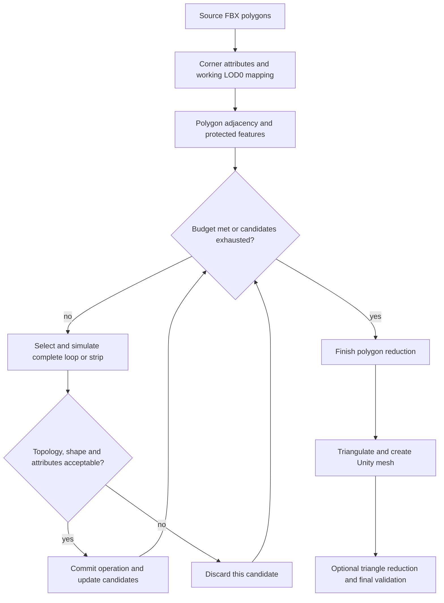

# LOD simplification from source polygon topology

**Reviewed:** 2026-10-10. **Status:** source and literature research with a conservative managed full-loop prototype; see [usage and boundaries](LOD_FULL_LOOPS.md). An isolated libigl QSlim comparison now covers the same eight real project FBX meshes at the current meshoptimizer baseline's actual LOD1/LOD2 budgets; see [measurements and images](LOD_PROJECT_VISUAL_EVALUATION.md#step-3-libigl-qslim-matched-budget-comparison--2026-10-10). Other candidate libraries remain unbenchmarked.

## Recommendation

Read the original polygons from the source FBX before Unity triangulation. Build a polygon adjacency graph with attributes stored per corner. Reduce suitable quad regions by removing complete loops or collapsing complete quad strips. Validate each result against the working LOD0, then triangulate for Unity.

Keep meshoptimizer for a separate triangle simplification mode and an optional final reduction stage. A strict full-loop mode must stop when no valid complete operation remains; enabling triangle reduction afterwards relaxes that mode's edge-flow guarantee. Each LOD should initially be generated independently from the source, with its budget expressed relative to LOD0.

For a first prototype, reuse the existing FBX SDK reader and implement a small, conservative operator for regular quad regions. Evaluate PMP as a reusable polygon data structure if this grows into a general editing backend. There is no verified candidate in this review that combines a permissive license, production-ready full-loop reduction, and automatic preservation of all Unity attributes.

## What topology preservation means here

These requirements need separate controls and measurements:

| Requirement | What must survive | What it does not establish |
| --- | --- | --- |
| Surface topology | Manifold connectivity, connected components, handles, boundary loops and orientation | Artist-authored quad flow or visual similarity |
| Quad flow | Coherent quad regions and complete loop/strip operations | An exact triangle budget or preservation of every original edge |
| Appearance | Silhouette, geometry, shading, UVs, materials and vertex-color fields | Unchanged connected-component count |
| Small-part removal | Explicitly selected object groups or insignificant components are removed | Strict preservation of the original surface topology |

An edge-collapse algorithm can enforce topological legality while disrupting quad flow. Conversely, retaining quads alone does not prevent intersections or appearance loss. CGAL's triangle simplifier rejects collapses failing its topological/geometric conditions, but it is not a quad-loop reduction algorithm. [CGAL simplification manual](https://doc.cgal.org/latest/Surface_mesh_simplification/index.html).

Removing an entire small component intentionally changes component count. Removing a semantic part that is connected to the main surface may also create a hole. Keep this operation explicit and record its effect separately from loop reduction.

## Getting the original polygons

The repository already has the needed starting point:

- [`FbxSourceDocument`](../Editor/Assets/FbxDocumentEdit.cs) imports an FBX scene without a triangulation call in this reader.
- `FbxLayerChannels.Topology` reads `GetPolygonCount()`, `GetPolygonSize()` and `GetPolygonVertex()`. Its arrays retain polygon sizes and corner-to-control-point indices.
- The same file provides per-corner access to UV sets and vertex colors. [`FbxCornerMatch`](../Editor/Assets/FbxCornerMatch.cs) is relevant to matching source corners with Unity vertices.

If the exported FBX contains quads, use those quads directly. Unity's duplicated render vertices at UV, normal or material seams are not the source control-point graph. Do not reconstruct connectivity by simply welding equal-position Unity vertices: this can join separate shells and erase attribute discontinuities.

Source polygons encode connectivity, not persistent artist-assigned loop IDs. Trace loops through regular quad vertices and strips through opposite quad edges. Stop or reject ambiguous continuations at poles, triangles, n-gons, non-manifold junctions and protected boundaries.

If the FBX was triangulated before export, the authored quad pairing is generally ambiguous. Triangle pairing can be offered as a heuristic with confidence diagnostics, but must not be reported as recovery of the original authored topology. Prefer an untriangulated DCC export or a topology sidecar produced by the DCC.

The extraction needs node/geometry transforms, units and axis conversion, corner normals, all required UV channels, float RGBA, material IDs and smoothing/crease information. Attribute mapping must reconcile source FBX with the **current working LOD0**, including edited/repacked UV2 and baked colors. A stale source file must not overwrite newer working attributes. Procedural meshes and meshes without accessible source polygons need the triangle mode.

The existing SDK path is gated by `LIGHTMAP_UV_TOOL_FBX_EXPORTER`. An independent reader is optional: [ufbx](https://github.com/ufbx/ufbx) exposes polygon faces and corner-indexed attributes, with explicit triangulation utilities. Its [mesh documentation](https://ufbx.github.io/elements/meshes/) describes the distinction between logical vertices and attribute indices. It is a reader, not a replacement for our FBX writing path.

## Algorithms worth investigating

### Complete edge-loop dissolve

Remove an entire regular loop and reconnect its neighboring rows. For example, remove one intermediate ring along a sufficiently smooth quad cylinder while retaining the surrounding rings. A sequence of individual dissolves must be treated as one transaction: either the complete loop is valid and accepted, or none of it is applied.

Simply merging faces across loop edges can leave n-gons and vertices that still contribute triangles. The operator must remove redundant loop vertices and reconstruct the neighboring faces. Measure triangle reduction **after** triangulation; edge count alone is misleading. On curved or twisted strips, the new faces can change surface shape and shading substantially.

### Polychord / quad-strip collapse

Collapse a strip of quads by merging corresponding vertices on its two sides. This is a close match for structured quad reduction, though it is a different operation from dissolving an edge loop while leaving surrounding vertices in place.

VCGlib's [`PolychordCollapse`](https://github.com/cnr-isti-vclab/vcglib/blob/main/vcg/complex/algorithms/polygon_polychord_collapse.h) explicitly supports complete rings and strips terminating at mesh borders. It expects polygonal quad input, provides link-condition checks and options concerning singularities; triangulated input is insufficient. Its rejection states should not be mistaken for a complete geometric self-intersection guarantee.

The implementation references Daniels et al., *Quadrilateral Mesh Simplification* (2008), listed on the [author's publication page](https://www.sci.utah.edu/~jdaniels/Joel_Daniels_Homepage/Publications.html). Follow-up [Localized Quadrilateral Coarsening](https://onlinelibrary.wiley.com/doi/10.1111/j.1467-8659.2009.01520.x) develops localized polychord operations for greater control over important surface regions. Complete strips can be too long or entangled to remove; localized variants improve flexibility but relax the user's complete-loop requirement.

### Local quad simplification

[Practical Quad Mesh Simplification](https://onlinelibrary.wiley.com/doi/10.1111/j.1467-8659.2009.01610.x) combines local quad operations with smoothing. It is relevant when retaining quad structure is more important than deleting exclusively complete loops. Treat it as a different mode, rather than labeling all quad-preserving operations as full-loop deletion.

VCGlib's quad simplification sample is useful for research, but its readiness needs caution: a MeshLab maintainer reported in 2022 that this code had been removed from MeshLab because of robustness problems. A later participant reported build problems in 2024. These are historical upstream reports, not a measured failure of the current checkout. [Maintainer discussion and sample link](https://github.com/cnr-isti-vclab/meshlab/discussions/1056).

### Un-subdivision

Reverse regular subdivision patterns when the source actually has such a pattern. Blender has a [`BMesh un-subdivision implementation`](https://github.com/blender/blender/blob/main/source/blender/bmesh/tools/bmesh_decimate_unsubdivide.cc). This is a useful reference and an offline DCC option, but arbitrary artist topology is not necessarily a subdivision grid. It also reduces in discrete patterns rather than targeting any requested triangle count.

### Quad-dominant QEM

[Single Edge Collapse Quad-Dominant Mesh Reduction](https://arxiv.org/abs/2411.16874) accepts mixed quad/triangle meshes and modifies quadrics and collapse ordering to retain more quad structure. This is promising for irregular assets and an eventual middle mode between strict loops and triangles. It still operates through individual edge collapses, so it does not implement atomic removal of every complete loop. An independently reusable implementation and its distribution license were not verified in the primary links reviewed here; classify it as an algorithm research lead, not a ready dependency.

### Triangle QEM / attribute-aware collapse

Keep this baseline for already triangulated or highly irregular input. Meshoptimizer supports attribute weights and vertex locks, while triangle-oriented libraries offer other legality, placement and distance policies. None reconstructs authored loops just by enabling topology preservation. [Meshoptimizer attribute-aware and advanced simplification](https://github.com/zeux/meshoptimizer#attribute-aware-simplification).

## Open-source candidates

Licenses below describe the reviewed components. A selected version and its transitive dependencies still need to be pinned and reviewed before distribution.

| Candidate | Useful role | Complete-loop reduction available? | License / integration considerations |
| --- | --- | --- | --- |
| [meshoptimizer](https://github.com/zeux/meshoptimizer) | Existing fast triangle backend; normal/UV/color costs and feature locks | No source quad-loop operator | [MIT](https://github.com/zeux/meshoptimizer/blob/master/LICENSE.md); already integrated |
| [PMP](https://github.com/pmp-library/pmp-library) | Polygon halfedge mesh with custom vertex, face and halfedge properties | Custom operator required; built-in decimation is for triangles | MIT; current `main` requires C++20 and Eigen 5.0.1 |
| [VCGlib](https://github.com/cnr-isti-vclab/vcglib) | Direct polychord implementation and quad simplification sample | Yes, for supported quad strips/rings | Reviewed polychord header is GPL-2.0-or-later; robustness and build evaluation needed |
| [libigl](https://github.com/libigl/libigl) | Triangle decimation callbacks and source-surface distance/projection tools | No | Reviewed `decimate` and distance headers are MPL-2.0; optional modules have other licenses |
| [CGAL](https://github.com/CGAL/cgal) | Triangle collapse policies, constraints and geometric filters | No | [Simplification header](https://github.com/CGAL/cgal/blob/master/Surface_mesh_simplification/include/CGAL/Surface_mesh_simplification/edge_collapse.h) is GPL-3.0-or-later or commercial; larger integration scope |
| [ufbx](https://github.com/ufbx/ufbx) | Independent FBX polygon/corner extraction | Reader only | MIT or Unlicense; single C source, additional native bridge if used from C# |
| [UnityMeshSimplifier](https://github.com/Whinarn/UnityMeshSimplifier) | Managed C# triangle QEM comparison; Unity attribute support | No | MIT; easier managed integration, but no demonstrated quality gain over our current backend |
| [Blender BMesh](https://github.com/blender/blender/tree/main/source/blender/bmesh) | Reference dissolve/un-subdivision operations; external DCC processing | Useful primitives; complete-loop selection and policy still needed | Reviewed un-subdivision source is GPL-2.0-or-later; substantial Blender dependencies |

PMP's [`SurfaceMesh` API](https://github.com/pmp-library/pmp-library/blob/main/src/pmp/surface_mesh.h) has polygon edge-removal operations and halfedge properties suitable for corner data. However, `collapse()` and `is_collapse_ok()` are explicitly triangle-only. Its [`decimation` API](https://github.com/pmp-library/pmp-library/blob/main/src/pmp/algorithms/decimation.h) also requires triangle input. A custom polygon strip operator and attribute propagation remain necessary. Current [target build settings](https://github.com/pmp-library/pmp-library/blob/main/src/pmp/CMakeLists.txt) and [dependency settings](https://github.com/pmp-library/pmp-library/blob/main/CMakeLists.txt) need reconciling with our C++17 native build; do not fetch a moving branch.

[OpenMesh](https://www.graphics.rwth-aachen.de/software/openmesh/) is another polygon halfedge foundation. Its official upstream is hosted outside GitHub. Current versions use [BSD-3-Clause](https://www.graphics.rwth-aachen.de/software/openmesh/license/). It is an alternative data-structure choice, not a verified ready-made full-loop reducer.

For correction/validation, libigl's [`point_mesh_squared_distance`](https://github.com/libigl/libigl/blob/main/include/igl/point_mesh_squared_distance.h) returns closest source faces and points; its [`decimate`](https://github.com/libigl/libigl/blob/main/include/igl/decimate.h) exposes collapse callbacks and intersection-blocking options. Closest-point queries support attribute transfer, but attribute interpolation and correspondence restrictions still belong to our pipeline. CGAL's [manual](https://doc.cgal.org/latest/Surface_mesh_simplification/index.html) documents constrained edges and normal/envelope filtering; [licensing is component-specific](https://www.cgal.org/license.html).

[FlowLOD](https://github.com/solid-state-games/flow-lod) is useful as an offline workflow reference. Despite its repository description mentioning recovered flow, the reviewed README says its reducer is Blender's Decimate. Its MIT wrapper should not be counted as a separate verified full-loop algorithm, nor does its license relicense Blender.

## libigl follow-up (2026-10-09)

The supplied [tutorial](https://libigl.github.io/tutorial/#mesh-decimation) is relevant, but its default `decimate` uses shortest-edge/midpoint collapse. For a production comparison, prefer [`qslim`](https://github.com/libigl/libigl/blob/main/include/igl/qslim.h): multidimensional quadric error reduction with an explicit face budget, boundary support and optional intersection blocking. Its documented input is edge-manifold. [`decimate`](https://github.com/libigl/libigl/blob/main/include/igl/decimate.h) also permits custom costs, stopping criteria and pre/post-collapse callbacks; it reports failure if the face budget remains unreachable.

`qslim` is a triangle edge-collapse alternative, not a complete-loop remover. Its n-dimensional input offers a way to incorporate continuous color/texture coordinates, but Unity corner seams, material slots, normal normalization and channel reconstruction need explicit handling. Birth-face/vertex mappings alone are not a complete attribute transfer.

[`point_mesh_squared_distance`](https://github.com/libigl/libigl/blob/main/include/igl/point_mesh_squared_distance.h) and barycentric coordinates are candidates for transfer/quality assessment against LOD0. The subsequent comparison uses the planned LOD0/LOD1/LOD2 chain, matching actual baseline counts near 1/3 and 1/9; the earlier proposed extra 1/27 level is outside the current plan. See [Step 3](LOD_PROJECT_VISUAL_EVALUATION.md#step-3-libigl-qslim-matched-budget-comparison--2026-10-10) and [offline runner](../Tools~/compare_lod_qslim.py). The pinned Python bindings 2.6.3 run 3D geometry-only QSlim, with chart-aware attribute transfer and the same accepted normal/RGBA correction afterward. On LOD2, five of eight models improve in both sampled geometry distance and the measured GPU silhouette, while Fire Shield, grenade and tent worsen. Fourteen of sixteen outputs reach their targets; authored RGBA has counterexamples. This supports an additional gated candidate experiment, not an unconditional backend replacement. No production libigl runtime dependency or distributed native binary is added.

## Proposed prototype

This is a proposed architecture, not a claim about existing behavior. Every quality check uses working LOD0 as the reference, and rejection must not retry an unchanged candidate indefinitely.

1. Extract polygons and corner data; verify correspondence with working LOD0. Report the proportion of usable quad faces and explicit reasons for rejecting source topology.
2. For the first operator, accept only unambiguous regular loops/strips. Protect boundaries, hard creases, material borders, UV seams, categorical color transitions and user-selected features.
3. Simulate the whole operation. Reject invalid links/connectivity, duplicate or degenerate faces, flipped faces, unacceptable intersections and excessive source-surface/attribute deviation. Loop-wide legality needs its own check; independent single-edge checks are insufficient.
4. Rank accepted candidates by measured error and actual post-triangulation triangle savings. Update neighboring candidates after each accepted operation.
5. Stop honestly when constraints block the requested budget. Show requested/actual count, deleted loop count, blocked candidates and error against LOD0.

Independent generation from the original is the initial policy. Progressive generation from the preceding LOD can later reuse a validated polygon sequence, but all budgets and final quality checks must still reference LOD0. Do not treat each step's local error threshold as a bound on cumulative source deviation.

## Normals, colors and correction

The initial audit found that [`MeshSimplifier`](../Editor/MeshSimplifier.cs) weighted normals and one selected UV channel, while copying colors through `colors32` without using them in the collapse cost. The prototype now adds configurable float RGBA weights and retains float color precision. The [native bridge](../Native~/xatlas-unity-bridge.cpp) still passes a null `vertex_lock` pointer for triangle LOD simplification; the managed loop mode protects features through its polygon graph.

For both modes, use float RGBA internally and configurable per-channel weights. Distinguish continuous fields, such as AO or blend masks, from categorical region IDs: interpolating an ID invents a new region. Attribute discontinuities belong to corners; shared geometric vertices must retain separate corner values across seams.

Compare interpolated signals **inside faces**, not just at retained vertices. A surviving vertex can preserve its normal/color exactly while the new triangle interpolates badly across its interior. Measure normal-angle error, RGBA error and relevant shader-mask transitions at source and destination samples.

For changed vertex positions, obtain a source triangle and barycentric coordinates, interpolate its attributes, normalize normals, and preserve hard-edge side selection. Restrict correspondence by source part/material, orientation and distance so a thin shell does not project onto its opposite side. Rebuild tangents consistently with the final normals and UV0. Re-run the measurements after correction; transfer alone cannot restore a lost silhouette or recover detail beyond the reduced mesh's sampling capacity.

## Validation before choosing a backend

The original research did not benchmark candidate libraries. The later isolated QSlim experiment now measures eight actual project meshes, alongside synthetic regression tests; its matched budgets, preparation, transfer policy and limitations are documented in [Step 3](LOD_PROJECT_VISUAL_EVALUATION.md#step-3-libigl-qslim-matched-budget-comparison--2026-10-10). No other candidate library has been evaluated comparatively. Synthetic EditMode fixtures establish selected behavior, not visual quality on production assets.

Build reproducible fixtures: a quad grid, cylinder rings, beveled box, torus, open surface, thin double-sided shell, mixed triangle/quad asset and irregular poles. Add UV/hard-normal/material seams, continuous color gradients, categorical masks, authored UV2, disconnected tiny parts and mirrored/nonuniform transforms. Include paired triangulated/untriangulated FBX exports and at least representative production assets.

Compare the current meshoptimizer baseline, strict full-loop reduction, a hybrid mode, and selected alternative triangle/quad algorithms at the same **actual** triangle count:

- Check manifold links, components, boundaries, orientation and expected handles. Euler characteristic is a useful diagnostic, not a sufficient validity certificate by itself. Detect geometric intersections separately.
- Record deleted complete loops, retained quad regions, valence distribution, budget attainment and why operations were blocked.
- Measure bidirectional sampled surface distance, normalized by source size, with maximum and percentile statistics. Sampled distance is an estimate, not a certified Hausdorff bound.
- Measure corner-aware normal-angle, UV and float color errors, including face-interior samples. Validate representative shader masks and baked-lightmap behavior.
- Render multiple views/distances for silhouette, shading and LOD transition comparison. Record runtime and peak memory; do not select by triangle count or screenshots alone.
- Verify repeat Generate, authored LOD retention, Undo, cancellation, mesh cleanup and FBX round trips when the prototype reaches Editor integration.

Source-topology extraction, conservative complete-loop deletion and an optional validated triangle stage are implemented in the managed prototype. The QSlim measurements justify further evaluation of a gated alternative candidate, including attribute costs, thin-surface legality and intended gameplay distances, before choosing a permanent extra dependency. Native integration, if selected, must update source and use `build-native.yml` for distributed binaries.
