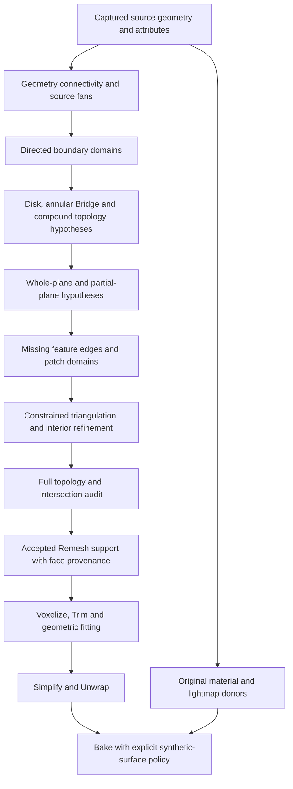

# Cap architecture and implementation plan

2026-10-09. Baseline `292c47a`, branch `codex/remesh-and-bake`, PR #225.
This follows [the research](REMESH_LOCAL_CAP_RESEARCH.md). Production Cap is not
implemented. The offline benchmark now covers boundary extraction and plane
hypotheses; the remaining stages are defined below.

## Working model

One opening is an **oriented boundary domain**, potentially with several loops,
surface regions and missing feature edges. It is not necessarily one polygon in
one plane. Reconstruct its surface structure before choosing its triangulation.



Alternative hypotheses and refusal reasons remain available until a complete
candidate is validated. Detection, reconstruction and acceptance must have
separate outputs. A fitted plane is evidence, not an accepted face.

## Current code: reuse and gaps

| Current component | What exists | Architectural consequence |
| --- | --- | --- |
| `Tools~/RemeshCapBenchmark/failure_capture.py` | Replays version 2 source/raw/input positions and indices plus metadata. | Reuse exact stage geometry. It captures no UV, normals, tangents or material assignments; attribute preservation needs separate managed tests. |
| `topology.py::inspect` | Exact-position connectivity, edge incidence/winding, duplicate/degenerate faces and disconnected fan counts. | Reuse as an independent audit. Counts and bad positions do not provide ordered boundary halfedges or source-fan traversal. |
| `compound.py::validate_boundaries` | Checks supplied directed cycles against every source boundary edge. | Current experiments depend on external JSON cycles. Selected-opening closure needs a domain-scoped coverage contract while preserving unselected boundaries. |
| `compound.py::generate` | Explicit shear/floor, projected triangulation and interior refinement; geometry auditing. | Retain as a measured comparator. It remaps to welded slots and verifies source face geometry, not preservation of original attribute/index arrays. Its global-floor surface and winding-based grouping are not the new local solver. |
| `branch.py::reconnect` | Bounded two-fan Cap-only reconnection with exact changed-patch checks. | A specialized candidate operation; it is not boundary extraction or an arbitrary source repair. |
| `intersections.py`, `analyze.py::scan` | AABB broad phase and exact triangle classification, including improper adjacent overlaps. | Reuse offline narrow-phase acceptance and distinction between existing and introduced defects. |
| `Editor/Geometry/RemeshTopology.cs` | Managed geometric topology inspection and strict native-output guards. | Keep guards. Offline exact-zero area and managed area policy must be compared explicitly, rather than assumed equivalent for slivers. |
| `Editor/TriangleBvh.cs` | Ray and nearest-point queries, including normal/facing filtering. | Current public API does not expose triangle-AABB candidate enumeration or an exact triangle-triangle classifier. Cap intersection certification cannot be replaced by raycasts. |
| `Editor/RemeshPipeline.cs` | Four stages; captured `node.source` feeds voxelization, Trim, surface fitting and baking. | Add preparation inside Remesh initially, with distinct geometric support and original bake references. No new public stage/asmdef is needed for the prototype. |

No native ABI change is required to experiment on position/index arrays before
voxelization. Native topology defects remain a separate investigation, even if
an input Cap passes its own guards.

## Proposed data boundaries

Names below describe responsibilities, not types already shipped in the package.

| Data | Required contents and invariants |
| --- | --- |
| `SourceSnapshot` | Original positions/indices and attribute references, capture-space transform, node identity and content identity. Freeze after the existing source-filter stage. |
| `ConnectivityView` | Virtual geometric slots, mapping back to original corners, edge incidents and oriented fan adjacency. Never rewrite the original snapshot merely to weld the analysis view. |
| `BoundaryDomain` | Ordered directed halfedge occurrences `(face, corner, fan)`, loop membership, selected-opening intent, collar and preexisting defect references. Stable identity is tied to a specific snapshot. |
| `ClosureHypothesis` | Grouped boundary rims, disk/annulus/compound operation, source collar evidence, patch topology and expected assembled components/genus when intent is known. Planarity alone cannot select this operation. |
| `PlaneHypothesis` | Local origin/normal, support edge intervals, rank, maximum/RMS residuals, scale, tolerance and evidence. Partial support respects cyclic ordering. |
| `FeatureGraph` | Existing junctions, proposed finite missing edges, proposed two-/three-plane intersection vertices, patch adjacency and explicit constraints. Every proposed feature has provenance. |
| `PatchPlan` | Closed domains/inner boundaries, fixed border and shared feature edges, winding, chosen construction method and refinement/search budgets. |
| `CapCandidate` | Added positions/faces plus an original-corner mapping, patch IDs, synthetic-face flags and the hypothesis that produced them. Original source arrays remain unchanged. |
| `CapAudit` | Independent preservation, coverage, topology, geometry and shape-prior results; existing defects; rejection witnesses; budget/cancellation status. |
| `RemeshSupport` | Validated assembled geometry and source/synthetic provenance. Read by geometry stages; never silently appended to original material/lightmap donors. |

Allow several vertex indices at one boundary position for attribute purposes,
but validate the geometry after exact position welding. Preserve original face
prefix and attribute arrays under Cap-only operation. Local source repair has a
different explicit edit map and must not claim that contract.

Suggested offline module responsibilities, introduced only as their milestones
are implemented: `boundaries.py`, `planes.py`, `structure.py`, `local_cap.py`.
Keep existing auditors independent. The eventual managed counterparts belong in
`Editor/Geometry/` and operate on snapshots, without direct scene/asset mutation.

## Structure recognition

First classify possible closure topology across boundary domains. Two rims may
need one annular Bridge rather than two independent disks. The [torus-band
counterexample](REMESH_CAP_BRIDGE.md) passes all local gates with either closure,
but only the Bridge preserves its intended handle. The open source signature
alone cannot choose: a box missing opposite faces has the same open signature
and needs disks. Keep operation alternatives and explicit intent ahead of local
plane fitting and sequential acceptance.

First test the complete contour. A plane requires non-collinear support;
maximum distance limits matter in addition to RMS. Weight by arc length so
uneven edge subdivisions do not dominate. Center computations in the local
capture frame and retain float32 conversion checks.

If one-plane support fails, generate and compare bounded hypotheses for
contiguous planar chains. Refit the complete chain when extending it. Cover
every boundary occurrence, handle wraparound, merge compatible neighbors, and
penalize unnecessary segmentation. A smooth curved rim must not become many
small planar faces simply because each short chain admits a fitted plane.

Do not require exactly three edges per region. Two nonparallel straight edges
already span a plane, but whether it describes a missing face requires further
structural evidence. A collinear chain cannot select a unique plane. Box side
normals are also not expected to equal the missing face normal across a corner.

Then build a constrained feature graph. Two plane intersections propose a line;
boundary junctions and patch closure must establish its finite edge. Three
independent plane intersections may propose a new corner. Check conditioning,
domain membership, winding, collisions and occupied source edges/faces before
accepting either. Near-parallel planes or several plausible graph completions
produce alternatives or an explicit refusal. Right-angle assumptions are a
box-specific prior, not a global rule.

Complete one planar patch tentatively inside a hypothesis branch, then audit its
continuous source-fan support, selected/unselected edge coverage and exact
new/source and new/Cap intersections. Re-extract the changed boundaries and
plane hypotheses: the added common edge may disambiguate the neighboring patch.
Never reuse old snapshot-bound loop selections. Roll back the branch if later
completion fails, rather than treating an earlier locally valid face as proof
of the intended surface. Preserve the original donor geometry throughout.

Compare candidates using geometric residual, evidence, shape consistency and
model complexity under fixed budgets. Report the terms; do not publish an
unvalidated numeric confidence threshold. A best-scoring rejected candidate
remains rejected.

## Initial analytic measurement

`Tools~/RemeshCapBenchmark/box_structure_probe.py` uses an axis-aligned box of
side 2. It fits the whole boundary with an arc-length-weighted least-squares
plane. The restored faces are **known reference geometry**, supplied from the
box definition, not automatically inferred. Unused source vertices are removed,
so the three-face case cannot rely on a hidden original corner.

| Missing faces | Boundary loops / edges | Maximum whole-plane distance | Reference triangles added | New reference vertices |
| --- | --- | ---: | ---: | ---: |
| One | 1 / 4 | 0 | 2 | 0 |
| Two adjacent | 1 / 6 | 0.942809 | 4 | 0 |
| Two opposite | 2 / 4+4 | 0 for each loop | 4 | 0 |
| Three meeting at a corner | 1 / 6 | 0.577350 | 6 | 1 |

All four reference closures pass the existing closed-manifold and exact
intersection audits while preserving source arrays. Four new test methods
cover these configurations and rotated/translated/scaled plane fits. **37/37
offline tests pass** with NumPy 2.1.3 and Triangle 20250106. This is not a Unity
test or evidence that an automatic feature-graph solver exists.

Reproduce from the repository root with the benchmark dependencies installed:

```powershell
python 'Tools~/RemeshCapBenchmark/box_structure_probe.py' --output '_results~/cap-structure/box.json'
python -m unittest discover -s 'Tools~/RemeshCapBenchmark' -v
```

The box probe now consumes the source-fan-aware extractor and reports P2 plane
hypotheses. Its restored faces still come from the known box reference, not a
Cap solver. Current plane results are recorded in [P2 results](REMESH_CAP_PLANES.md).

## Milestones and exit criteria

| Milestone | Work | Required result |
| --- | --- | --- |
| P0 — architecture and reference fixtures | Map current stages and contracts; establish known box closures. | Completed by this change: plan, reproducible probe, 37 passing offline tests. |
| P1 — boundaries | Build virtual connectivity, face-fan-aware halfedge traversal and selected-domain coverage. | Exact coverage once per selected directed boundary; no cross-fan pairing; deterministic identities/refusals under seam splits, reversed winding and contour offsets. No Cap faces generated yet. |
| P2 — planes | Whole-contour fit, rank/tolerance checks and contiguous partial-plane hypotheses. | Single/opposite-face boxes select separate planar rims; adjacent-face box yields a supported two-plane hypothesis. Curved, collinear and noisy controls expose ambiguity. No destructive mesh edits. |
| P3 — feature graph | Finite two-plane edges, three-plane corners and patch closure. | Automatically reconstruct the two-/three-face box references, including the absent corner, under rotations/scales and uneven subdivisions. Constraints and winding survive float32. |
| P4 — local patches | Fixed-boundary triangulation, bounded interior refinement and feature-preserving fairing. | Complete preservation/coverage/topology/intersection checks pass; concave and nested planar cases keep valid domains. Ambiguous branches and occupied diagonals are refused explicitly. |
| P5 — private replay | Decode current failures; test hypotheses on the same source, opening intent and budgets. | Separate local Cap acceptance from global source readiness; capture every refusal and preexisting defect. Compare planar/3D/stitching methods without replacing reference data. |
| P6 — Unity integration | Separate support/donors, extend diagnostics, lifecycle and invalidation; keep Cap opt-in initially. | Actual EditMode tests for attributes, cancellation and cleanup; isolated native 64/128/256 Solve off/on, Trim and Simplify checks; bake miss/quality checks. |

P1 is implemented in the offline benchmark; results and limits are recorded in
[source-fan-aware boundary extraction](REMESH_BOUNDARY_EXTRACTION.md). It replays
the private source as seven fan-consistent cycles, including a pinched cycle
requiring further domain resolution. Loop IDs are snapshot-bound; geometric
boundary coverage survives seam/winding/order changes, while IDs appropriately
change with the snapshot.

P2 is also implemented offline; [plane results](REMESH_CAP_PLANES.md) record a
unique two-plane hypothesis for two adjacent missing box faces and two competing
three-plane hypotheses for the missing-corner case. The suite now passes 67/67
tests. P3 feature reconstruction is next: plane fits alone do not select a valid
missing surface. Starting at the triangulator would still skip unresolved patch
structure.

An [incremental transaction probe](REMESH_CAP_INCREMENTAL.md) now validates
supplied planar candidates and re-analyzes their remaining boundaries. Known
reference boxes close consistently in both two-face orders and all six
three-face orders; the full offline suite passes 79/79 tests. This establishes
the local gate and re-analysis contract, not the missing-feature solver or an
automatic branch/backtracking implementation. P3/P4 completion remains next.

The [Bridge reference probe](REMESH_CAP_BRIDGE.md) adds a topological
counterexample and component/Euler/genus diagnostics; 86/86 offline tests now
pass. It supplies known reference strips and does not implement automatic rim
pairing or correspondence. P3/P4 must handle annular domains, cyclic matching
and topology intent alongside missing planar edges/corners.

[Generated Bridge and virtual growth](REMESH_BRIDGE_GENERATION.md) now provide
a bounded monotone zipper for explicitly selected annular domains, unequal-rim
coverage, independent annulus/assembled topology audits and exact geometry gates.
Virtual signed averaged co-normal trajectories report self/partner convergence
as evidence. The suite passes 105/105 offline tests; generated torus strips and
the blocked-gap/box refusals are measured. This does not select closure type,
certify shape or implement automatic planar feature-graph completion.

## Integration and regression controls

The [first managed planar disk integration](REMESH_PLANAR_CAP_UNITY.md) now adds
opt-in welded support before solid Voxelize, retained through Trim and fitted
Simplify. Original bake donors remain separate. Sandbag succeeds at 64/128;
256 is safely rejected for a remaining native defect. P6 is partial: automatic
rim selection, Bridge/compound reconstruction and broader real-model evidence
remain outstanding.

An [explicitly selected planar disk generator](REMESH_SANDBAG_PLANAR_CAP.md) now
triangulates simple whole-rim candidates and checks them through the independent
incremental audit. On a real SandbagRoundedcorner capture, 45 generated floor
triangles preserve the source prefix and make all ten solid voxel trials at
resolutions 32–128 valid. The suite now has 114 passing tests. Compound feature
completion and closure-type selection remain outstanding; the narrower managed
disk integration is described above.

- Geometry preparation runs after existing small-part filtering. Keep the
  filtered original as the bake reference; attach accepted support per captured
  node. Evaluate the same hierarchy/capture granularity used by Remesh. Nearby
  renderers must not be bridged merely because their bounds overlap.
- `BoundingBox` already constructs a proxy, so it does not need source-hole
  filling. LOD0/Hull preparation and intentional open-shell behavior require
  explicit policies. Do not auto-seal shell mode or a vessel mouth.
- Add Cap options and algorithm revision to the Remesh invalidation contract.
  The current stage key includes settings and source instance ID, not a full
  geometry content hash. Diagnostic replay identity should include captured
  geometry, transforms, selected domains, tolerances and backend versions.
- Accepted support must remain available through Trim and geometric fitting.
  Test that both preserve closure; using original open geometry alone as their
  target is an identified risk, not an already reproduced regression.
- Preserve original bake/lightmap/color donors. Synthetic surfaces need a
  designated material/projection policy and independent missed-projection
  reporting. Never invent original UVs for the Cap by reusing arbitrary indices.
- Record original, prepared support and failed stage separately. Do not overload
  the existing v2 `source/raw/input` meanings: use a new explicitly versioned
  capture or an associated support artifact, with backward-compatible replay.
- Clear prepared support and temporary previews with the Remesh stage; retain
  current deferred disposal/cancellation behavior. Publish only completely
  validated candidates and report deliberate partial closure as partial.
- A local pass does not imply a closed solid. Global readiness additionally
  checks all required boundaries, source intersections, component orientation
  and volume policy. Native outputs still pass their existing strict guards.

The first acceptance target is correct boundary/feature interpretation on known
models, followed by geometric closure. Native voxel repair and bake quality
remain downstream evidence requirements, not consequences assumed from Cap.
