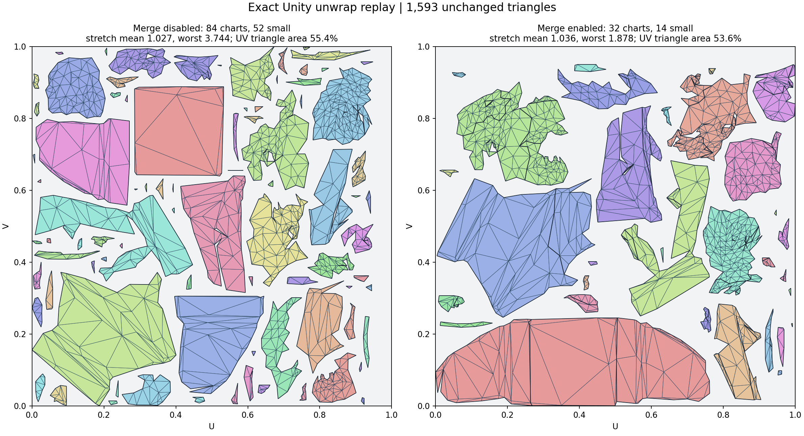
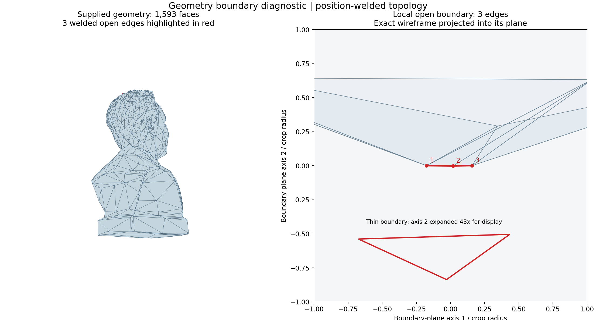
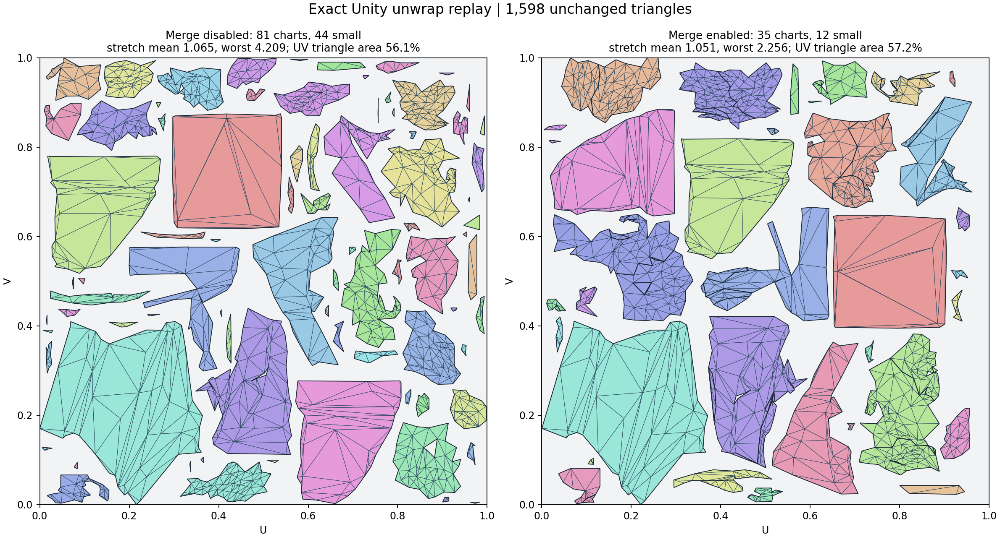
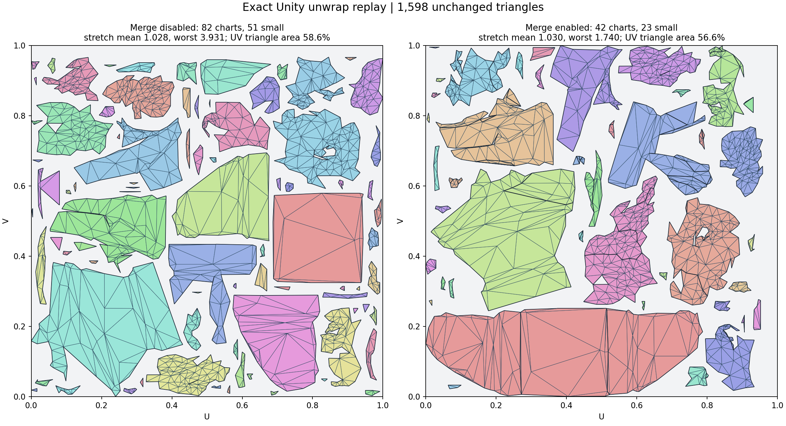

# Диагностика Remesh из E:/fps-project-M2-4328

Продолжение Experiment #1, 2026-10-04. Проверен установленный package commit
`b4c0cf64a181ff49eba4c48e85f1490404afde30`; FBX и Windows native DLL совпадают
по SHA256 с копиями в изолированном Unity 6000.2.6f2 проекте. Проект
`C:/LostInExtraction/fps-project` для этих выводов не использовался.

## Точный вход Unwrap

Capture `unwrap_20261004_184507_267_973ee3.bin` содержит 799 позиций,
1593 треугольника, voxel resolution 256, Simplify error 0.005, target 1600,
texture 512 и padding 3. Уже в этой геометрии есть три открытых ребра,
образующие одно треугольное отверстие около верхней части бюста.

Три повтора для каждого merge режима побайтово одинаковы. Каждый исходный
угол треугольника сохранён. Полный scan всего атласа подтверждает:

| Вариант | Charts | Small charts | Mean / worst stretch | UV area | Overlap pairs |
|---|---:|---:|---:|---:|---:|
| Merge off | 84 | 52 | 1.02710 / 3.74388 | 55.4381% | 0 |
| Merge on | 32 | 14 | 1.03557 / 1.87827 | 53.6271% | 0 |

Оба результата имеют ноль invalid/degenerate UV faces и ноль вершин вне
атласа. Проверены пересечения внутри chart и между charts. Это проверка
корректности UV, а не доказательство нужного художественного расположения швов.

## Отверстие до Simplify

В присланном логе native Simplify принимает boundary=3. Его postflight
сверяет границы с входом, поэтому отверстие существовало до этого collapse.
Восстановление его одним cap без знания исходной стадии опасно: настоящая
граница открытого source должна сохраняться.

Найден опасный путь в native bridge: после fitted voxelize вызов `Clean`
удаляет грани с площадью ≤ extent² × FLT_EPSILON. Удаление одной узкой,
но ненулевой грани может открыть замкнутую поверхность. Точная стадия
возникновения отверстия в пользовательском запуске пока не воспроизведена:
сохранённый ранее source даёт 210624 закрытых voxel faces и 1598 закрытых
Simplify faces при тех же настройках; вход пользователя имеет 1593 faces.

Независимый прямой вызов Windows DLL воспроизвёл дефект после равномерного
масштабирования source ×0.1: 210625 fitted faces с тремя boundary edges,
против 210626 закрытых faces без fitting. После обратного масштабирования
центр отверстия отличается от E capture на 3.205 × 10⁻⁸ m, около 0.002 cell.
Missing triangle area 1.46426 × 10⁻¹⁴ ниже native Clean floor
1.90742 × 10⁻¹⁴. Это тот же участок source; точный transform/state первого
пользовательского запуска остаётся неизвестен.

Компактный независимый regression fixture из восьми вершин при resolution 48
даёт 6995 fitted faces / 3 boundary edges и 6996 unfitted faces / 0 boundary.
Оба случая повторены по три раза для каждого solve режима с одинаковыми
SHA256. Проверка установила также примеры невалидного retry без fitting;
поэтому fallback обязательно проверяется, а не принимается безусловно.

Добавлена проверка raw solid до Trim. Повреждённый fitted результат
повторяется при той же resolution без native solve; принимается только
валидная замкнутая поверхность. Если повтор невалиден, операция завершается
с явной ошибкой. Explicit Two-sided shell сохраняет прежний путь.
При таком fallback возможны более заметные voxel ступеньки; он виден в логе.
Native ABI и plugin binaries не изменены.

При Info + категории RemeshDiag стадия Remesh теперь сохраняет один
`remesh_*.bin` с точными settings, source, raw voxel и trimmed geometry,
а также печатает topology каждой стадии. Сохраняются последние три capture.
Этот capture позволяет проверить происхождение отверстия без предположений
о transform, повторном импорте или сохранённом состоянии стадии.

## Почему refinement писал ноль перемещений

На сохранённом source при resolution 256 первоначально выполнялись
232132 операции перемещения и находились 1273 feature targets. После этого
reverse source-distance max превышал допустимое значение: 5.36743 → 5.43234
cells при пределе 5.39243. Старый код откатывал все перемещения, сохранял
38451 flips и обнулял счётчики без объяснения причины.

После collapse было 856 попыток перемещения и 17 feature targets.
Target-to-source RMS 0.373017 → 0.457708 превышал предел 0.391667,
max 2.34817 → 2.46874 превышал предел 2.37317 cells.
Новый лог сохраняет attempted counts и конкретные RMS/max/limits.
Он также прямо сообщает, если pre-refinement collapse candidate отклонён
и его изменения не вошли в итоговую сетку.

При полном отказе подгонки теперь дополнительно проверяются 1/2, 1/4 и 1/8
смещения. Каждый вариант начинает с исходных indices, заново строит flips,
защищает исходную ориентацию/площадь граней и проходит те же forward/reverse
source-distance и topology gates. Пороги не расширены. Только после трёх
отказов применяется flips-only fallback. Частичная подгонка feature targets
не выдаётся за точное закрепление на feature edge. Эта дополнительная проверка
увеличивает время refinement для первоначально отклонённых кандидатов.

На сохранённом бюсте проверенный pre-fit теперь принимает 101326 moved
vertices при шаге 1/4 и max displacement 0.087 cell. Его последующий
collapse всё ещё отклонён по source max, поэтому эти изменения не выдаются
за финальную геометрию. Финальный pass на ordinary 1598-face Simplify принимает
799 moved vertices при шаге 1/8, 89 flips и max displacement 0.044 cell;
mean triangle quality 0.662 → 0.679. Boundary/non-manifold/duplicates/degenerate
по-прежнему равны нулю. Это небольшой допустимый шаг, а не полное устранение
voxel ступенек или всех вытянутых треугольников.

## Повторная упаковка без лишнего отказа Unwrap

End-to-end повтор на закрытой 1598-face геометрии выявил ещё один дефект:
обычный repair pack имел worst=5.0359 при limit=4.36884, а повышенная точность
32× вообще не запускалась, потому что 81 × 16384² превышает safety budget 20B.
При этом 8× достаточно: worst=4.20915 проходит прежний предел.

Максимальная точность теперь ограничена chart count, atlas side ≤16384,
multiplier ≤32 и прежним бюджетом 20B. Для 81 charts/512 безопасный максимум
равен 30×. Repair пробует 8×, 16×, затем доступный максимум, каждый раз из
исходных UV triangles; останавливается после первого кандидата, прошедшего
прежние gates. Финальная source-коррекция требует 16× вместо 8×, но тоже
проходит полный scan с сохранением source corners. Пользовательские padding,
texture resolution и distortion limits не изменены.

| Сетка | Merge | Charts | Mean / worst stretch | UV area | Overlaps |
|---|---|---:|---:|---:|---:|
| Ordinary Simplify | off | 81 | 1.06509 / 4.20915 | 56.0788% | 0 |
| Ordinary Simplify | on | 35 | 1.05117 / 2.25570 | 57.2389% | 0 |
| Финальная source-коррекция | off | 82 | 1.02751 / 3.93101 | 58.6252% | 0 |
| Финальная source-коррекция | on | 42 | 1.02963 / 1.74033 | 56.6452% | 0 |

Число charts после source-коррекции растёт; доля длинных и маленьких частей
остаётся заметной. Улучшение stretch не доказывает совпадение швов с ручным
эталоном. Рендеры нужны для проверки этой разницы, а не только счётчиков.

## Cage и bake

`max171°` сравнивает cage со shading normal, а не с направлением грани.
Это число само по себе не означает обратный projection ray. Normal tilt
включает детали нормальной карты source. 123 missed texels из 145764 —
около 0.084%; 9528 nearest fallbacks — отдельный счётчик samples.
Source/target diagonal около 0.005, ratio=1: расхождение масштаба не подтверждено.

Исправлен самостоятельный воспроизводимый дефект: FitReach выбирал ближайший
нефильтрованный source hit, хотя CPU/GPU projection исключали обратные грани.
Близкая обратная грань могла сокращать reach, скрывая более дальнюю допустимую
лицевую грань. Теперь fit и bake используют одинаковые winding/two-sided
ограничения, сохраняя предел 8×. Preview получает ту же политику и обновляет
cage при её изменении. Вклад этого дефекта в конкретные 123 пропуска без
исходного bake capture не установлен.

## Воспроизведение

Финальная проверка в Unity 6000.2.6f2 с GPU: **241 passed, 0 failed, 0 skipped**
(52.1 s), включая фактический native voxel regression и полные CPU/GPU bake
tests. Добавлены 36 случаев: fitting/backtracking, geometry guard, cage-facing,
обновление preview и precision budget. Compile check с FBX exporter define
и без него: 0 ошибок.

- `Tools~/UvCapturedInputReplay.cs`: точный unwrap capture; три off/on повтора,
  complete intersection scan и проверка неизменности triangle corners.
- `Tools~/VoxelBoundaryReplay.cs`: isolated Unity `-executeMethod
  VoxelBoundaryReplay.Run`; `MESHLAB_REMESH_CAPTURE` задаёт новый stage capture.
  Без него используются standard geometry source и JSON settings через
  `MESHLAB_BOUNDARY_SOURCE` / `MESHLAB_BOUNDARY_SETTINGS`.
- `MESHLAB_BOUNDARY_OUTPUT` задаёт output для source/raw/trim/ordinary/refined
  captures, а также `native-before-guard.bin` для прямого native результата.
  Рабочий проект и его scene assets не изменяются.
- `VoxelBoundaryReplay.UnwrapSaved` обрабатывает сохранённые ordinary/refined
  meshes в обоих merge режимах, проверяет source corners и весь атлас,
  сохраняет canonical UV captures для `Tools~/render_remesh_log_diagnostics.py`.
