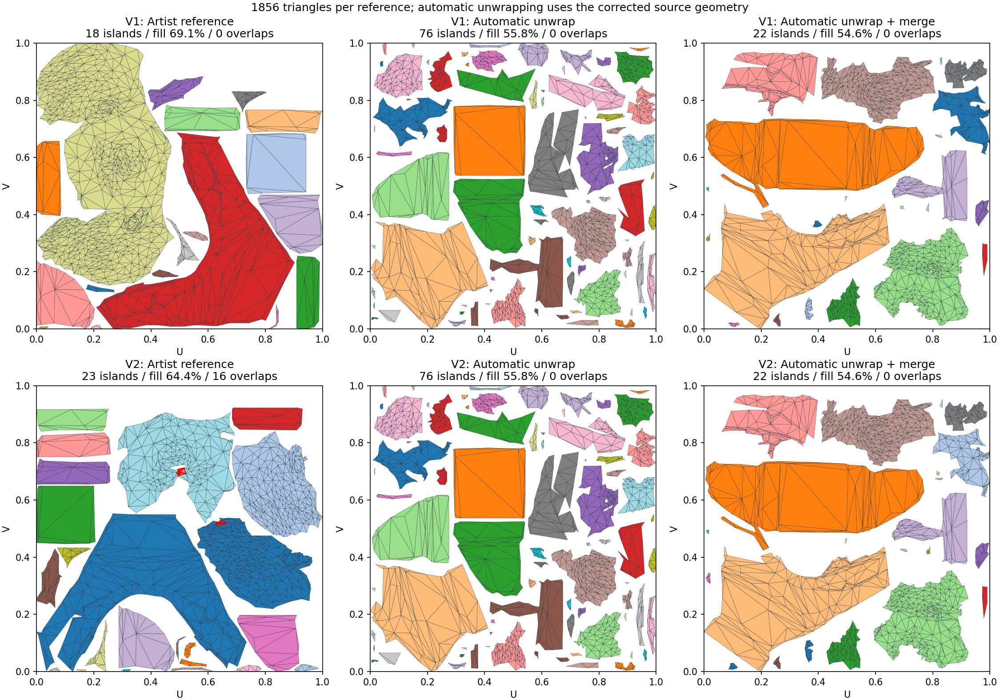
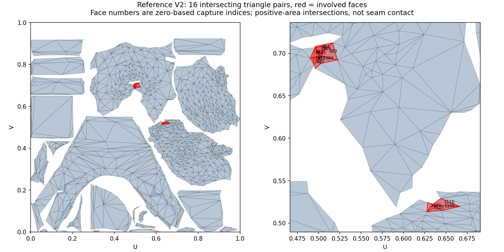

# Сравнение с ручными UV-эталонами

Проверено 2026-10-04 в Unity 6000.2.6f2. Две последовательно полученные версии
`uvbest.fbx` сохранены отдельно в изолированном проекте; пользовательский FBX не
изменялся и не включён в репозиторий. SHA-256:

- V1: `309DCD1FB852C76A8A173ADB36830D90736944E448CE9B322612DF60066FFC62`.
- V2: `F09EBE0CCAFFB38D41D842FFA5B4F146350EB863B63426EFEC442738E7B4B569`.

Обе версии содержат одинаковые исходные позиции и порядок углов треугольников
(проверено бит-в-бит по raw FBX). 930 control points, 1855 polygons: 1854 triangles
и один quad; после импорта 1856 triangles. Без duplicate faces, non-manifold edges,
открытых boundary edges или противоречивой намотки. Геометрия первого эталона
содержит 19 triangles с минимальным углом меньше 5°, ни одного меньше 1°.

## Результаты

Автоматический вариант получает ту же исправленную геометрию без её UV-швов;
512 px, padding 3, текущие рекомендованные chart settings. Author normals
сохраняются для анализа, но Unwrap строит свои normals из геометрии и настроек;
это сравнение развёртки, а не воспроизведение авторских smoothing groups.
Перед алгоритмом размеры нормализованы по диагонали bounds.

| Вариант | Острова | Малые (≤8 triangles) | Сумма UV-площади | Mean stretch | Worst stretch | Пересечения пар |
|---|---:|---:|---:|---:|---:|---:|
| Ручной V1 | 18 | 3 | 69.14% | 1.0810 | 5.6987 | 0 |
| Ручной V2 | 23 | 5 | 64.35% | 1.0618 | 2.2341 | 16 |
| Автоматический, merge выключен | 76 | 41 | 55.84% | 1.0332 | 12.8868 | 0 |
| Прежний merge (`ec910d0`) на V1 | 52 | 24 | 55.22% | 1.0272 | 1.6258 | 0 |
| Выбор двух merge-кандидатов на V1 | 22 | 10 | 54.63% | 1.0416 | 2.0582 | 0 |
| Выбор двух merge-кандидатов на V2 | 22 | 10 | 54.63% | 1.0416 | 2.0582 | 0 |

Все проверки пересечений завершены, без sampling. У V2 все 16 пересечений
внутри charts, между charts — ноль: 13 пар в chart 19 и 3 пары в chart 20
(нумерация с нуля в Unity capture). Их суммарная площадь по парам 0.000209714 UV².
Это сумма попарных площадей, не площадь объединения. Для V2 сумма UV-площади
не является уникальной занятой площадью из-за этих пересечений. Касание по шву
не считается overlap. Независимый Python polygon clipping подтвердил все пары
и площади из Unity diagnostics.





Индексы на картинке соответствуют triangulated Unity capture, а не номерам
полигонов в 3ds Max. Полный список: [CSV](UVBEST_V2_OVERLAPS.csv).
Полные UV-метрики: [CSV](UVBEST_REFERENCE_COMPARISON.csv).

## Что изменено в merge

Прежний residual 2% исключал много швов между криволинейными patches ещё до relax.
Простое увеличение лимита ухудшало упаковку на другом реальном входе. Поэтому
Unwrap сравнивает два результата на независимых массивах из одного baseline:

1. Прежняя стратегия: seam residual 2% bbox diagonal, local worst stretch 4.
2. Более свободные предложения: residual 10%, local worst stretch 6.

Оба кандидата проходят прежний conformal relax, repack, точную проверку всех
пересечений и прежние global stretch / density / packing gates. Local mean limit
не менялся. Увеличенный local worst разрешает только промежуточные предложения;
финальный worst-limit остаётся `max(4, baselineWorst * 1.1)`.

Свободный кандидат должен уменьшить фрагментацию относительно строгого и
сохранить минимум 95% его заполнения с прежним density gate. Иначе выбирается
строгий результат. Исходный Geometry изменяется только после выбора; отмена
во время второго кандидата или непосредственно перед commit результата
сохраняет все исходные массивы. Native ABI, serialized settings и UI не менялись.
Merge toggle сохраняет прежний default.

| Старый фиксированный вход | Строгий кандидат | Свободный кандидат | Выбран |
|---|---|---|---|
| 1901 triangles, округлённые настройки скриншота | 55 islands / 56.78% | 53 / 57.97% | Свободный |
| 1997 triangles, сохранённые настройки | 56 islands / 64.58% | 53 / 58.60% | Строгий |

Эти входы не являются точным 1883-face состоянием пользовательского скриншота.
Каждый проверен тремя повторениями Merge off/on: все исходные 3D-углы сохранены,
позиции/UV/индексы/charts выходят бит-идентично; полные scans дают ноль overlaps,
invalid/degenerate faces и out-of-bounds vertices.

## Топология и smoothing groups

В прежнем 1901-face входе имеются три совпадающие пары faces с противоположной
намоткой и три non-manifold edges. В 1997-face входе две такие пары. Это часть
причины плохих локальных patches, но даже исправленная сетка раньше давала 52
islands. Автоматическое удаление противоположных faces здесь не вводилось:
они могут быть намеренными двумя сторонами листа.

Оба ручных FBX содержат пять smoothing masks: 1, 2, 4, 8, 16; количества polygons
152, 327, 1340, 9, 27. Разделение сглаживания и UV — независимые решения:

| Срез по raw FBX | V1 | V2 |
|---|---:|---:|
| UV seam edges | 204 | 270 |
| Hard smoothing edges | 163 | 163 |
| Smooth edges с UV-швом | 43 | 115 |
| Hard edges без UV-шва | 2 | 8 |

Hard edges имеют dihedral от 1.67° до 119°, smooth — от 0.0046° до 145.33°.
Один crease angle не может воспроизвести эти группы. Новый merge не является
переносом авторских smoothing groups и не заявляет их автоматическое восстановление.

## Подбор настроек и оставшиеся ограничения

На V1 проверены 12 комбинаций chart cost 5/10/20, normal deviation 0.5/2,
straightness 0/6, iterations 4, fragmentation reduction и merge выключены.
Они дают 72–80 islands. Это ограниченный sweep, не доказательство глобального
оптимума; увеличение cost/iterations само по себе не приближает результат к
18/23 авторским islands. Также проверены шесть merge-профилей: residual
0.02/0.05/0.1 × local mean 1.15/1.3 с local worst 6. Лучший результат по
фрагментации здесь даёт 0.1/1.15; повышение mean limit не требуется.

Количество islands существенно приблизилось к эталону, но заполнение 54.6%
остаётся ниже ручных 64–69%, и малых islands больше. Авторские UV не сопоставлялись
по одинаковому pixel padding, поэтому это прямое измерение layouts, а не
сравнение packing при доказанно одинаковых margins. Худшее растяжение V1 5.7
приходится на малую часть поверхности: P95=1.300, P99=1.528, всего 0.292%
3D-площади имеет stretch>2. Одного worst stretch недостаточно для оценки
художественного качества. Поиск двух кандидатов добавляет работу merge/relax/repack,
особенно при `Best packing`; это осознанная цена экспериментального Merge.

## Воспроизведение

`Tools~/UvReferenceBenchmark.cs` скопировать в `Assets/Editor` изолированного
Unity-проекта с этим пакетом. Указать `MESHLAB_UV_REFERENCE_FBX` и отдельный
`MESHLAB_UV_REFERENCE_TAG` для каждой версии, запустить
`-batchmode -executeMethod UvReferenceBenchmark.Run`. Harness сохраняет source hash,
author UV/normals, настройки и три повторения полного Unwrap с Merge off/on;
проверяет source corners, determinism и завершённый scan каждого автоматического
результата. Для графиков:

```text
python Tools~/analyze_uv_reference.py FIRST_CAPTURE_DIR SECOND_CAPTURE_DIR Documentation~
```

Unity EditMode: 181/181 passed, zero skipped, включая реальный native Unwrap и
отмену на трёх этапах merge. Licence-free compile check также прошёл в обеих
конфигурациях `LIGHTMAP_UV_TOOL_FBX_EXPORTER`. Дополнительно полный production
Unwrap проверен в [44 запусках](UVBEST_PRODUCTION_REGRESSION.csv): bust (10 repeats
на профиль), wave/cylinder/torus/cube (по 3), recommended и сохранённый пользовательский
профиль. Все scans complete, zero overlaps/invalid/degenerate/out-of-bounds,
source corners сохранены, выходные geometry buffers бит-идентичны в повторениях.
Медиана полного Unwrap для bust на этой машине: 3.28 s recommended, 24.44 s
при пользовательском профиле с Best packing. Гарантии относятся к измеренным
входам; художественное соответствие авторскому эталону всё ещё неполное.
