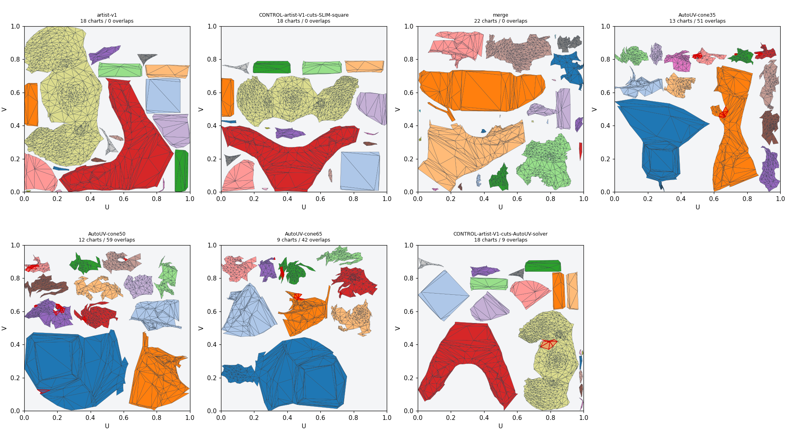
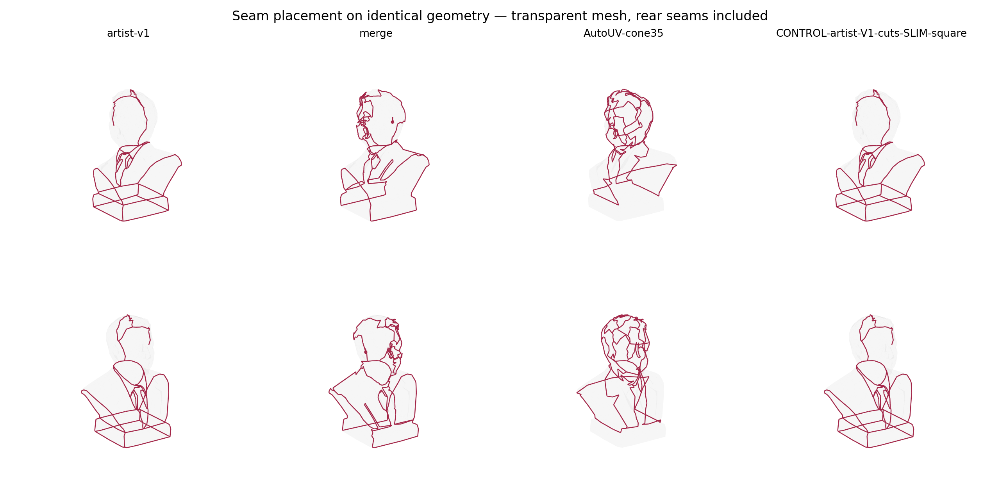

# Обучаемые швы: проверка нового направления

2026-10-04, продолжение chart-merge Experiment #1 / PR #214.

Переходим к обучению расположения швов на авторских примерах. Это обоснованная
гипотеза, но пока не доказано, что она даст нужное качество или является единственным
решением. Текстовая LLM для первого прототипа не требуется: вход и выход удобно
представить графом рёбер меша. Маленькая графовая сеть уже проверена на локальной
видеокарте, **без обучения**. Production Unwrap и его defaults этим исследованием
не изменены.

## Что проверено на бюсте

Все новые UV-прогоны используют одну поверхность: 930 геометрических вершин,
1856 треугольников, 2784 рёбер. Авторские UV не передаются автоматическому AutoUV.
Позиции, связность и winding новых AutoUV/SLIM outputs проверены точно. В контроле
SLIM авторские UV используются только для восстановления cut topology; все
координаты строятся заново. Это **контроль с заданными швами**, а не автоматическое
предсказание и не доказанный оптимум.

| Метод | Charts | Seam F1 V1 | Triangle fill | Mean / worst stretch | Overlap pairs внутри chart |
|---|---:|---:|---:|---:|---:|
| Ручной V1 | 18 | 1.000 | 69.14% | 1.081 / 5.699 | 0 |
| Прежний merge | 22 | 0.276 | 54.63% | 1.042 / 2.058 | 0 |
| AutoUV cone 35° | 13 | 0.213 | 42.26% | 1.236 / 11.953 | **51** |
| AutoUV cone 50° | 12 | 0.172 | 53.42% | 1.337 / 50.729 | **59** |
| AutoUV cone 65° | 9 | 0.240 | 43.95% | 1.344 / 43.618 | **42** |
| Авторские cuts → AutoUV solver | 18 | 1.000 | 46.38% | 1.079 / 6.323 | **9** |
| Авторские cuts → SLIM → square xatlas packing | 18 | 1.000 | 50.45% | 1.105 / 4.523 | **0** |

F1 взвешен длиной рёбер и оценивает совпадение с конкретным V1, не универсальное
художественное качество. Triangle fill — сумма UV-площадей треугольников;
для вариантов с overlaps она считает перекрытую площадь повторно. Stretch —
отношение сингулярных значений локального отображения, среднее взвешено 3D-площадью;
оно не оценивает все виды area distortion. Ни один новый автоматический вариант
не принят как замена Unwrap.

Полный intersection scan включает соседние и несоседние треугольники одного
шелла, а также разные шеллы. Нулевая площадь контакта разрешена. Численные пороги:
overlap area > max(1e-16, min(triangle areas) × 1e-8); zero-area |cross| ≤ 1e-14.
У всех семи outputs ноль mixed-winding faces, zero-area faces и UV vertices вне
атласа. Поэтому одной проверки winding недостаточно: AutoUV даёт внутренние
пересечения при согласованной ориентации всех треугольников.

Сохранены [все отдельные UV PNG](LearnedSeamResearch/README.md),
[HTML-галерея](LearnedSeamResearch/index.html),
[полные quality metrics с SHA256](LearnedSeamResearch/quality.csv),
[оценки расположения швов](LearnedSeamResearch/scores.csv).





### Контроль параметризации и упаковки

AutoUV — отдельный исполняемый геометрический baseline, исходники автора
`f0e0ff8963210b35e362a15eaf56d88d07fdd778`. Проверены max_cone_deg 35/50/65,
weld=False, requested resolution 512, padding 3; остальные настройки автора
сохранены. Код и приватные captures не включены в пакет.
[Официальный AutoUV](https://github.com/visualbruno/AutoUV).

Для SLIM все 18 authored charts проверены как диски: chi=1, одна boundary loop,
manifold edge incidence. Граница помещена на окружность; внутренние вершины
решаются положительным uniform Laplacian. Затем свободная граница и symmetric
Dirichlet SLIM, checkpoints 10/20/30. После каждого checkpoint — полный скан
пересечений, при отказе сохраняется предыдущий валидный результат. На этом
бюсте все charts приняли checkpoint 30. Итоговый packed float32 atlas проходит
отдельный полный gate перед записью успешного JSON.
[Точный отчёт контроля](LearnedSeamResearch/SLIM_CONTROL.json).

Упаковка тоже оказалась отдельной проблемой. Skyline AutoUV масштабирует padding
вместе с атласом: для SLIM получено около 1.86 px между bbox вместо заявленных
3 px при 512. Его packFill означает **bbox coverage**, например 82.87% при
реальном triangle fill 46.38% у AutoUV solver control. Эти величины не смешиваются.

Standalone xatlas выдаёт прямоугольный raster 462×366. Деление U/V отдельно на
width/height растягивало острова: mean stretch 1.103 → 1.302. Добавлен режим
`pack-square`, который делит обе координаты на max(width,height). Он сохраняет
форму, но оставляет свободную полосу в квадрате: fill 50.45%, mean 1.105.
Raster padding 3 соответствует примерно 3.325 px в конечной текстуре 512².
Режим `pack` сохраняет прежнее поведение; Unity/native plugins не менялись.

Даже с точными швами форма островов и упаковка не воспроизводят эталон. Один
круговой seed и 30 итераций не устанавливают нижнюю границу возможного distortion.
Ручной V1 также имеет chart density CV 11.78% против 0.53% у нового контроля:
авторское распределение масштаба островов — ещё одна отдельная степень свободы.

## Какие обучаемые методы можно использовать

Доступность проверена 2026-10-04; сведения ниже могут измениться после релиза.
Числа из статей не считаются нашими результатами на бюсте.

| Метод | Полезная идея | Доступность для нового теста |
|---|---|---|
| GraphSeam | Обучение GNN на желаемом авторском стиле швов, графовый postprocess | Подтверждена постановка в статье; официальный исполняемый релиз не найден |
| SeamFlow | Генерация согласованных seam probabilities непосредственно на рёбрах | Официальная страница показывает Code soon / Models soon; модель около 712M parameters |
| SeamGen | Локальное внимание по графу + глобальный mesh context, заданные/запрещённые швы | Статья доступна; официальный код/веса для воспроизводимого запуска не установлены |
| MeshTailor reproduction | Pointer decoder строит цепочки по соседним вершинам существующего меша | Неофициальные training/inference исходники и checkpoint доступны; обучение на одежде |

[GraphSeam](https://arxiv.org/abs/2011.13748) прямо рассматривает создание
собственного artist dataset. Это наиболее близкое подтверждение самой идеи
обучения на ваших работах.
[SeamFlow: страница авторов](https://meshy-dev.github.io/seamflow/),
[архитектура в Appendix A](https://arxiv.org/html/2609.04751v1),
[SeamGen](https://arxiv.org/html/2607.12379v1).

У оригинального [MeshTailor](https://meshtailor.github.io/) код пока TBA.
У [неофициальной репродукции](https://github.com/Xinghan-Wang/meshtailor) есть
checkpoint ~1.14 GB, обученный на 100k garments. Это размер файла, не требуемая
VRAM. Автор проверял RTX 5080 16 GB, требуется отдельный Michelangelo encoder;
инференс на нашей GTX 980 Ti ещё не проверен. Предобработка по умолчанию
упрощает до 1000 faces: для честного сравнения нужны loader без decimation и
наши исходные 1856 faces. Для Maxwell нужен FP32; training reproduction требует
адаптации без обязательного BF16. MIT у reproduction не заменяет GPL-3.0/отдельные
terms upstream encoder. Веса в этом исследовании не скачивались.

ArtUV, SeamGPT и SeamCrafter проверены, но подтверждённого публичного полного
inference с весами для нашего запуска пока нет:
[ArtUV repo](https://github.com/chenyg59/ArtUV),
[SeamGPT project](https://victorcheung12.github.io/seamgpt/),
[SeamCrafter repo](https://github.com/chenyg59/SeamCrafter).

## Маленький локальный baseline

Добавлен `Tools~/LearnedSeamBenchmark/model_probe.py`: 4 residual message blocks,
width 64, masked mean/max соседних рёбер; binary-logit head получает также global
mean/max. **79 169 parameters**. На реальном графе бюста 2784 edges × 2 geometry
features, batch 1, FP32 прошли forward/backward с конечными logits/gradients.

Локальный замер: GTX 980 Ti 6 GB / CC 5.2, Torch 2.5.1+cu118 / CUDA 11.8.
Peak allocated 53.7 MiB; peak reserved 78 MiB; incremental peak 37.0 MiB.
Счётчики относятся к PyTorch tensors после warmup, исключают CUDA context и
другие приложения. Это один проход **без optimizer, обновления параметров,
обучения или UV prediction**. Он подтверждает вычислительную выполнимость такого
baseline, а не достаточность архитектуры и не память полноценного обучения.
[Исходные численные показания и hashes](LearnedSeamResearch/MODEL_CAPACITY.json).

Два текущих признака — edge length / bbox diagonal и dihedral angle — нужны
для capacity probe. Для обучения семантическим границам потребуется проверить
более богатые признаки: положение/нормали в нормализованном object frame,
контекст нескольких масштабов, curvature/thickness; source AO/cavity добавлять
отдельной ablation с confidence проекции. Предыдущий
[source-signal эксперимент](UV_SOURCE_SIGNALS.md) не показал улучшения общих
UV-разрезов после исключения hard edges, поэтому source weights не принимаются
вслепую. Smoothing groups и UV seams — отдельные targets.

## Данные и следующий проверяемый этап

### Требования к сбору: UV, сглаживание и топология

Для первого UV/SG пилота обязателен авторский low-poly с готовой развёрткой,
правильными hard/soft границами и финальными normals. Предпочтительный переносимый
формат — FBX; `.max` сохраняем как редактируемый первоисточник, если доступен.
Для начала удобны target meshes примерно 500–10000 triangles; это ограничение
первого эксперимента, не фильтр для удаления более крупных моделей из архива.
Source может иметь гораздо больше faces и обрабатываться отдельно.

На первой партии из 5–10 разных объектов проверяем импорт и сохранение labels.
Для первого обучения ориентир 20–50 независимых объектов со сходной задачей;
сначала приоритет органике. Конструкционные объекты помечаются отдельно и не
заменяют органические примеры. Ни одно из этих чисел не гарантирует качество.
Размер независимого test важнее количества LOD/UV-вариантов одного объекта.

| Файл на объект | Для чего | Обязательность |
|---|---|---|
| `artist_final.fbx` | Авторская геометрия, основной UV channel, SG/explicit normals | Минимум для UV/SG |
| `artist_editable.max` | Quad/ngon structure, stack и выбранные диагонали | Сохранить, если есть |
| `source.fbx` | Исходная детальная поверхность и геометрические source signals | Для source-aware обучения/оценки поверхности |
| `raw_remesh.fbx` | Результат вокселизации до последующих исправлений | Для изучения voxel→simplify проблем |
| `simplify_before.fbx` | Конкретная сетка до ручного исправления | Для supervision исправлений этой стадии |
| `artist_corrected.fbx` | Хорошая сетка после исправления того же объекта; может совпадать с `artist_final` | В паре с `simplify_before` для topology training |
| `textures/` | Визуальная проверка, normal/detail maps, decals | Не нужны для первого geometry/seam обучения |
| `notes.txt` | Asset/family, UV channel, units, категория, хороший вариант и смысл открытых краёв | Краткие сведения, если известны |

Одна папка — один исходный asset. Имена файлов условные: существующие файлы
можно сохранить с исходными именами и указать роли в notes, не экспортировать
повторно весь архив. Если `artist_final` и `artist_corrected` — одна версия,
не нужна физическая копия. Варианты одного объекта кладём в его `variants/`,
помечаем основной рекомендованный вариант; противоречивые seam labels разных
авторских решений не усредняем в единственную цель. Все варианты остаются
в одном train/val/test group.

Пример структуры — **протокол сбора**, не уже поддерживаемый FBX manifest:

```text
dataset/
  bust_001/
    artist_final.fbx
    artist_editable.max
    source.fbx
    simplify_before.fbx
    raw_remesh.fbx
    notes.txt
    variants/
    textures/
```

Не нужно вручную запекать curvature/AO, собирать NPZ или рендерить картинки.
Автоматические import/QA/correspondence/features/rendering нужно дополнить
в коллекторе; нынешний `prepare.py` принимает внутренние captures. Присутствие
полного комплекта не требуется для сохранения объекта в архиве: отсутствующие
стадии исключают только соответствующий вид supervision. Старый хороший FBX
без source пригоден для UV/SG; source и final без before недостаточны для
восстановления конкретных ручных операций simplify.

В FBX exporter включаем Smoothing Groups и сохраняем explicit normals, выбранный
UV channel и material assignments. Для машинной triangle-копии фиксируем
триангуляцию и сохраняем turned edges; редактируемую quad-версию не уничтожаем.
После первой экспортной партии проверяем roundtrip по faces/UV/SG. В Max
Preserve edge orientation может конвертировать Editable Poly в triangulated
Editable Mesh; настройки и проверка описаны в
[Autodesk FBX Geometry](https://help.autodesk.com/cloudhelp/2025/ENU/3DSMax-Interoperability/files/GUID-249100FE-67BE-43B8-AF12-D20703CDF8D1.htm).

Все стадии одной пары сохраняются в общей системе координат с известными units
и transforms. Не применять независимый Reset XForm/центрирование к каждому
файлу перед сбором. Нормализацию и axis conversion проводим согласованно после
сохранения оригиналов. Анимация/rig для статического пилота не нужны; если модель
skinned, сохраняем исходник и отдельную статическую копию выбранной позы.

Хороший target: осмысленные швы, приемлемый distortion/density, правильное
сглаживание, отсутствие случайных дыр, duplicate/degenerate faces и overlaps.
Открытые поверхности допустимы: отмечаем намеренные boundaries. Для первого
атласного пилота предпочтительны UV в 0–1 без stacking; намеренные mirror/tiling/
UDIM cases сохраняем и помечаем отдельно, иначе QA ошибочно сочтёт их браком.
Плохие `before` meshes с nonmanifold/дырками сохраняем без исправления: нынешний
seam preparer их отклоняет, будущий topology pipeline должен читать и описывать
их отдельно. Задача QA — сохранить метки дефектов, а не стереть причину.

### Комплексные данные и разделение задач обучения

План расширения dataset включает geometry graph, vertex/edge/face normals,
площади/длины/углы/aspect, connected components, boundaries, manifold/Euler
checks; авторские UV cuts/parts, local UV Jacobians и chart density; отдельные
hard/soft edge и explicit-normal targets. SG IDs и chart IDs сами по себе
произвольны: учим отношения/границы, а не номер группы.
Авторские SG/explicit normals не подаются как скрытая готовая подсказка модели,
которая их предсказывает: входные normals для этого baseline вычисляются из
геометрии/source. Пользовательские locks — отдельное явное условие.

При наличии source рассчитываем curvature/cavity, normal variation и AO на
нескольких радиусах, проверяем полезность AO с обеих сторон, оцениваем thickness,
source distance/normal error. Эти поля проецируются геометрически в samples
target поверхности с confidence; draft UV для такой проекции не требуется.
Texture normal map не заменяет физическую source geometry. Пиксельные признаки
материалов оставляем отдельным дополнительным каналом: цвет сам по себе не
задаёт topology. Не каждый из перечисленных признаков будет полезен модели —
это проверяется на фиксированных splits, geometry-only против source-aware.

**Сейчас реализованы** capture→edge graph/seam labels и два geometry features;
source projection/curvature/cavity/AO проверялись в отдельном
`SourceSignalsBenchmark`. Их общей автоматической подготовки для набора,
FBX/SG ingestion и topology trainer пока нет. План расширения не следует
принимать за уже существующий сбор всех параметров.

Первый trainer — supervised graph model с двумя отдельными edge targets:
UV cut и hard/soft boundary, weighted BCE/контроль дисбаланса positives.
Обучение FP32 с AdamW; LR/regularization и early stopping выбираем по validation.
Связность швов обеспечивается отдельным decoder и проверкой topology charts,
а не одним threshold. Авторские junctions допустимы: требовать degree=2 везде
было бы неверно. Затем валидный solver/relax и packing; случайный номер острова,
его перенос/поворот в атласе не являются координатной regression-целью.
Это первый baseline, не гарантия воспроизведения авторского стиля; при
противоречивых layouts понадобится conditioning/генерация нескольких вариантов.

Topology correction — отдельный следующий эксперимент с before/after/source
pairs: прежде всего ранжирование допустимых local edge flips/collapse/split и
source-constrained vertex moves. При изменении connectivity соответствие вершин
не задано, поэтому MSE по одноимённым индексам не подходит. Нужны surface
correspondence и оценки сохранения формы/диагоналей/границ/качества треугольников;
валидность каждой операции остаётся строгим геометрическим gate. Финальный
хороший меш без before полезен как quality reference, но не как готовая запись
действий редактора.

### Время: измеренная скорость и оценка разработки

Дополнительный локальный microbenchmark использует реальный граф/UV labels,
временную случайную модель 79169 parameters и AdamW: 10 warmup + 50 measured
steps, FP32 batch 1, 2784 edges, GTX 980 Ti. Median wall step **10.899 ms**,
p90 **13.654 ms** в первом запуске; повторный запуск дал median **31.955 ms**,
p90 **34.813 ms**. Это измеренный разброс двух коротких запусков на общем
пользовательском компьютере, а не гарантированная скорость. Peak allocated с
gradients/optimizer states **54.31 MiB**,
reserved 78 MiB; CUDA context/прочие приложения исключены.
[Повторный timing JSON](LearnedSeamResearch/TRAIN_STEP_TIMING.json),
[первый timing JSON](LearnedSeamResearch/TRAIN_STEP_TIMING_FIRST.json).
Параметры обновлялись только в этом временном процессе; checkpoint и качество
обученного решения не сохранялись/не проверялись.

Для **похожих графов и этого baseline** 50 training objects × 200 epochs ×
0.010899–0.031955 s ≈109–320 s (округлённо **2–6 минут**) чистых optimizer steps.
Это не время полного обучения/поиска:
не включены FBX import, source field sampling, decoder, solver, full validation,
renders, checkpoint IO. Более крупные meshes, богатые features и новый decoder
нужно измерить заново. Ускоренный microbenchmark не предсказывает сходимость.

Предварительная оценка от получения готовой первой партии: несколько рабочих
дней (ориентир **3–7**) до дополненного коллектора, первого UV/SG baseline и
отчёта на независимом test. Это оценка инженерной работы, не измеренная ETA и
не обещание хорошего production результата. Исправление topology и перенос на
разные классы объектов — последующие итерации; надёжную длительность нельзя
установить по одному бюсту. После проверки 5–10 полных комплектов оценку нужно
уточнить по времени импорта/source sampling и размерам графов.

Набор ещё предстоит собрать пользователю. Подготовщик `prepare.py` уже извлекает
метки из готовых geometry+UV captures; массового обхода диска/FBX importer пока
нет. Два варианта бюста дают **2 captures, 1 independent model, 1 split group**;
geometry SHA256 `1d4ab4b18bb89b6563f02de715ec222a0eb2b7d50a7ef60bccebb0c0b200214a`.
Внутренних cuts 204/270, forced open boundaries 0/0. Из второго варианта нельзя
делать независимый test set. V2 имеет найденные ранее UV overlaps, поэтому его
layout нельзя автоматически использовать как безусловно чистую цель; seam labels
и валидность исходной параметризации нужно учитывать отдельно.

Для сбора сохраняем оригинальные FBX с ручными UV/SG и отдельные source модели,
если они есть. Все LOD, UV-варианты и аугментации одного объекта получают один
asset_id; family_id объединяет общий исходник/шаблон, а не всю категорию organic.
Исходные модели не перезаписываются. Пары source→target и версия ручного решения
нужны явно, особенно когда ручная коррекция изменила триангуляцию.

Подготовщик проверяет degenerate/duplicate faces, winding, nonmanifold edges и
vertex fans; отделяет UV discontinuity от splits ради normals. Forced boundary
не используется как обучаемая положительная метка. Конфликт train/val/test через
asset, exact geometry или family отклоняется до записи файлов. Выходная папка
должна быть новой/пустой. Приватные captures/NPZ/manifest остаются в `_results~`.
Captures не хранят явную UV topology: совпадающий по координатам разрез восстановить
нельзя; будущий FBX importer должен сохранять per-corner UV indices и SG.

Первый pilot можно начать с 20–50 различных объектов одной категории, но это
рабочая оценка для эксперимента, не гарантия достаточности данных. До подбора
признаков/настроек резервируем test по независимым семействам; random edge split
и UV-вариант того же бюста в test недопустимы.

Последовательность после сбора: (1) labels/QA и family split, (2) geometry-only
против geometry+source на одинаковых splits, (3) decoder непрерывных цепочек,
(4) cut topology → валидный solver → packing, (5) отдельный held-out тест.
Независимый threshold per edge не гарантирует цепочки/диски и может снова
порождать случайные островки. Предсказанные и добавленные ради валидности швы
считать отдельно. Пользовательские seam/no-seam locks должны ограничивать
decoder, а невозможность выполнить их валидно должна быть видна.

Главные критерии: авторская оценка положения швов, exact/near seam precision и
recall, нарушения locks, длина safety cuts, полный intra/inter-shell overlap
scan, distortion и actual triangle fill. Число shells остаётся вторичным.
На другой Simplify topology label transfer требует доверенной проекции цепочек
и пути по её графу; отсутствующее нужное ребро нельзя восстановить простым UV
merge. Результаты на вручную исправленной сетке не доказывают качество на raw
voxel/simplify.

## Воспроизведение и проверки

Команды и optional dependencies:
[SeamPlacementBenchmark](../Tools~/SeamPlacementBenchmark/README.md),
[LearnedSeamBenchmark](../Tools~/LearnedSeamBenchmark/README.md).
Standalone probe собран из текущих Tools~ + vendored xatlas, без установки DLL.
18 seam/control tests и 10 prepare/graph tests прошли без skips. Рендеры визуально
проверены. Это Python/native research validation; новый Unity EditMode прогон
не выполнялся, поскольку production C#/assets/plugins не менялись.
