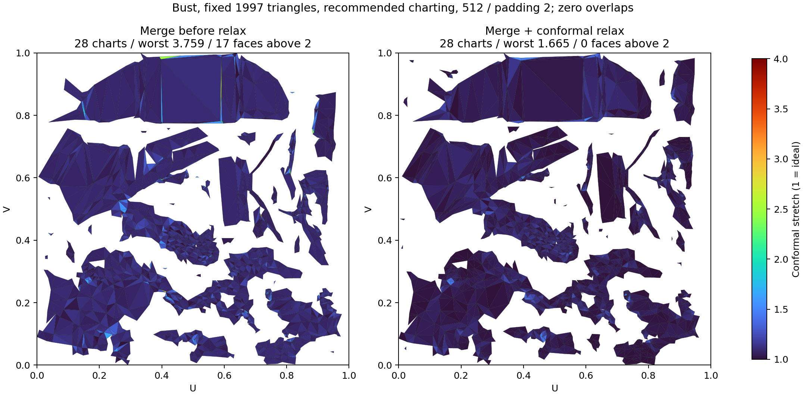

# Merge distortion relax — 2026-10-04

Continuation of the [chart-merge experiment](EXPERIMENTS.md). A guarded,
free-boundary conformal relax now runs **after a successful merge and before
repack**, over all resulting charts. Merge remains opt-in. The original xatlas
charting settings, merge-pair fit/limits and unmerged pipeline are unchanged.

## Why the merged layout needs relaxation

A similarity fit preserves each triangle's shape. The following exact seam snap
does not: it changes only the mover's seam vertices and concentrates deformation
near the new seam. The old local gate permits worst stretch up to 4, so valid,
overlap-free merged islands can still contain highly distorted triangles.
Repeated greedy merges can accumulate this deformation. Candidate direction is
chosen by seam residual, moved vertex count and chart id, not by a whole-chart
distortion optimum.

Moving the free UV vertices after joining the charts lets the deformation spread
through the chart. The new pass minimizes conformal distortion against the
original 3D triangle shapes. It is comparable in purpose to 3ds Max's
[Relax By Edge/Face Angles](https://help.autodesk.com/cloudhelp/2023/ENU/3DSMax-Modifiers/files/GUID-48B2004C-9A5C-43BE-9040-5EE34E3F38E3.htm),
whose boundary can move to reduce distortion. It is our own solver, not an
implementation of Autodesk's proprietary algorithm.

## Solver and acceptance

For each triangle, express its 3D edges in a local orthonormal frame and form
the UV Jacobian `J`. The MIPS quantity `trace(JᵀJ) / |det J| = κ + 1/κ`
uses the singular-value ratio `κ`, the same conformal distortion reported by
`UvChartQuality`; 1 is ideal. The underlying scale-independent measure is from
[Hormann and Greiner, MIPS (2000)](https://www.inf.usi.ch/hormann/papers/Hormann.2000.MAE.pdf).

Our objective sums `z + 0.25 z²`, where `z = MIPS - 2`. Triangle weights are
90% normalized 3D area plus 10% uniform weight, so small faces with large
distortion are not ignored. L-BFGS keeps six correction pairs and runs at most
**50 iterations**, with early convergence and Armijo backtracking. Before a step,
the first positive root of the quadratic determinant along that direction limits
motion to 80% of the fold threshold. Checking only the endpoint determinant would
allow jumping across an inverted interval.

The solver retains improving checkpoints every five iterations. A late proposal
may have a global self-intersection despite positive local determinants; its
rejection must not discard an earlier safe result. Each checkpoint is tried at
full strength and by halving down to 1/32. Acceptance requires:

- No increase in either chart mean or worst stretch (relative numerical slack
  `1e-6`); an actual decrease of mean by `1e-5` or worst by `1e-4` is required.
- Uniform winding, finite/nondegenerate triangles and a **complete, zero-overlap**
  chart scan, including shared-edge neighbours.
- Preservation of each chart's total UV triangle area by uniform scaling,
  rather than shrinking an island to hide distortion. Rigid alignment keeps its
  orientation/centre close to the input; packing decides final placement.
- A second stretch check against every original source corner position, since
  positional welding has a tolerance.

Normal/tangent duplicates and both copies of a joined seam share one UV unknown
and receive bit-identical coordinates. Existing ambiguous cuts inside a chart
are skipped; closed/disconnected charts and non-manifold edges are skipped.
The source positions, indices, normals, chart assignments and chart count are
not changed by relax. Tangents and final shading are rebuilt after packing.
No local injectivity assumption replaces the final full-atlas overlap and
existing merge quality gates. Rejection restores the original chart.

UV changes are committed together after all chart proposals complete.
Cancellation in merge now also restores the complete pre-merge geometry before
rethrowing; previously cancellation bypassed rollback after an accepted merge.

## Measured comparison

Unity 6000.2.6f2, Windows/DirectX, the same native binaries and fixed corpus as
the [xatlas defaults comparison](XATLAS_DEFAULTS_BENCHMARK.md). Bust geometry is
1997 simplified triangles; the remesh remains 30288 → 51612 triangles, 4 trimmed.
Cube, cylinder, torus and curved wave are the four additional fixtures.
The final CSV contains **323 measured phase/production calls**; earlier
exploratory prototypes are not mixed into it.

Actual production `RemeshNative.Unwrap`, Merge enabled, Reduce UV fragmentation
enabled. Every result has a complete scan, **zero overlaps/invalid/degenerate/OOB
data**, and every 3D source corner is preserved.

| Bust settings | Atlas / padding | Charts / small | Before mean / worst | After mean / worst | After samples |
|---|---|---:|---:|---:|---:|
| Recommended xatlas | 512 / 2 | **28 / 14** | 1.10772 / 3.75916 | **1.05221 / 1.66454** | 10 |
| User saved xatlas | 512 / 2 | **36 / 19** | 1.18992 / 3.19396 | **1.06325 / 1.65894** | 10 |
| Recommended xatlas | 2048 / 8 | **29 / 13** | 1.03837 / 3.90045 | **1.03197 / 1.67871** | 3 |

The pass reduces distortion, rather than claiming fewer shells. At 512, total
production unwrap medians were 512 ms for the recommendation and 2364 ms for
the user settings. Relax itself costs about 40 ms on this bust. At 2048, total
unwrap is still about 11.1 seconds: the 4× oversampled native pack dominates.
Timing depends on this local machine and is not a general performance promise.



On the production recommended fixtures at 512, mean/worst becomes approximately
1.002/1.012 on the cylinder, 1.025/1.082 on the torus and 1.001/1.001 on the cube.
Their counts stay 4, 6 and 2 respectively. The one-chart wave has no accepted
merge and deliberately retains its original unwrap: no relax/repack is inserted
in that production path. Standalone all-chart benchmark rows can still relax
the wave; they are not claims about the production merge path.

## Alternatives and placement

The existing ARAP solver is retained as a developer benchmark alternative.
It can improve developable charts such as cube/cylinder/torus; preliminary
joined-chart bust runs at 5/15/50 iterations produced no accepted proposals.
Conformal optimization directly targets the measured angular distortion, and
helps the actual bust. The CSV also includes final all-chart ARAP comparisons.

On the fixed bust at 512, the final conformal placement comparison is:

| Placement (50 iterations) | Recommended charts / mean / worst | User charts / mean / worst |
|---|---:|---:|
| Joined charts after merge | 28 / 1.05276 / 1.66454 | 36 / 1.06494 / 2.83251 |
| **All charts after merge** | **28 / 1.05221 / 1.66454** | **36 / 1.06325 / 1.65894** |
| All charts before and after merge | 30 / 1.03580 / 1.59486 | 33 / 1.04944 / 1.72352 |

Relaxing before merge changes seam-fit candidates and is not uniformly better:
the recommendation gains two shells. The selected post-merge placement preserves
the existing fragmentation result and improves the worst triangle in both presets.
The matrix also compares 5/15/30/50/100 iterations. Keeping safe checkpoints matters
more than blindly increasing iterations; 50 is a bounded compromise for both
presets. Future work could rank candidate merges by distortion or jointly optimize
multiple chart joins. This patch leaves the original seam residual/density limits
and greedy ordering intact.

## Validation and reproduction

The production harness repeats each 512 bust preset **10 times**, requiring
byte-identical position/UV/index/chart buffers. Both pass 10/10; other production
cases have three repeats, including default-resolution 2048. Source-corner checks
are independent of the existing native xref checks.

Regression tests cover mirrored winding, tangent/seam duplicate colocalization,
chart area preservation, source buffers, existing cuts, deterministic output,
analytic gradients versus central differences, the first-root fold barrier,
and cancellation after a real accepted merge without timing assumptions.
**165/165 related Unity EditMode tests passed** with DirectX and no skips;
C# compilation passed both FBX define variants.
Visual bake seam review and the separate Playground LODGroup GO protocol remain
outside this UV measurement.

Copy `Tools~/UvMergeRelaxBenchmark.cs` and `Tools~/XatlasDefaultsBenchmark.cs` into
the existing scratch project. Reuse its fixed `xatlas-benchmark/bust-input.bin`.
Run `-executeMethod UvMergeRelaxBenchmark.Run` for the phase comparison, or
`UvMergeRelaxBenchmark.Production` for the real entry point and corner/determinism
validation. The harness does not write EditorPrefs. Environment controls:

| Variable | Values |
|---|---|
| `MESHLAB_UV_RELAX_SOLVER` | `conformal` (default), `arap` |
| `MESHLAB_UV_RELAX_STAGE` | `merged` (joined charts), `all` (all after), `before` (50 iterations before + chosen count after) |
| `MESHLAB_UV_RELAX_RESOLUTION` | `512` (default), `2048` |
| `MESHLAB_UV_RELAX_REPEAT` | `3`, otherwise one phase sample |
| `MESHLAB_UV_RELAX_FINAL` | `1`: compare 0/50; otherwise 0/5/15/30/50/100 |
| `MESHLAB_UV_RELAX_PROFILE` | `recommended`, `user`, unset for both |
| `MESHLAB_XATLAS_CASES` | Optional comma-separated phase fixture filter |

The `before` phase always has a 50-iteration pre-pass, including when its
post-merge `iterations` column is zero. Production uses both presets at 512 and
the recommendation at 2048; it always validates all five fixtures.

```text
python Tools~/analyze_uv_merge_relax.py <scratch-project> Documentation~
```

The script exports the [measured CSV](UV_MERGE_RELAX_BENCHMARK.csv) and UV heatmap.
The recorded native/xatlas settings are the recommendation and user controls
specified in the harness and earlier defaults report. The data distinguishes
phase experiments from full production validation.
