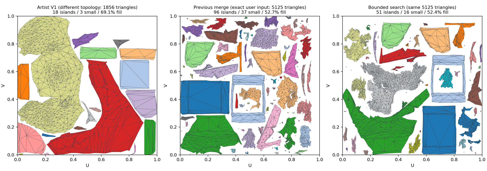

# Проверка свежего 5125-face unwrap

2026-10-04, Unity 6000.2.6f2. Воспроизведён именно новый пользовательский лог,
а не прежний 1883/1901/1997-face snapshot. Input SHA-256:
`2E2377BD7C621DA9A1776D935457B82A4F93462AC27FA626E873DA94A1B34340`.
Дамп содержит 2565 positions, 5125 triangles и точные настройки: voxel 256,
maximumError 0.002, target 1600, Smooth normals / smoothing 4.8, chart cost 2,
deviation 2, roundness 0.5, straightness 6, seam 4, iterations 1,
512 px / padding 3, rotation on, brute force / block alignment off.
Исходная геометрия и приватные captures в репозиторий не добавлены.

**Позднейшая проверка расположения швов:** уменьшение числа charts не доказывает
правильные границы. На одинаковой геометрии ручных эталонов merge снижает
seam recall V1 с 50.12% до 30.17%. [PartUV/OptCuts, 3D seam metrics и рендеры](UV_SEAM_PLACEMENT.md).

## Причина лишней фрагментации и исправление

После overlap repair baseline имеет 147 charts. Broad merge соединяет их в 44,
relax снижает worst до 1.814; полная проверка пересечений проходит. Но fill
падает с 52.745% до 45.879%. Прежний код отменяет половину 103 слияний,
принимает первый прошедший budget 51 и останавливается: 96 charts.

Упаковка меняется скачками, поэтому такое прекращение поиска неоправданно.
Новый поиск сохраняет каждый прошедший checkpoint. После первого отказа
проверяет 3/4 merge budget, затем промежуточные бюджеты между принятым и
отвергнутым; максимум шесть попыток на стратегию. Все попытки стартуют с
исходного snapshot, а последний отказ quality/packing gate не уничтожает ранее
проверенный результат. Native/session exceptions и cancellation сохраняют
прежний безопасный rollback к baseline.
Refinement применяется при fast packing до 512 px. При brute force или большем
разрешении сохранён прежний halving / first-success путь, без дополнительных
refinement repacks. Это ограниченный поиск по детерминированному порядку слияний, не доказательство
глобального оптимума. В данном случае broad budgets 77, 90, 96 проходят,
99 и 97 отвергаются; итог берётся из budget 96.

Также соединение теперь использует только вершины общих welded edges.
Внутренний UV-разрез в другой части chart не запрещает присоединение соседа;
одинаковая 3D-позиция без общего ребра не является поводом закрывать разрез.
Неоднозначный разрез на самом предлагаемом шве по-прежнему запрещён.
Регрессионный тест присоединяет flap к развёрнутому цилиндру и проверяет
бит-идентичное сохранение существующего разреза.

| Тот же 5125-face input | Острова | Малые ≤8 faces | Fill | Mean | Worst | Overlap pairs |
|---|---:|---:|---:|---:|---:|---:|
| Прежний merge | 96 | 37 | 52.726% | 1.02726 | 1.86308 | 0 |
| Поиск checkpoint | 51 | 16 | 52.366% | 1.03097 | 1.81362 | 0 |

Цена: три measured Merge-on runs прежнего варианта 5.81–6.02 s, нового
13.72–13.84 s на этой машине. Поиск добавляет работу только после отказа
полного кандидата; Merge остаётся opt-in. Это компромисс качества и времени,
не ускорение. Fill снижается на 0.36 процентного пункта; mean слегка растёт.
Прежние final stretch, density и 95% packing gates сохранены.

[Числа для изображения](UV_MERGE_SEARCH.csv). Слева другая, вручную исправленная
топология (1856 triangles); справа и в центре один и тот же 5125-face input.

## Что проверено и не принято

На том же input отдельно сравнивались альтернативы; они не попали в defaults:

| Вариант полного кандидата | Charts / small | Fill | Результат |
|---|---:|---:|---|
| Narrow, brute force | 55 / 21 | 45.414% | packing gate не проходит |
| Broad, brute force | 44 / 16 | 49.763% | packing gate не проходит |
| Relax 20 iterations после каждого join | 40 / 15 | 41.468% | хуже packing |
| То же, temporary local mean 2, residual 10% | 34 / 11 | 43.437% | хуже packing |
| То же, residual 25% | 33 / 9 | 42.373% | хуже packing |
| Приоритет по 3D compactness / balanced / gain | 41–43 / 16–18 | 42.933–46.516% | gate не проходит |
| Ограничение UV contour occupancy 0.35 / 0.5 / 0.65 | 45–58 / 16–21 | 45.833–47.681% | gate не проходит |

Шесть общих углов 0–75° вместо min-box orientation не устранили потери fill.
Fixed-square packing с явно заданной density при повышении fill дал cross-chart
overlaps в readback. Этот режим допускает несколько native atlas pages, а bridge
читает их UV в один tile; complete scan отвергает такой результат. Этот режим
не используется в production. Комбинация relax
во время роста с checkpoint search дала 54 / 13 / 53.927%: другой компромисс,
не устойчивое улучшение относительно выбранных 51 / 16.

## Проверка и оставшийся разрыв с эталоном

- 194/194 связанных Unity EditMode tests passed, skipped 0; в том числе отмена
  после сохранения прошедшего checkpoint.
- Прежний и новый алгоритмы: Merge off/on, по три повтора на точном 5125-face
  input. Все source corners сохранены, output buffers побайтово повторяемы;
  полные scans имеют zero overlap / invalid / degenerate / out-of-bounds.
- Обе версии ручного FBX повторно проверены на новом коде: по три Merge off/on
  runs, автоматический результат остаётся 22 charts / 10 small / 54.633% fill,
  zero overlaps. Их собственные UV не используются как вход автоматического
  charting. Ручной V1: 18 / 3 / 69.143%, V2: 23 / 5 / 64.354%, причём у V2
  имеются ранее подтверждённые 16 intra-chart overlap pairs.
- Compile-check обеих FBX define configurations и identifier/dependency checks
  проходят. Native source, ABI, binaries и serialized settings не изменены.

**51 islands не равны качеству ручного эталона.** Merge удаляет существующие
границы xatlas, но не планирует новые пути разрезов и не восстанавливает авторские
smoothing groups. Initial chart growth xatlas также имеет собственный жёсткий
normal-deviation cutoff, независимый от весов. Отдельные relax/packing веса не
решили этот разрыв на проверенном input. Для дальнейшего приближения требуется
проверять само разбиение поверхности и пути швов, а не объявлять уменьшение
счётчика островов художественной эквивалентностью.

## Replay

Скопировать `Tools~/UvCapturedInputReplay.cs` в `Assets/Editor` изолированного
Unity-проекта, подключённого к проверяемой версии пакета. Установить
`MESHLAB_UNWRAP_CAPTURE` в путь к сохранённому `unwrap_*.bin`,
`MESHLAB_REPLAY_OUTPUT` в локальную папку результатов и
`MESHLAB_REPLAY_TAG` в метку версии. Запустить batchmode
`-executeMethod UvCapturedInputReplay.Run`. Harness делает три повтора для
каждого положения Merge, сохраняет geometry captures и точные settings,
проверяет source corners, полный atlas scan и повторяемость.
Captures содержат модель: хранить локально, не включать в публичный PR.
