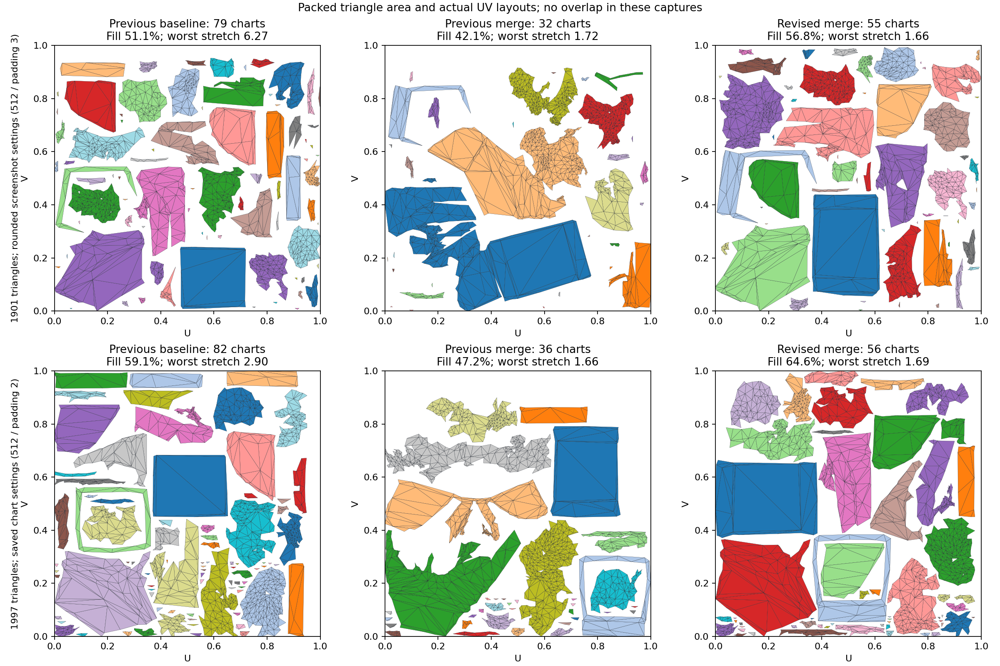

# UV packing quality after merge — 2026-10-04

Continuation of chart merge Experiment #1, following the poor layouts reported
on commit `10464bb`. Fewer charts and zero overlaps did not guarantee useful UVs:
merge could spend substantially less of the texture and redistribute texel density.

## Changes

- Before each UvMesh repack, normalize every chart's UV triangle area to its original
  3D triangle area using a uniform scale. The native UvMesh path explicitly sets
  `surfaceArea = parametricArea`; it cannot restore 3D density itself. Similarity
  fits permit density changes per join, which can accumulate over greedy merges.
  The separate preparation buffer preserves input UV on cancellation/failure.
  This also applies to overlap-repair repacks when Merge is off.
- Prefer seams by the fraction of the smaller chart's border they remove. Chart ids
  remain deterministic tie-breakers. Angular/stretch and exact overlap gates remain.
- Measure final packed triangle area and area-weighted chart texel-density coefficient
  of variation. Reject results that lose more than **5% relative filled area** against
  the current repaired baseline, or exceed density CV `max(0.02, baselineCV * 1.1)`.
  Five percent permits a bounded packing/relax tradeoff; it is not zero regression.
  The density metric is per chart, not a guarantee of identical density on every face.
- On failed packing/stretch gates, restart from a fresh baseline snapshot and halve
  the accepted-merge budget. Every proposal is relaxed, packed and fully validated.
  The first passing proposal wins; if none passes, keep the baseline. This is a
  bounded deterministic search, not a global layout optimum. It adds repack calls
  when full merging is harmful. Native session safety/4x oversampling stay unchanged.
- Info diagnostics print `uvArea`, `chartDensityCV`, `merge-packing-gate` and retries.
  At Verbose with RemeshDiag enabled, `unwrap_*.bin` also stores exact source positions,
  indices and settings in `%TEMP%/meshlab-uvmerge` (the remesh and re-pack captures
  need the same level); only the last five captures remain.
  Existing repack captures contain UVs only and cannot reproduce source simplification.

## Production measurements

Same fixed source geometry per before/after pair, Unity 6000.2.6f2 / DirectX.
The actual screenshot has **1883 triangles**; the available full 3D replay snapshots
have **1901** (rounded screenshot settings) and **1997** (previous saved settings).
These are representative comparisons, not a claim to reproduce the exact screenshot.
The user's two 1883-face UV-only captures were preserved locally; no 3D areas can be
reconstructed reliably from them. The new input captures make the next run exact.

| Source / settings | Version | Charts / small | Filled triangle area | Chart density CV | Mean / worst stretch |
|---|---|---:|---:|---:|---:|
| 1901, 512 / padding 3 | Previous baseline | 79 / 44 | 51.1% | 0.00982 | 1.09708 / 6.27359 |
| same | Previous merge | 32 / 18 | 42.1% | 0.13703 | 1.07322 / 1.71815 |
| same | Revised baseline | 79 / 44 | 58.8% | 0.00131 | 1.09634 / 5.76767 |
| same | **Revised merge** | **55 / 28** | **56.8%** | **0.00134** | **1.06154 / 1.66348** |
| 1997, 512 / padding 2 | Previous baseline | 82 / 47 | 59.1% | 0.03500 | 1.17660 / 2.90240 |
| same | Previous merge | 36 / 19 | 47.2% | 0.10603 | 1.06325 / 1.65894 |
| same | Revised baseline | 82 / 47 | 60.6% | 0.00595 | 1.17345 / 3.52157 |
| same | **Revised merge** | **56 / 26** | **64.6%** | **0.00498** | **1.05525 / 1.68645** |

Filled area sums UV triangle areas and excludes padding. Here every full scan is
complete with zero overlaps, so it represents occupied geometric area. Unpacked
`uvArea` does not mean atlas utilization. Small means <=8 faces per chart.
Repacking can change worst stretch on tiny charts because native ceil sizing scales
axes separately; area normalization alone is not a distortion fix. Final gates
and conformal relax remain necessary. Narrow triangles and holes already present
in source geometry can remain: improving packing does not retopologize the model.

Full merge candidates were rejected at 49.4% (1997) / 47.7% (1901); partial candidates
passed after 26 / 24 merges respectively. Compared with revised baselines, 1997
fills 6.6% more relative area; 1901 loses 3.4%, within the stated 5% tradeoff, while
worst stretch drops from 5.77 to 1.66.

Raw measurements: [CSV](UV_PACKING_QUALITY.csv).
Plot reproduction: `python Tools~/analyze_uv_packing.py SCRATCH_REPLAY Documentation~`.
Source captures are local diagnostic data and are not committed.

Capture format: little endian int32 magic `0x554D4C42`, int32 version `1`,
BinaryWriter UTF-8 length-prefixed JSON settings, int32 vertex/index counts,
float32 XYZ positions, int32 indices. No mesh faces are dropped.
## Validation

- 179/179 related Unity EditMode tests pass, zero skips, DirectX backend.
- Compile-check passes with and without the FBX exporter define on an isolated
  package snapshot, keeping concurrent inspector WIP out of verification.
- Both revised source cases: 3/3 baseline and 3/3 merge runs produce byte-identical
  buffers; every source corner is preserved. Full atlas scans are complete with
  zero overlaps, invalid/degenerate faces or out-of-bounds UV vertices.
- Added regressions cover angularly perfect but poorly filled atlases, unequal
  density at equal filled area, duplicate UV corners, failed normalization and
  cancellation without input mutation.

The plotted improvement is packing utilization and measured distortion. It is
not a claim of artist-authored seams or a completed visual bake/shading review.
