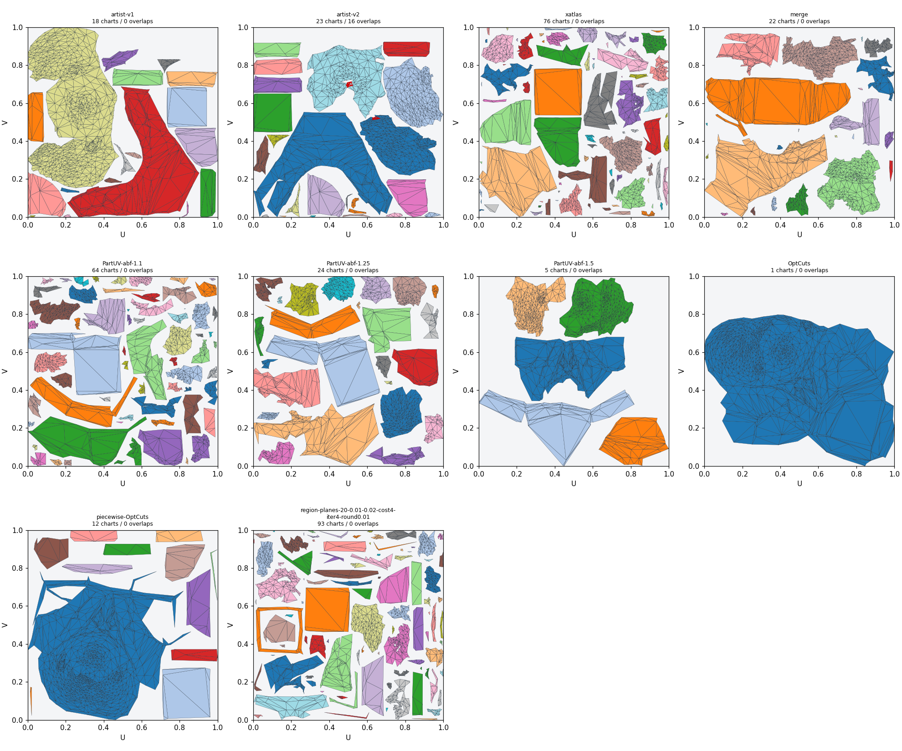

# Расположение швов: PartUV, OptCuts и геометрические методы

2026-10-04, продолжение chart-merge Experiment #1. Основная цель — швы на
нужных границах формы. Число островов, fill и отсутствие overlaps проверяются
отдельно и не заменяют эту цель. Новые методы пока исследовательские: в Unity
Unwrap/defaults они не включены.

## Сравнение на одинаковой поверхности

Оба `uvbest.fbx` содержат одинаковые 930 welded positions / 1856 triangles /
2784 manifold edges. В сравнениях сохраняется эта геометрия; чужой 5125-face
simplify capture сюда не подмешивается. Проверяются точные позиции и каноническое
соответствие всех граней. UV/нормали авторских эталонов не передаются автоматическим
методам; smoothing groups используются только для оценки результата.

Шов — разрыв UV между концами одного и того же 3D-ребра. Дублирование вершины
ради normals/tangents само по себе швом не считается. Precision измеряет долю
длины полученных швов, совпавшей с эталоном; recall — долю длины эталонных швов,
которая восстановлена. F1 объединяет их. Вес — длина ребра, а не число рёбер.
Дополнительно измерена приблизительная coverage в пределах 0.25% / 1% bbox
diagonal: 9 точек на ребро, точное расстояние до сегментов, вес по длине.

| Готовые UV на этой поверхности | Charts | Precision V1 | Recall V1 | F1 V1 | Fill | Overlap pairs |
|---|---:|---:|---:|---:|---:|---:|
| Текущий xatlas | 76 | 24.50% | 50.12% | 0.329 | 55.84% | 0 |
| Текущий merge | 22 | 25.39% | 30.17% | 0.276 | 54.63% | 0 |
| PartUV / ABF, threshold 1.1 | 64 | 13.80% | 29.79% | 0.189 | 55.95% | 0 |
| PartUV / ABF, threshold 1.25 | 24 | 16.06% | 22.63% | 0.188 | 59.47% | 0 |
| PartUV / ABF, threshold 1.5 | 5 | 18.16% | 12.00% | 0.145 | 45.33% | 0 |
| OptCuts, свободные швы | 1 | 1.32% | 0.25% | 0.004 | 59.94% | 0 |
| Геометрические части → отдельные OptCuts → packing | 12 | 34.97% | 36.37% | 0.357 | 60.68% | 0 |
| Крупные planar regions → xatlas cost 4 / iterations 4 | 93 | 27.09% | 77.11% | 0.401 | 49.77% | 0 |

У V1/V2 взаимный F1 0.850: допустимые ручные варианты тоже различаются. Это
проверка сходства с двумя конкретными художественными решениями на одном asset,
а не универсальная оценка качества UV. Все метрики для обоих эталонов находятся
в [UV_SEAM_PLACEMENT.csv](UV_SEAM_PLACEMENT.csv); validation и capture hashes —
в [UV_SEAM_QUALITY.csv](UV_SEAM_QUALITY.csv).

**Merge действительно ухудшает нужные границы на этом примере.** Recall V1
падает 50.12% → 30.17%, V2 — 52.45% → 29.80%. Доля сохранённой длины hard
boundaries падает 52.55% → 33.71%; пропущены 88 из 163 рёбер. Relax уменьшает
distortion внутри chart, но не восстанавливает другой путь шва.

## Что именно запущено

**[PartUV](https://github.com/EricWang12/PartUV)**: официальный Linux wheel 0.1.2
cp312, native core SHA256
`41a3feacb3a14d758c20df98c300cee25dfc75471decb1425ccc1cd1dcd641aa`.
PartField features получены на Windows / GTX 980 Ti из официального Objaverse
checkpoint, strict state loading, seed 42, 10 face samples, batch 256. Checkpoint
SHA256 `463efc8a3afd3913142aa025e0125c00f16ef452b8de6a132ebe32bbe7877ee4`.
Авторский hierarchy builder из commit
`46bad07092a9396f00d7e04ea90369ded7de3d18` строит дерево на всех 1856 faces.
Далее настоящий native `pipeline_numpy` выполняет recursive part selection,
ABF с 5 итерациями и собственные split/merge решения. Это полный unwrap pipeline,
не ранний PartField + наш фиксированный Ward clustering.

Для WSL PAMO выключен штатным `unwrap.pamo: false`: исходный default-run
выдавал CUDA 801/invalid argument. Его результаты не считаются успешным GPU
benchmark. Три CPU-варианта завершились без этих ошибок. Упаковка отдельно
через vendored xatlas, 512 / padding 3 / bilinear / rotation; это не платный
UVPackMaster из авторских part-based packing примеров. Все source faces сохранены.
API возвращает один combined component, но фактических UV charts внутри него
64/24/5; счётчик components нельзя использовать как счётчик шелов.

**[OptCuts](https://github.com/liminchen/OptCuts)** commit
`cd2302671af7954f263b0ea93d8419aa943d54be`.
Собран MSVC 19.44 / CMake, только platform/build adaptations, без изменения
оптимизационной энергии. Headless method 0, weight 0.999, symmetric Dirichlet
bound 4.5, bijectivity on, farther two-point initialization. Это минимум длины
шва при ограничении distortion, а не модель художественного выбора границ.
127 iterations; финальная поверхность сопоставлена по каждому ordered corner.
На другом запуске обязательные 12 planar regions решаются по отдельности;
несвязные incident fans на границах разделены без движения source corners.

Порог OptCuts 4.5 и пороги PartUV не равны нашему `mean/worstStretch`:
в quality CSV stretch = отношение singular values, усреднение по
3D-площади. У свободного OptCuts оно 1.436 / 10.241; у piecewise — 1.260 / 7.401.
Отсутствие overlaps не означает приемлемого distortion или правильных швов.

## Piecewise OptCuts: устранение слишком крупного шела

В первом piecewise результате один chart занимал 63.54% 3D-площади поверхности.
В нём объединялись различные кривые области; средний symmetric Dirichlet bound
не ограничивал локальное растяжение. Введён новый автоматический вариант:
авторское semantic hierarchy PartUV делится по 3D-площади, пересекается с
обязательными planar boundaries, затем каждый connected patch решается OptCuts.
Distortion bound снижен с 4.5 до 4.15. 3D positions/triangulation сохранены.

| Вариант | Charts | Крупнейший chart, 3D-площадь | Mean / worst stretch | V1 recall / F1 | Overlaps |
|---|---:|---:|---:|---:|---:|
| Первый piecewise | 12 | 63.54% | 1.260 / 7.401 | 36.37% / 0.357 | 0 |
| Area cap 15%, Ed 4.15 | 28 | 12.45% | 1.084 / 3.764 | 49.74% / 0.347 | 0 |
| Area cap 20%, Ed 4.15 | 25 | 16.55% | 1.076 / 3.716 | 49.74% / 0.361 | 0 |
| Area cap 30%, Ed 4.15 | 17 | 24.09% | 1.099 / 3.674 | 38.60% / 0.321 | 0 |
| Area cap 20%, Ed 4.05 | 25 | 16.55% | 1.158 / 3.416 | 51.93% / 0.367 | 0 |

Это совместное изменение partitioning и distortion bound; таблица не выделяет
их независимый причинный вклад. Структурные швы не удаляются ради cap. Если
одна исходная грань превышает лимит, это явный leaf exception; на этой сетке
исключений нет. [Новые рендеры](UV_OPTCUTS_BOUNDED.png),
[качество](UV_OPTCUTS_BOUNDED.csv), [seam scores](UV_OPTCUTS_BOUNDED_SEAMS.csv).

Triangle aspect определяется как `sqrt(3)*longestSide²/(4*area)` (equilateral = 1).
На этой исходной сетке 37 faces уже имеют aspect >10. Дополнительное UV-вытягивание
выделяется, когда UV aspect >10 и >1.5× собственного 3D aspect: первый piecewise
даёт 20 таких faces, cap 20% — 5, ручной V1 — тоже 5. Их доля 3D-площади
0.187% → 0.072% (ручной V1 0.035%). Худший UV aspect остаётся около 52, потому
что такие треугольники есть в самой сетке. Это diagnostic threshold, не критерий
художественного качества всех швов. [Inherited/introduced slivers](UV_OPTCUTS_TRIANGLES.png).
Сходство швов остаётся неполным; вариант исследовательский и пока не Unity default.

Дополнительный прогон с теми же partitions cap 20%, но Ed 4.05, уменьшил
UV-induced slivers до 2 (0.014% 3D-площади) и улучшил worst stretch 3.716 → 3.416.
Однако mean stretch ухудшился 1.076 → 1.158, fill снизился 51.13% → 49.05%.
Seam F1 повысился лишь 0.361 → 0.367. Это не безусловно лучший preset:
ограничение энергии OptCuts не является ограничением нашей отдельной stretch
метрики. Оба результата сохранены для визуальной оценки; UV relax сам по себе
не изменит художественно неверный путь шва. Следующее улучшение должно выбирать
разрезы по структурным границам и локальному distortion, а не одной площади шела.

## Другие проверки и вывод для следующего изменения

Отдельно реализованы geometry-only normal-proxy graph cuts, shape-thickness
segmentation (25 inward rays), planar patches и crease thresholds/components.
Они не используют авторские labels или source classifier, обученный на этом же
asset. Это собственные исследовательские методы, не запуск CGAL VSA/SDF.
Границы каждого region proposal проверены в настоящем xatlas с обязательным
`faceMaterialData`; xatlas может добавлять внутренние разрезы. Контроль без
regions воспроизводит текущий baseline точно по UV-метрикам.

216 таких unwrap runs включают 24 ранних normal-proxy варианта без spatial suffix;
они сохранены для просмотра и не служат выбором нового алгоритма. Актуальный
`relocate.py` генерирует имена с `spatial0/25/100`. Локальная полная галерея
содержит 221 исходный render плюс отдельный обзор полноценных PartUV/OptCuts.
Raw proposal F1 не смешивается с F1 окончательных UV.

В исследовательском xatlas cost 2 / iterations 4 улучшил fill 55.84% → 59.57%
и worst 12.89 → 2.24, но ухудшил seam F1 0.329 → 0.289. Cost 4 / iterations 4 /
roundness 0.01 повысил F1, однако создал 3 intra-chart overlaps. Поэтому новый
набор defaults не принят только по fill или chart count.

Следующая архитектура должна сначала планировать и защищать структурные границы,
затем выбирать дополнительные разрезы и параметризовать каждый patch. Для
PartUV требуется оценивать реальное расположение semantic boundaries; для
OptCuts — задавать обязательные/предпочтительные cut constraints, иначе его
целевая функция удаляет нужные художественные разрезы. Пока ни один испытанный
вариант не воспроизвёл пользовательский эталон достаточно хорошо для замены
Unity Unwrap по умолчанию.

Полный PartUV включает компоненты NVIDIA с non-commercial research/education
use limitation в [LICENSE](https://github.com/EricWang12/PartUV/blob/main/LICENSE).
Локальный исследовательский запуск не означает возможность включить весь этот
pipeline в распространяемый commercial Unity package. Чужой код/weights/DLL
в PR не добавлены.

## Проверка и рендеры

Финальный повтор 2026-10-04: 18 Python checks passed. Проверяются geometry correspondence, UV continuity при duplicate normals,
truncated captures, closed manifold gate, length weighting, near-segment distance,
graph-cut exhaustive oracle/energy decrease, adjacent intra-chart folds и boundary
fan splitting, surface-area hierarchy bound и scale-invariant triangle aspect.
Standalone C++ probe собран успешно. Для каждого полного UV
проверены positive-area triangle intersections, mixed winding, zero area и bounds.
Это не новый Unity Editor test run: production Editor/Native~/Plugins не менялись.

Tools: [SeamPlacementBenchmark](../Tools~/SeamPlacementBenchmark/README.md).
Локально `_results~/seam-placement/preferred-renders/index.html` показывает
PartUV/OptCuts и оба эталона, а `renders/index.html` — все геометрические прогоны.
Каждый PNG содержит параметры, реальные UV, validation и SHA256 capture;
обзорные листы и `quality.csv` лежат рядом. Приватные meshes/captures остаются локально.
