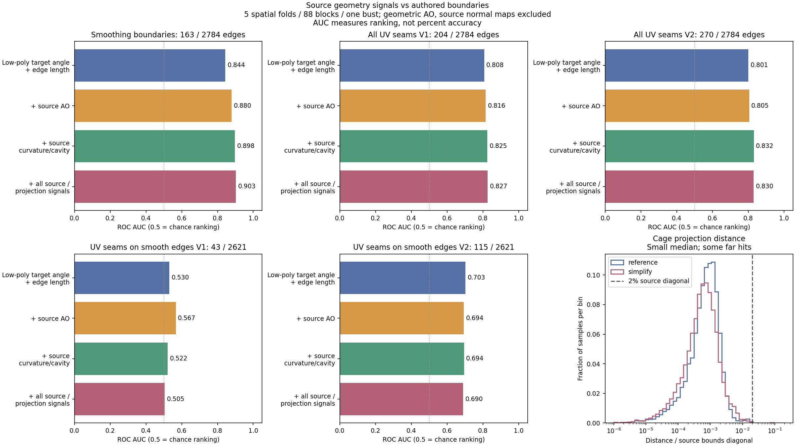

# Source curvature, cavity и AO против ручных UV/smoothing границ

2026-10-04, продолжение chart-merge Experiment #1. Проверка на source
`Meshy_AI_Distinguished_Bust_0925154648_texture`, двух сохранённых версиях
`uvbest.fbx` и actual simplify input из предыдущих прогонов.

**В текущем Unwrap/merge source curvature, cavity и AO не корректируют веса.**
Source AO используется в bake. xatlas получает позиции/индексы simplify,
усреднённые normals этой сетки и общие chart weights; переданные в IndexedMesh
normals не передаются через нынешний native unwrap ABI. Поэтому геометрические
normal-deviation costs косвенно учитывают форму simplify, но high-poly source
не даёт им дополнительных деталей. Merge работает с UV-швом, stretch,
overlap и packing. Смена production/default weights в этом исследовании не введена.

Измерения показывают дополнительную информацию для smoothing boundaries.
После удаления hard edges преимущество для оставшихся UV-швов исчезает.
Это не доказательство, что source бесполезен для UV; это отсутствие подтверждения
достаточного правила выбора авторских разрезов на этом asset.

## Что сопоставлено

- High-poly: 30288 triangles, 16847 indexed vertices / 15146 position-welded vertices.
- Ручной target: общая исправленная геометрия 1856 triangles / 2784 manifold edges.
  V1: 204 UV seam edges, V2: 270; обе версии имеют 163 hard smoothing edges.
  Общие UV seam edges: 193, union 281, Jaccard 0.687. Source и геометрия одинаковы,
  поэтому различие швов не может объясняться только изменением source-сигналов.
- Actual simplify: 1997 triangles / 1001 vertices / 2990 manifold edges; current
  merged layout имеет 472 UV seam edges на них. Non-manifold edges не являются
  двусторонними edge samples в этом сравнении.

Source захвачен через production `RemeshSource.Capture(... geometryOnly:true)`.
Его позиции нормализованы по bounds diagonal. Ориентация source/reference совпала:
перестановка XYZ и знаки +++; ICP/deformation registration не применялись.
Для reference используется его нормализация по bounds; actual simplify
использует точно сохранённый source root frame. Медиана ближайшей source vertex
для reference — 0.195% diagonal; это только alignment check, не ошибка проекции
на треугольную поверхность. Сглаживание извлечено из raw FBX masks, сопоставление
triangle centroids после axis conversion: max residual 2.52e-8 normalized units.

На каждой стороне каждого edge использованы t=0.2/0.5/0.8 и небольшой сдвиг
5% к face centroid. Результат — 16704 samples reference и 17940 samples simplify.
Проекция использует production fitted cage: distance 0.02 diagonal,
smoothing 2, fitted reach; facing-filtered ray из наружной cage через target,
затем production bounded nearest fallback. Source winding probe = +1.
Source features интерполируются barycentric на найденной source face.

Проверены:

- Signed cotangent mean-curvature estimate и его absolute value на welded source.
- Signed area-weighted normal height (cavity/convexity proxy) и local normal
  variation на радиусах 1%, 3%, 7% source diagonal.
- Геометрический AO на source через actual `SourceAoBaker` на радиусах 1%, 5%,
  20%. 128 sphere directions (приблизительно половина в выбранной hemisphere),
  cosine weighting, linear distance falloff, bias 0.0001, intensity 1, ground off.
  В таблицах AO-сигнал — occlusion=`1-visibility`.
- Расстояние projection hit и расхождение source normal с simplify face normal.

Текстурные curvature/cavity/AO и source normal map в этом сравнении не участвуют.
Это геометрические source-сигналы с импортированными vertex normals. Значения
сняты в нескольких samples, а не по полной поверхности каждого triangle.

## Projection confidence

| Измерение | Reference | Actual simplify |
|---|---:|---:|
| Samples | 16704 | 17940 |
| Bounded nearest fallback | 33 | 37 |
| Misses | 0 | 0 |
| Median hit distance / source diagonal | 0.0729% | 0.0565% |
| P95 distance | 0.2625% | 0.3142% |
| Max distance | 1.978% | 10.606% |
| Median dot(source normal, target face normal) | 0.976 | 0.975 |
| P05 normal dot | 0.585 | 0.531 |
| Samples с distance >2% | 0 | 10 |
| Samples с source/target normal dot <0 | 121 | 123 |

Нулевой miss не гарантирует правильную correspondence. Фitted cage может принять
далёкий hit; normal mismatch может означать потерю формы при simplify, ошибочную
correspondence или проблемную shading normal. На simplify 132 samples (0.74%)
имеют distance>2% или normal dot<0. Перед изменением production weights нужен
confidence/fallback; эти флаги — диагностика, не уже внедрённый reject threshold.

## Связь с ручными границами

Для каждого edge агрегированы mean, max absolute value, std и difference двух
сторон каждого source field, плюс projection distance/normal disagreement.
Контроль: dihedral angle и edge length исправленного ручного low-poly target.
Классификация границ выполняется на общей геометрии двух эталонов; actual simplify
проверен отдельно по качеству проекции и source-сигналам, без переноса ручных edge
labels на его другую топологию. Пять GroupKFold folds над
5×5×5 spatial cells, в данных 88 непустых blocks. Соседи внутри block всегда
в одной fold. На границах blocks spatial exclusion buffer не вводился.
Зависимые features, включая AO больших радиусов, могут пересекать blocks.

Все feature families используют одну заранее фиксированную конфигурацию Random
Forest: 180 trees, max depth 6, min leaf 12, max features 0.7, balanced class
weights, seed 73. Это исследовательский классификатор, не production seam planner.
ROC AUC измеряет ранжирование positive/negative edges, **не процент правильных
границ**. Average precision учитывает редкость положительных labels.

| Target | Low angle + length | + source AO | + source curvature/cavity | + source и projection |
|---|---:|---:|---:|---:|
| Hard smoothing boundaries | 0.844 | 0.880 | 0.898 | **0.903** |
| Все UV-швы V1 | 0.808 | 0.816 | 0.825 | **0.827** |
| Все UV-швы V2 | 0.801 | 0.805 | **0.832** | 0.830 |

Average precision для low → all source: hard 0.279→0.424, UV V1
0.285→0.390, UV V2 0.327→0.485. AO увеличивает precision некоторых верхних
кандидатов, но общий AUC для UV меняет мало; на V2 добавление AO/projection
к curvature family не улучшает AUC. Source fields не заменяют low geometry:
source/projection family без dihedral/length даёт 0.890 / 0.803 / 0.815.

500 paired spatial-block bootstrap resamples для изменения AUC low → all source:

| Target | Δ AUC | 2.5–97.5 percentiles |
|---|---:|---:|
| Hard boundaries | +0.059 | +0.032 … +0.088 |
| UV V1 | +0.020 | −0.013 … +0.048 |
| UV V2 | +0.029 | +0.006 … +0.051 |

Это интервалы при resampling blocks **этого asset** с уже полученными OOF scores,
не доказательство переносимости на другие модели и не повторное обучение во
всех bootstrap samples. Для V1 диапазон AUC включает отсутствие преимущества.
Среди отдельных source признаков заметны normal variation на радиусе 1%,
source/target normal disagreement и cavity/convexity magnitude на радиусе 3%.
Необработанная curvature на одном vertex не стала достаточным правилом шва.

## Критический контроль: UV-швы на smooth edges

V1: 161 из 204 UV-швов уже совпадают с hard edges; V2: 155 из 270.
Поэтому общий UV score частично вознаграждает предсказание сглаживания.
Все 163 hard edges удалены; осталось 2621 edges и 43/115 UV-швов:

| Target на smooth edges | Low | + AO | + curvature/cavity | + all source |
|---|---:|---:|---:|---:|
| UV V1 | 0.530 | 0.567 | 0.522 | 0.505 |
| UV V2 | 0.703 | 0.694 | 0.694 | 0.690 |

Для V1 дополнительно остаётся очень мало positive examples. Для V2 average
precision вырастает 0.118→0.174, но AUC не улучшается. Сигналы помогают
выделить часть кандидатов; они не восстановили авторские мягкие разрезы.
Число совпавших hard edges в top-163 OOF candidates выросло 54→74, UV V1
в top-204 — 76→83, UV V2 в top-270 — 117→137. Даже top-K не даёт готовой
структуры islands. Эти classifier checks не проверяют disk topology, длину
необходимых cuts, overlap-free parameterization или final atlas packing.

## Следствие для алгоритма

Измерения поддерживают мягкий source prior для smoothing boundaries на этом asset.
Source-aware оценка потери формы/normal variation при simplify с projection confidence
остаётся перспективным направлением, но её влияние на конечную сетку не проверено.
Curvature/cavity можно проверять как вес сохранения деталей и stretch penalty,
AO — как дополнительный visibility prior при выборе между допустимыми cuts.
Это кандидаты для следующего controlled experiment, а не уже доказанные defaults.

Выбор UV-разрезов требует отдельно учитывать связность, допустимую topology chart,
структуру протяжённых cuts и параметризацию. Высокая curvature/AO не означает
обязательный UV-шов; низкая curvature не разрешает merge, который закрывает
необходимый cut и создаёт непараметризуемый или пересекающийся chart. Порог для
повторения artist layout не выбран. Подгонка весов по двум версиям одного бюста
пока не оправдывает включение новых production/default weights.

## Проверка и файлы

Unity 6000.2.6f2: все projection/AO arrays reference и actual simplify повторены
бит-в-бит с фиксированными samples/seed. Portable helper scripts повторили
alignment, labels, projection и исходные CV scores. Runtime Editor/Native/Plugins
не менялись. Гарантии валидности прежнего merge не заменены классификатором.

- [Основные CV scores](UV_SOURCE_SIGNALS_CV.csv).
- [Smooth-edge контроль](UV_SOURCE_SIGNALS_SOFT.csv).
- [Spatial-block bootstrap](UV_SOURCE_SIGNALS_BOOTSTRAP.csv).
- [Top-K ranks](UV_SOURCE_SIGNALS_TOP_K.csv).
- [Отдельные признаки, exploratory scores](UV_SOURCE_SIGNALS_SINGLE.csv).
- [Протокол и переносимый harness](../Tools~/SourceSignalsBenchmark/README.md).

Все сырые source/reference meshes, per-edge feature tables, query и projection
buffers остались локально в scratch-проекте. Только численные summary и figure
включены в репозиторий. Оба ручных FBX — версии одной модели, не независимый
train/test набор. Второй reference сохраняет известные 16 intra-chart overlaps;
labels отражают его швы, а не сертификат идеальности. Изменение source materials,
AO radius, sample count, feature estimators или target registration требует
отдельной повторной проверки.
