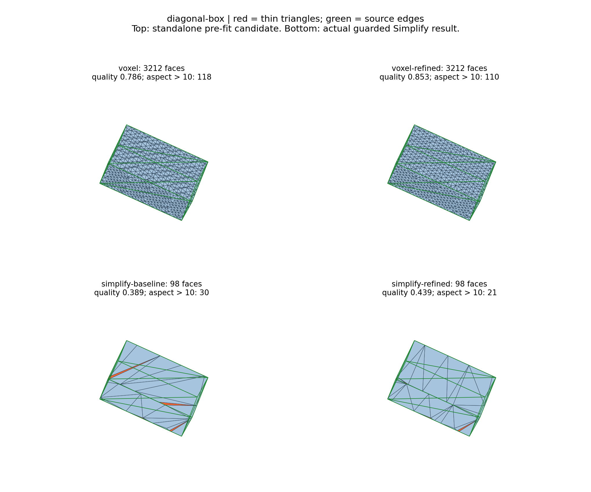
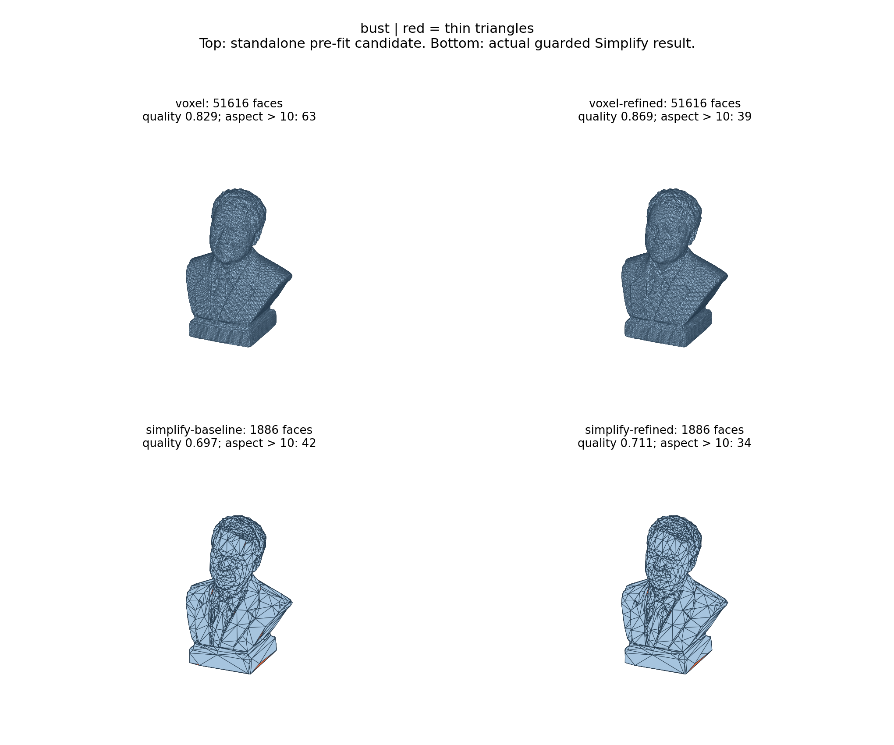
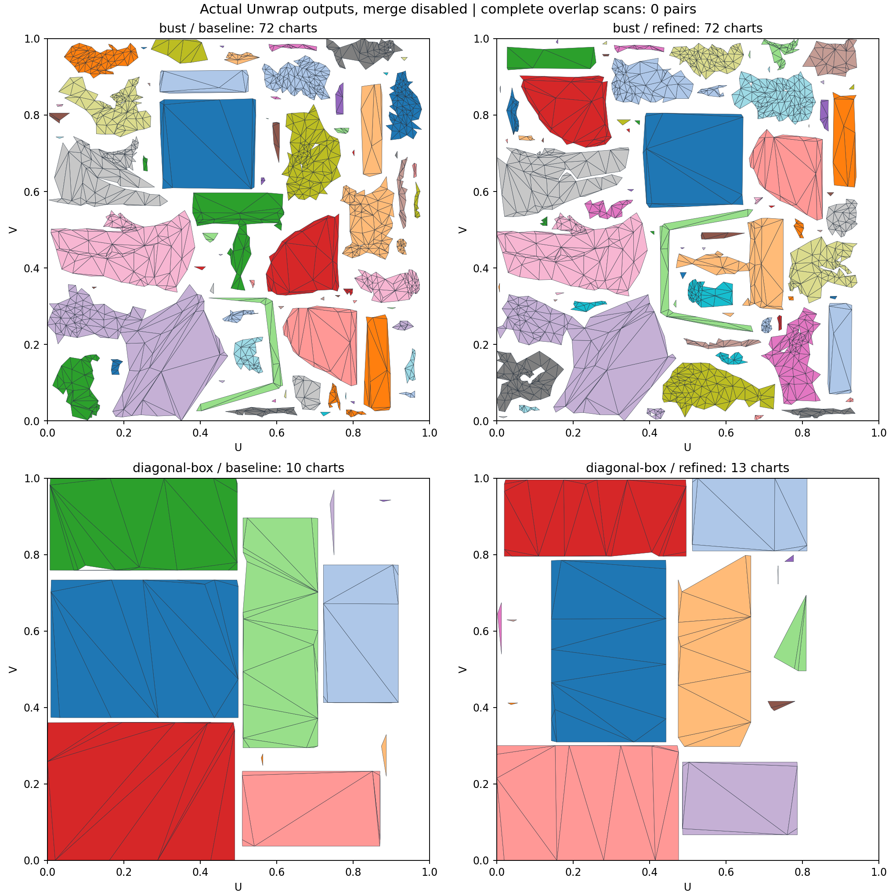

# Подгонка и перестройка voxel triangles по source

2026-10-04, продолжение входной диагностики Experiment #1.

Native voxelizer уже выполняет source fitting: проблема остаётся в диагоналях
и распределении треугольников сетки. Добавлена локальная коррекция в Simplify,
когда включён **Fit to source surface**, выбран LOD0 и выключен Two-sided shell.
Bounding box/hull и режим без Simplify идут прежним путём. Serialized settings,
native ABI и Plugins не изменены.

## Что выполняется

1. Сначала вычисляется обычный Simplify как контрольный результат.
2. Source BVH строится из сохранённых positions/indices исходного меша, до UV.
   Source features — реальные boundaries/non-manifold edges и резкие переходы
   face normals (dot < 0.75). Здесь не используются запечённые AO/curvature,
   ручной UV-эталон или сглаживание из FBX.
3. Voxel vertices проецируются на source с фильтром нормалей и ограниченным
   радиусом поиска. Рядом с резким source edge вершина привязывается к сегменту;
   на гладкой поверхности выполняются два небольших касательных перемещения
   с повторной проекцией. Настоящие open boundaries фиксированы. Перемещение
   ограничено 0.35 voxel cell относительно входа **каждого прохода Apply**.
4. Четыре прохода edge flips меняют диагонали локальных пар треугольников, когда
   минимальное качество пары улучшается минимум на 2%. Острые перегибы,
   source features, неправильный winding и существующая новая диагональ
   запрещают замену. Source-distance пробы ограничивают изменение формы.
5. Результат проверяется на валидность edges/vertex fans, точное сохранение
   boundary segments и component Euler characteristics. Source-distance gate
   сравнивает area-weighted RMS и максимум в двух направлениях. Для target
   используются centroid + три midpoints, для reverse runtime gate — source
   centroids. Допуск RMS: max(5%, 0.005 cell); максимума: +0.025 cell.
   Если перемещения не проходят, проверяется отдельно перестройка диагоналей
   с исходными positions. Если она тоже не проходит, сохраняется вход.
6. После Simplify подготовленного voxel candidate требуется тот же source gate
   и triangle count не выше max(ordinary count × 1.1, ordinary count + 2).
   Затем тот же локальный проход выполняется на выбранном Simplify output.
   Лог сообщает перемещения, flips, anchors, качество и максимальное смещение.
   Отображаемый Simplify error остаётся ошибкой native collapse, не полной
   ошибкой по исходному source.

Локальные перемещения также сохраняют ориентацию/площадь соседних faces и запас
над native Clean area floor. Это важно: слишком маленький треугольник мог бы
исчезнуть при следующем collapse и открыть отверстие.

## Реальные результаты

Unity 6000.2.6f2, одинаковый сохранённый source/voxel input для каждого сравнения.
Бюст: voxel 128, target 1600, maximum error 0.0041, Preserve folds.
Контрольный бокс: Euler (23°, 31°, 17°), размеры в пропорции 1:0.6:0.4,
voxel 32, target 100, maximum error 0.003, Preserve folds.

| Final Simplify | Faces | Mean triangle quality до → после | Aspect > 10 до → после | Target→source RMS, cells | Source→target RMS, cells |
|---|---:|---:|---:|---:|---:|
| Бюст | 1886 → 1886 | 0.6975 → 0.7111 | 42 → 34 | 0.17454 → 0.17267 | 0.19805 → 0.19936 |
| Диагональный бокс | 98 → 98 | 0.3887 → 0.4390 | 30 → 21 | 0.001501 → 0.000789 | 0.002429 → 0.000778 |

Quality = 2√3 × cross magnitude / sum of squared sides; equilateral = 1.
Aspect = √3 × longest side² / (4 × area). CSV/replay distance measurements
используют четыре пробы на face **в обоих направлениях**; это более подробная
независимая проверка, чем reverse runtime gate. Небольшое увеличение reverse RMS
на бюсте явно сохранено в таблице, а не названо полной неизменностью формы.

Все восемь snapshots имеют ноль boundary edges, валидную topology и один
component. Повторные pre-fit buffers побайтово идентичны, input не мутируется.
На бюсте final коррекция — 93 flips без перемещений; на боксе — 40 flips,
51 принятых перемещений (счётчик операций) и максимум 0.032 cell.

Отдельный pre-fit уменьшает voxel slivers 63 → 39 на бюсте и 118 → 110 на боксе.
Но **его native collapse candidates отклонены в обоих случаях**: на бюсте
ухудшалось соответствие source, на боксе topology retry не достигал ordinary
triangle budget. Поэтому нижний ряд рендеров показывает обычный Simplify плюс
прошедшую финальную коррекцию, а верхний — исследованный pre-fit candidate.
Перестройка не устраняет все тонкие треугольники и не доказывает artist UV parity.




## Проверка Unwrap

Merge выключен, texture 512, padding 3. Полные scans всех четырёх конечных
атласов: **0 same-chart / cross-chart overlap pairs**, 0 degenerate/invalid UV
faces; каждый source corner сохранён. Бюст: 72 charts в обоих вариантах;
бокс: 10 → 13 после исправления внутренних UV overlaps. Число charts здесь
не является критерием качества швов.

Независимый Python triangle-clipping scan тех же сохранённых captures также
даёт zero overlaps/zero-area/out-of-bounds; [CSV проверки](VOXEL_SURFACE_REFINE_UV_CHECK.csv).

На исправленном боксе ordinary repair pack создавал worst stretch 12.158 при
допустимом 10.219: xatlas ceil-rounds размеры маленького чарта отдельно по осям.
Repair теперь может один раз повторить pack **из исходных UV triangles** с
большей внутренней точностью: до 32×, internal resolution ≤ 16384 и прежний
pack-cost budget. Пользовательские resolution/padding и все acceptance gates
сохранены. Получено worst 9.9385, mean 1.05154, density CV 0.00018, zero overlaps.
При повторном отклонении результат по-прежнему не принимается.



## Проверка и воспроизведение

205/205 связанных Unity EditMode tests passed, skipped 0, Unity 6000.2.6f2 с
реальным NVIDIA graphics device. Включены восемь новых проверок: два масштаба,
плохая диагональ, source fitting, protected fold/обратный sheet, cancellation,
invalid input и native diagonal-box Simplify → Unwrap. C# compile check прошёл
с FBX exporter define и без него; identifier scan — zero findings, meta GUIDs
уникальны. Предварительный запуск с `-nographics` не подходит GPU-тестам;
долгий native integration test имеет явный 600 s timeout.

Developer harness: [SurfaceRefineReplay.cs](../Tools~/SurfaceRefineReplay.cs).
Подготовить captures через [SimplifyTopologyReplay.cs](../Tools~/SimplifyTopologyReplay.cs),
затем скопировать новый harness в `Assets/Editor` изолированного Unity-проекта,
запустить `-batchmode -executeMethod SurfaceRefineReplay.Run` без `-quit`.
Harness ничего не записывает в source assets/EditorPrefs. Raw geometry остаётся
локально в `PROJECT/surface-refine/`, публичные результаты —
[CSV](VOXEL_SURFACE_REFINE_METRICS.csv). Точные SHA256 captures сохранены в
[списке](VOXEL_SURFACE_REFINE_HASHES.txt).

```text
python Tools~/render_surface_refine.py PROJECT/surface-refine --out OUTPUT
```

Для пользовательской проверки заново выполнить **Simplify → Unwrap** с Fit to
source surface. Raw voxel preview не изменяется этим проходом.

Цена: standalone pre-fit на 51616-face бюсте около 9 s на этой машине; runtime
также вычисляет контрольный Simplify и проверяет candidate. Редкая упаковка
при повышенной точности может занимать существенно больше времени обычной.
Native end-to-end test бокса с default padding 8 занял 232 s; общий suite 250 s.
Это локальная коррекция с ограниченным смещением, а не глобальный isotropic
remesher. Sampled source-distance и topology checks не являются сертификатом
Hausdorff distance или полным поиском 3D self-intersections.
