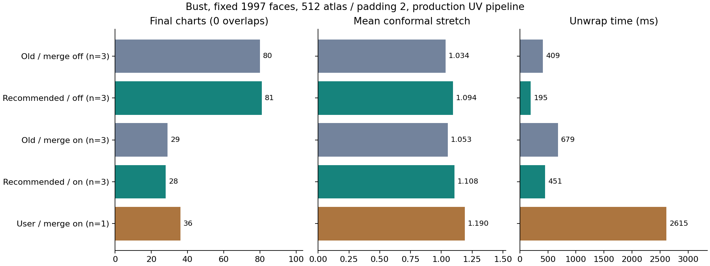

# xatlas defaults comparison — 2026-10-04

The measured balanced default changes **roundness from 0.01 to 0.5**. Other
chart weights, iteration count and packing defaults stay unchanged. This is a
continuation of the [chart-merge experiment](EXPERIMENTS.md), using its repaired
UV pipeline. It is a corpus-based choice, not a universal optimum for every mesh.

## Recommended settings

| Control | Default |
|---|---:|
| Max cost | 2 |
| Normal deviation | 2 |
| Roundness | **0.5** |
| Straightness | 6 |
| Hard edge seam | 4 |
| Iterations | 1 |
| Max island area / border | 0 / 0 (unlimited) |
| Rotation | On |
| Block alignment | Off |
| Brute force | Off |
| Texture size / padding | 2048 / 8 (unchanged) |
| Reduce UV fragmentation | On (unchanged) |
| Merge charts | Off, opt-in (unchanged) |

Previously saved settings are preserved. Use **Remesh & Bake → Unwrap →
Islands & packing → Recommended xatlas settings** to apply the chart and packing
defaults explicitly. The button preserves texture size/padding, optimizer toggles,
mesh, shading and bake settings. It invalidates only the Unwrap stage settings key.

## Method

Unity 6000.2.6f2, local Windows/DirectX scratch project; existing native plugins
and vendored xatlas revision `f700c77`. No native source, binary or ABI changes.
The source FBX is `Meshy_AI_Distinguished_Bust_0925154648_texture`:
30288 source triangles → 51612 remesh triangles (4 trimmed) → **1997 fixed
simplified triangles**. The earlier user log had 1883 triangles and belongs to a
different saved-settings snapshot. All profiles reuse the same cached geometry.
Other fixtures are a cube (12 triangles), closed cylinder (320), torus (768) and
curved wave sheet (800). The cylinder's triangle winding was corrected before
the reported corpus runs; the erroneous preliminary rows were replaced.

The comparison includes 82 initial chart profiles, 16 repaired finalists, 20
joint chart variations, 26 packing profiles, and 18 final production-pipeline
profiles, each on five meshes: **810 distinct phase/case/profile measurements,
1568 measured native/pipeline calls**. The final matrix covers 512/padding 2 and
2048/padding 8, Reduce UV fragmentation enabled, and Merge charts off/on.

Initial chart runs have one sample; subsequent runs target three. If a call
takes over two seconds, remaining repeats for that profile/mesh are omitted.
Tables and the CSV retain actual sample counts. Times are medians, or the single
observation when `n=1`, and depend on this machine. Unwrap time includes native
passes, repair/optimizers and final normals, but excludes the explicit final
quality/overlap measurement. Console logging is suppressed during timing without
writing EditorPrefs. A complete scan, zero positive-area overlaps and valid
triangle geometry are mandatory for accepting a final result.

Stretch is area-weighted mean / worst conformal distortion; 1 is ideal. Small
charts contain at most eight triangles. UV area is the sum of triangle areas;
for a complete zero-overlap atlas it measures filled coverage, but for unsafe
raw outputs it is **not** union coverage. The measured CSV includes controls,
sample counts, scan completion, validity, error strings and timing.

## Charting before repair

Fixed bust, 512/padding 2, random packing, rotation on, block alignment off.
These raw results illustrate why chart count alone is insufficient.

| Chart profile | Charts | Small | Mean | Worst | Overlap pairs |
|---|---:|---:|---:|---:|---:|
| Previous defaults | 92 | 62 | 1.03520 | 3.00663 | 6 |
| Recommended roundness 0.5 | 81 | 46 | 1.09449 | 2.44182 | **0** |
| User chart weights, controlled packing | 78 | 43 | 1.04028 | 2.81836 | 8 |
| Cost 5 / iterations 8 | 68 | 43 | 1.03170 | 2.69110 | 4 |

Higher cost and more iterations can produce fewer raw islands while leaving
overlaps that require cuts and another pack. Iterations are not monotonic in
island count. Cost 5 also worsens cylinder mean stretch from about 1.098 to 1.249,
outside the existing relative quality bound. Higher normal/seam weights do not
consistently improve this corpus. Roundness 0.5 avoids the bust repair pass while
reducing small fragments; increasing iterations adds work without a consistent
final benefit.

## Final production pipeline

Fixed bust, 512/padding 2, Reduce UV fragmentation on. The user rows retain their
saved chart weights and brute-force/block-aligned packing; the old/new rows use
their respective defaults. **Every row has zero overlaps and a complete scan.**

| Settings | Merge | Charts | Small | Mean | Worst | Filled area | Unwrap ms | n |
|---|---|---:|---:|---:|---:|---:|---:|---:|
| Previous defaults | Off | 80 | 51 | 1.03383 | 3.23459 | 59.52% | 408.5 | 3 |
| Recommended | Off | 81 | 46 | 1.09449 | 2.44182 | 61.74% | 195.2 | 3 |
| Previous defaults | On | 29 | 18 | 1.05256 | 3.44768 | 37.18% | 679.0 | 3 |
| Recommended | On | **28** | **14** | 1.10772 | 3.75916 | 47.76% | **451.0** | 3 |
| User saved settings | Off | 82 | 47 | 1.17660 | 2.90240 | 59.14% | 2013.4 | 1 |
| User saved settings | On | 36 | 19 | 1.18992 | 3.19396 | 45.27% | 2614.9 | 1 |

The recommendation trades some mean stretch against fewer small fragments,
better coverage and lower time compared with the previous defaults. Compared
with the user's saved settings, merged mean stretch improves, but worst stretch
increases from 3.194 to 3.759; it remains within the existing limit of 4. These
tradeoffs are intentional and visible rather than hidden by shell count.



At the unchanged default texture size, 2048/padding 8:

| Settings | Merge | Charts | Small | Mean | Worst | Filled area | Unwrap ms | n |
|---|---|---:|---:|---:|---:|---:|---:|---:|
| Previous defaults | Off | 80 | 51 | 1.05861 | 3.40397 | 58.74% | 10576.8 | 1 |
| Recommended | Off | 81 | 46 | 1.02712 | 2.39626 | 62.04% | **889.6** | 3 |
| Previous defaults | On | 30 | 20 | 1.07389 | 3.40381 | 52.00% | 14096.3 | 1 |
| Recommended | On | 29 | 13 | 1.03837 | 3.90045 | 50.41% | 11137.6 | 1 |

The large merge-off gain comes from avoiding the overlap-repair pack, whose
internal resolution is 4× the requested size. Merge remains expensive at 2048
because it still requires that oversampled pack. It remains opt-in.

Other fixtures show the limits of one default. At 512, cube and cylinder chart
counts/stretch are unchanged. Wave mean improves from 1.099 to 1.063. Torus
merge-off charts fall from 12 to 11, small charts from 1 to 0, mean from 1.054 to
1.043, but worst increases from 1.151 to 1.370; with merge enabled its final chart
count increases from 5 to 6. At 2048 its merge-off mean rises about 4.5%, remaining
within the quality bound. No single profile wins every metric on every mesh.

## Packing comparison

Rotation stays **on**: disabling it raises cube mean stretch at 2048 from about
1.008 to 1.539. Block alignment is not generally beneficial: even with rotation
enabled, cube mean reaches about 1.218 versus 1.008 without alignment.

On the recommended bust chart profile at 2048, brute force plus block alignment
raises filled area from 62.04% to 64.41%, but takes about 1976 ms versus 310 ms
for native random packing, and mean stretch increases from 1.027 to 1.047.
In a preliminary previous-default profile at 2048 with rotation and alignment
both disabled, brute force took about **24.8 seconds**, versus about 296 ms for
random packing, while coverage was worse. That pathological combination was
excluded from the bounded follow-up matrix; it is not representative of every
brute-force configuration. The default therefore keeps **brute force off** and
**block alignment off**. Low-resolution wins for individual meshes do not justify
their global cost and quality regressions.

## Reproduction and validation

Copy `Tools~/XatlasDefaultsBenchmark.cs` into a scratch project's `Assets/Editor`,
reference this local package, and put the source FBX at `Assets/Bust.fbx`.
Put the desired full `RemeshSettings` snapshot in the project-root `settings.json`
for the initial remesh/simplify. The harness caches `xatlas-benchmark/bust-input.bin`;
reuse it to hold geometry fixed. Run Unity with
`-batchmode -projectPath <scratch> -executeMethod XatlasDefaultsBenchmark.Run`.
Use the normal graphics backend, not `-nographics`.

`MESHLAB_XATLAS_PHASE` selects `raw`, `repaired`, `pack` or `pipeline`.
`MESHLAB_XATLAS_PROFILES` optionally points to JSON shaped as
`{"profiles":[{"name":"...","settings":{...}}]}`; the committed CSV records
all varied controls needed to reconstruct the profile settings.
`MESHLAB_XATLAS_CASES` optionally selects comma-separated fixture names.
Creating `xatlas-benchmark/stop-after-native` requests a cooperative stop after
the current native operation. Remove it before another run.

The analysis script expects the five phase CSV filenames listed in its source:

```text
python Tools~/analyze_xatlas_benchmark.py <results-directory> Documentation~
```

It produces the [complete comparison CSV](XATLAS_DEFAULTS_BENCHMARK.csv) and PNG.
All final production profiles in this run have complete scans, valid geometry,
zero overlaps and no reported errors. **154/154 related Unity EditMode tests**
pass on DirectX, including the preset's saved-settings/stage-key regression test;
C# compile checks pass both FBX define variants. Visual bake seam review and the
separate Playground LODGroup GO protocol are still outside this measurement.
